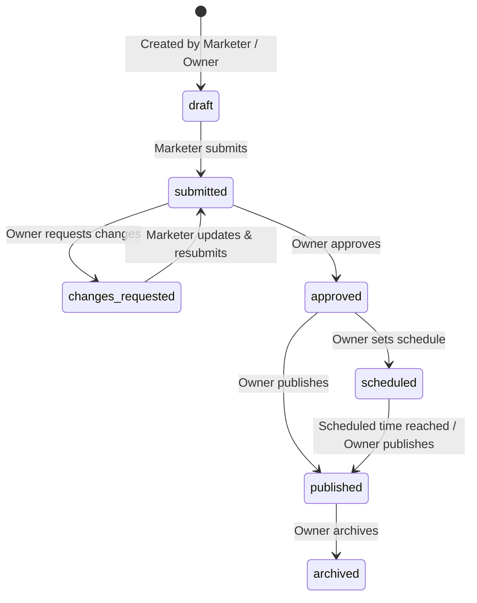

# C2 Structured Diagnostics Report: Digital Marketing Workspace & Public-Site Consumers

**Program:** Controlled Stabilization  
**Stage:** C2 — Structured Diagnostics (READ-ONLY)  
**Target:** CradleHub Web — Digital Marketing Workspace (`/marketing`, `/owner/marketing`) & Public-Site Consumers  
**Base SHA:** `3f402e033e1d1ca05b8cc8a4f2764823f7aaa622` (Accepted C1 truth consolidation merge on `main`)
**Branch:** `stage/c2-marketing-diagnostics`
**Original C2 Diagnostic Delivery SHA:** `88a0136b246bbfbcf780a7cd4a30ec7c651fa2df`
**Current Correction Commit SHA:** (Recorded in git log upon commit; reported in handoff)
**Date:** 2026-09-01
**Status:** REPORT CORRECTED / AWAITING INDEPENDENT REVIEW (Zero Implementation / Zero Production Mutation)

---

## A. Executive Summary & Authorization Scope

1. **C1 Acceptance & Merge Closeout:** C1 Truth Consolidation was formally accepted by the owner and successfully merged into production-connected `main` at commit SHA `3f402e033e1d1ca05b8cc8a4f2764823f7aaa622` via Pull Request #1.
2. **C2 Authorization:** Conditioned on the accepted C1 merge, C2 Structured Diagnostics was authorized exclusively for the **Digital Marketing Workspace** (`/marketing`, `/owner/marketing`) and its shared public-site consumers.
3. **Guardrails Strictly Observed:**
   - C2 is **READ-ONLY DIAGNOSTICS**.
   - Zero product implementation, zero schema mutation, zero migration application, zero RLS/Storage changes, zero production deployment.
   - Production evidence is classified as **REPOSITORY-RECORDED PRODUCTION EVIDENCE**.

---

## B. Inspected Repository Files

### 1. Marketing Workspace & Server Actions
- `src/app/(dashboard)/marketing/page.tsx`
- `src/app/(dashboard)/marketing/actions.ts`
- `src/app/(dashboard)/marketing/marketing-workspace.tsx`
- `src/app/(dashboard)/owner/marketing/page.tsx`
- `src/app/(dashboard)/owner/marketing/actions.ts`
- `src/app/(dashboard)/owner/marketing/marketing-studio.tsx`

### 2. Data Queries, Mutations & Helpers
- `src/lib/queries/marketing-content.ts` (drafts, revisions, approvals, scheduling, publishing)
- `src/lib/queries/public-site.ts` (live section and asset queries/updates)
- `src/lib/queries/branches.ts` (branch queries and caching)
- `src/lib/queries/services.ts` (public catalog resolution)
- `src/lib/services/service-catalog.ts` (master and branch service catalog engine)
- `src/lib/services/service-eligibility.ts` (visibility and delivery mode normalization)

### 3. Schemas, Defaults & Validation
- `src/lib/marketing/public-section-defaults.ts` (fallback copy and section metadata)
- `src/lib/public/public-site-data.ts` (static proof points, journey steps, setting cards)
- `src/lib/public/service-catalog-config.ts` (category definitions and fallback images)
- `src/lib/validations/marketing.ts` (draft validation schemas)
- `src/lib/validations/public-site.ts` (live section/asset schemas)
- `supabase/migrations/20260803042453_marketing_studio_foundation.sql` (Marketing Studio DB schema)
- `src/types/supabase.ts` (TypeScript database type definitions)

### 4. Public Pages & Presentational Components
- `src/app/page.tsx` (Homepage root)
- `src/app/(public)/layout.tsx` (Public shell layout)
- `src/app/(public)/about/page.tsx` (About page)
- `src/app/(public)/services/page.tsx` (Services catalog page)
- `src/app/(public)/branches/page.tsx` (Branches directory page)
- `src/app/(public)/contact/page.tsx` (Contact page)
- `src/components/public/home-page-sections.tsx` (Desktop homepage sections)
- `src/components/public/mobile/public-mobile-home.tsx` (Mobile homepage orchestrator)
- `src/components/public/mobile/mobile-home-hero-carousel.tsx` (Mobile hero carousel)
- `src/components/shared/brand-logo.tsx` (Brand logo component)

---

## C. Existing Architecture & System Topology

```mermaid
flowchart TD
    subgraph Roles["Actor Roles"]
        DM["Digital Marketer (digital_marketer)"]
        OWN["Owner (owner)"]
        PUB["Public Guest (anon)"]
    end

    subgraph Workspaces["Workspace Layer"]
        MKT_UI["/marketing (Marketer Workspace)"]
        OWN_MKT["/owner/marketing (Owner Studio)"]
    end

    subgraph DataTables["Database Tables"]
        MCD["marketing_content_drafts"]
        MCR["marketing_content_revisions"]
        MMA["marketing_media_assets"]
        MBS["marketing_brand_settings"]
        MSS["marketing_seo_settings"]
        PSS["public_site_sections (LIVE)"]
        PSA["public_site_assets (LIVE)"]
        BR["branches (LIVE)"]
        SRV["services & branch_services (LIVE)"]
    end

    subgraph Storage["Supabase Storage"]
        BUCKET["Bucket: public-site-media"]
    end

    subgraph Consumers["Public Site Consumers"]
        DESK_HOME["Desktop Home (HomePageSections)"]
        MOB_HOME["Mobile Home (PublicMobileHome)"]
        SVC_PAGE["/services"]
        BR_PAGE["/branches"]
        ABT_PAGE["/about"]
    end

    DM -->|Save / Submit Drafts| MKT_UI
    MKT_UI -->|Writes draft & revision| MCD
    MKT_UI -->|Writes audit log| MCR
    MKT_UI -->|Uploads image asset| BUCKET
    MKT_UI -->|Registers media metadata| MMA

    OWN -->|Approve / Schedule / Publish| OWN_MKT
    OWN_MKT -->|Publishes draft to live| PSS
    OWN_MKT -->|Direct update fallback| PSA
    OWN_MKT -->|Status update & revision| MCD

    PSS -->|Reads live sections| DESK_HOME
    PSA -->|Reads gallery assets| DESK_HOME
    BR -->|Reads branch details| BR_PAGE
    BR -->|Reads branch contact/phone| DESK_HOME
    BR -->|Reads branch contact/phone| MOB_HOME
    SRV -->|Reads service catalog| SVC_PAGE
    SRV -->|Reads featured services| DESK_HOME
    SRV -->|Reads featured services| MOB_HOME

    BUCKET -->|Serves public images| PUB
```

---

## D. Consumer & Source of Truth Map

| Editable Concept | Canonical Source | Query Location | Mutation Action | Owning Workspace | Public Consumers | Cache / Revalidation Behavior |
| :--- | :--- | :--- | :--- | :--- | :--- | :--- |
| **Homepage Hero** | `public_site_sections` (`section_key = 'hero'`) | `getPublicSiteSections()` | `updatePublicSiteSection()` / `publishMarketingContentDraft()` | `/owner/marketing` (Drafted in `/marketing`) | `src/components/public/home-page-sections.tsx` (Desktop only) | `revalidatePath('/')` + `revalidatePath('/owner/marketing')` |
| **Homepage About** | `public_site_sections` (`section_key = 'about'`) | `getPublicSiteSections()` | `updatePublicSiteSection()` / `publishMarketingContentDraft()` | `/owner/marketing` (Drafted in `/marketing`) | `src/components/public/home-page-sections.tsx` (Desktop only) | `revalidatePath('/')` + `revalidatePath('/owner/marketing')` |
| **Homepage Promotion / Quote Banner** | `public_site_sections` (`section_key = 'quote_banner'`) | `getPublicSiteSections()` | `updatePublicSiteSection()` / `publishMarketingContentDraft()` | `/owner/marketing` (Drafted in `/marketing`) | `src/components/public/home-page-sections.tsx` (Desktop only) | `revalidatePath('/')` + `revalidatePath('/owner/marketing')` |
| **Before You Book** | `public_site_sections` (`section_key = 'before_you_book'`) | `getPublicSiteSections()` | `updatePublicSiteSection()` / `publishMarketingContentDraft()` | `/owner/marketing` (Drafted in `/marketing`) | `src/components/public/home-page-sections.tsx` (Desktop only) | `revalidatePath('/')` + `revalidatePath('/owner/marketing')` |
| **Gallery Images** | `public_site_assets` (`section_key = 'gallery'`) | `getPublicSiteAssets('gallery')` | `createPublicSiteAsset()` / `updatePublicSiteAsset()` / `disablePublicSiteAsset()` | `/owner/marketing` | `src/lib/public/public-site-data.ts` (Static fallback) / `public_site_assets` | `revalidatePath('/')` + `revalidatePath('/owner/marketing')` |
| **Marketing Drafts** | `marketing_content_drafts` | `getMarketingContentDrafts()` | `saveMarketingContentDraft()`, `submitMarketingContentDraft()` | `/marketing` | None (Internal workspace only) | `revalidatePath('/marketing')`, `revalidatePath('/owner/marketing')` |
| **Revision History** | `marketing_content_revisions` | `getMarketingContentRevisions()` | `insertMarketingRevision()` (Internal trigger) | `/marketing` & `/owner/marketing` | None (Internal workspace only) | Revalidated with workspace |
| **Media Assets** | `marketing_media_assets` | DB table (Foundation ready) | Storage upload + metadata record | `/marketing` (Future Media Library) | `public-site-media` bucket consumers | Storage cache headers |
| **Brand Settings** | `marketing_brand_settings` | DB table (Foundation ready) | Migration ready; UI currently uses static SVGs | `/owner/marketing` (Future Brand Studio) | `BrandLogo` across public, auth, and dashboard | Static SVG bundling |
| **SEO Settings** | `marketing_seo_settings` | DB table (Foundation ready) | Migration ready; UI currently uses static `buildMetadata()` | `/owner/marketing` (Future SEO Studio) | Next.js `metadata` in `app/**/page.tsx` | Route-level ISR/SSR |
| **Public Branch Fields** | `branches` (public columns) | `getPublicBranches()` / `getPublicBranchesCached()` | `updateBranch()` (Owner Branch Management) | `/owner/branches` | `/branches`, `/`, Header phone, Footer | `revalidateTag(cacheTags.publicBranches)` |
| **Public Service Fields** | `services` & `branch_services` | `getPublicServiceCatalog()` | `saveServiceAction()` (Owner Service Management) | `/owner/services` | `/services`, `/`, `/book` | `revalidatePath('/services')`, `revalidatePath('/book')` |

---

## E. Strict Authorization Boundaries

### 1. Digital Marketer (`digital_marketer`) Authority
- **Permitted Operations:**
  - Create, view, edit, and save drafts in `marketing_content_drafts` with statuses `draft`, `submitted`, `changes_requested`.
  - Submit drafts for owner review (`draft` → `submitted`).
  - View audit revision history in `marketing_content_revisions`.
  - Upload media files into `public-site-media` bucket (allowed via Storage RLS).
  - Create and edit draft metadata in `marketing_media_assets`.
- **Strictly Prohibited Operations (Enforced at RLS & Server Action Layers):**
  - **NO direct write access** to live `public_site_sections` or `public_site_assets`.
  - **NO draft approval, scheduling, publishing, or archiving** (must be performed by `owner`).
  - **NO authority over service operational prices, custom prices, duration, buffer times, or category rules.**
  - **NO authority over therapist eligibility, staff records, schedules, or onboarding.**
  - **NO authority over booking dispatch, attendance, customer records, payments, or payroll.**
  - **NO authority over branch operational activation, slot interval, or travel fee parameters.**
  - **NO RBAC, auth, or database security configuration rights.**

### 2. Owner (`owner`) Authority
- Full write access to both draft workflow (`marketing_content_drafts`) and live public tables (`public_site_sections`, `public_site_assets`).
- Exclusive authority to approve, request changes, schedule, publish, or archive marketing drafts.
- Exclusive authority to reconfigure operational parameters across all workspaces.

---

## F. Public-Site Dependency & Mobile Discrepancy Map

A major finding of C2 diagnostics is the **divergence between desktop and mobile public presentation**:

1. **Desktop Homepage (`src/components/public/home-page-sections.tsx`):**
   - Fully dynamic. Queries `public_site_sections` and falls back gracefully to `PUBLIC_SITE_SECTION_DEFAULTS`.
   - Any draft published via Marketing Studio updates the live desktop hero headline, subtitle, CTAs, background images, and about copy immediately upon page revalidation.
2. **Mobile Homepage (`src/components/public/mobile/public-mobile-home.tsx` & `mobile-home-hero-carousel.tsx`):**
   - **Static & Hardcoded.** The mobile hero carousel reads from hardcoded `HERO_SLIDES` (in `src/components/public/mobile/mobile-home-hero-carousel.tsx`) and hardcoded copy (`"Where calm meets care."`).
   - It does **NOT** read from `public_site_sections`!
   - Consequently, when an owner publishes marketing changes from `/owner/marketing` or `/marketing`, the changes **only appear on desktop screens**, leaving mobile users on the old hardcoded copy.
3. **Public Secondary Pages (`/about`, `/services`, `/branches`, `/contact`):**
   - `/about`: Uses static copy and constants (`SPA_IMAGES.about`).
   - `/branches`: Fully dynamic. Reads active branches from `branches` table via `getPublicBranches()`.
   - `/services`: Fully dynamic. Reads active services from `services` and `branch_services` via `getPublicServiceCatalog()`.

---

## G. Media & Storage Architecture

1. **Storage Bucket:** `public-site-media`
   - Configured as public (`public = true`).
   - RLS Policies (Migration `20260803042453_marketing_studio_foundation.sql`):
     - `SELECT`: Allowed for `anon` and `authenticated`.
     - `INSERT`, `UPDATE`, `DELETE`: Restricted to `authenticated` users with `public.get_auth_role() in ('owner', 'digital_marketer')`.
2. **Media Assets Table:** `marketing_media_assets`
   - Fields: `id`, `bucket_path`, `public_url`, `title`, `alt_text` (min 3 chars required), `section_key`, `content_key`, `status` (`draft`, `submitted`, `approved`, `published`, `archived`), `metadata`, `created_by`, `updated_by`, `reviewed_by`.
3. **Orphan & Replacement Risks:**
   - Current codebase lacks an automated usage-reference tracking mechanism. If an image is deleted from Storage or replaced in `marketing_media_assets`, live `public_site_sections.image_url` or `marketing_content_drafts.image_url` may point to broken URLs if not validated.
   - Safe refactor path: Media picker must store both `bucket_path` and `public_url`, with soft-archiving instead of hard deletion.

---

## H. Brand & Logo Architecture

1. **Current Component Implementation (`src/components/shared/brand-logo.tsx`):**
   - Directly imports static SVG files: `cradle-logo-horizontal.svg` and `cradle-logo-mark.svg`.
   - Supports modes: `horizontal` and `mark`.
   - Supports variants: `light` (natural colors) and `dark` (`brightness-0 invert opacity-90`).
   - Consumed across 12+ critical UI areas (Public header/footer, mobile breath reveal, dashboard sidebar, workspace switcher, attendance scanner, auth pages).
2. **Database Table (`marketing_brand_settings`):**
   - Schema is prepared (`setting_key`, `label`, `value` JSONB, `status`).
   - Intended keys: `logo_primary`, `logo_dark`, `logo_mark`, `favicon`, `social_image`.
3. **Safe Transition Path:**
   - Keep static SVGs as robust fallback defaults.
   - Enhance `BrandLogo` to optionally resolve from brand settings when available, preserving exact CSS dimensions and responsive classes (`w-28`, `w-40`, `w-52`).

---

## I. Branch & Service Boundaries

### 1. Branch Entity Boundary
- **Public Presentation Fields (Marketing Domain):**
  - `name`, `address`, `city`, `barangay`, `phone`, `secondary_phone`, `email`, `fb_page`, `messenger_link`, `maps_embed_url`, `opening_hours`, `sort_order`, `latitude`, `longitude`, `place_id`, `location_metadata`.
- **Operational Configuration (Strictly Owner/Ops Domain):**
  - `is_active` (Branch operational status).
  - `slot_interval_minutes` (Booking grid calculation).
  - `home_service_free_km` & `home_service_extra_km_fee` (Pricing logic).
  - Branch resources (`branch_resources`) & staff assignments (`staff`).

### 2. Service Entity Boundary
- **Public Marketing Fields (Marketing Domain):**
  - `public_title`, `public_description`, `custom_image_url`, `image_alt`, `is_featured`, `sort_order`, category badges.
- **Operational Configuration (Strictly Owner/Ops Domain):**
  - Base `price` and `custom_price` in PHP.
  - Base `duration_minutes` and `custom_duration_minutes`.
  - Buffer times (`buffer_before`, `buffer_after`).
  - Delivery modes (`available_in_spa`, `available_home_service`).
  - Booking visibility (`visibility`, `booking_visibility`, `customer_tier_required`).
  - Therapist qualification rules (`requires_senior_staff`, `requires_special_setup`).

---

## J. Draft Preview & Publishing Workflow

### 1. Current Publishing Workflow State Machine

### 2. Presentational Component Reuse Strategy
- Current draft preview inside `/marketing` uses a basic text-summary card.
- **Target C3/C4 Architecture:** Shared presentational section components (`HeroSection`, `AboutSection`, `QuoteBannerSection`, `BeforeYouBookSection`) that accept a `data` prop.
  - Live page passes data from `public_site_sections`.
  - Preview studio passes live draft data merged with fallback defaults.
  - Device toggle (Desktop / Tablet / Mobile) renders the preview in responsive containers without duplicating layout markup.

---

## K. UX & Accessibility Audit Findings

Audit performed against repository design standards and modern UI/UX guidelines:

1. **Visual Language & Colors:**
   - The workspace correctly follows the CradleHub `--cs-*` token hierarchy from `src/app/globals.css` and `src/components/features/dashboard/sidebar.tsx`:
     - Background: Warm cream (`--cs-bg: #F5F2EE`, surface: `--cs-surface: #FFFFFF`, warm surface: `--cs-surface-warm: #FAF8F5`).
     - Sidebar: Dark warm brown/slate (`--cs-sidebar: #1E1916`, hover: `--cs-sidebar-hover: #2A2420`, active: `--cs-sidebar-active: #332C28`).
     - Workspace Accent: Muted purple (`--cs-owner-accent: #7A5A8A`, `accentBg: rgba(122, 90, 138, 0.15)`) designating Marketing workspace identity and selection.
     - Action Family: Cradle Sand action family (`--cs-sand: #A67B5B`, `--cs-sand-dark: #8A6347`, `--cs-sand-light: #C4966E`) for primary and important actions.
     - Semantic status colors remain semantic (success/warning/error/info tokens).
     - No independent green concept theme or heavy purple tinting across the entire UI.
2. **Accessibility Observations:**
   - **Labels:** Several input fields in `marketing-workspace.tsx` and `marketing-studio.tsx` rely on visual container labels without explicit `id` and `htmlFor` association.
   - **Keyboard Navigation & Focus:** Focus styling is custom; needs consistent `focus-visible:ring-2 focus-visible:ring-[#A67B5B]` outline across all inputs and buttons.
   - **Action State Feedback:** Draft saves update state via `useActionState`, but lack an `aria-live="polite"` container for screen reader announcements.
   - **Touch Targets:** Navigation tabs and icon action buttons in desktop view are 32px height; need minimum 44x44px clickable target on responsive touch viewports.

---

## L. Performance & Query Diagnostics

1. **Initial Page Load:**
   - `/marketing` and `/owner/marketing` execute 4 parallel queries via `Promise.all()`:
     - `getPublicSiteSections({ includeDisabled: true })`
     - `getPublicSiteAssets('gallery', { includeDisabled: true })`
     - `getMarketingContentDrafts()`
     - `getMarketingContentRevisions(12)`
   - C2 confirmed the four initial queries are initiated in parallel via `Promise.all()`. C2 did not preserve a controlled timing measurement sufficient to claim a latency figure. Performance must be measured before any caching/query optimization decision (Measure First policy).
2. **Revalidation Efficiency:**
   - Publishing mutates `public_site_sections` and invokes `revalidatePath('/')` and `revalidateMarketingWorkspace()`.
   - Tag-based caching (`cacheTags.publicBranches`) cleanly isolates branch changes from marketing section changes.
3. **Media Loading:**
   - Public hero images utilize Next.js `<Image priority sizes="..." />` with WebP optimization.
   - Mobile carousel preloads first slide only (`preload={index === 0}`).

---

## M. Ranked Risk Register (P0 - P3)

| Priority | Risk ID | Component | Description | Impact | Stabilization Mitigation |
| :---: | :---: | :--- | :--- | :--- | :--- |
| **P1** | MKT-001 | Public Mobile Home | Mobile homepage (`public-mobile-home.tsx` / `mobile-home-hero-carousel.tsx`) uses hardcoded copy and ignores `public_site_sections`. | Marketing copy updates published by owner only update desktop views, causing mobile/desktop content desynchronization. | Refactor `PublicMobileHome` to consume `public_site_sections` with mobile-optimized defaults in authorized implementation stage. |
| **P1** | MKT-002 | Owner Direct Mutation | `/owner/marketing` allows direct mutation of `public_site_sections` bypassing draft history. | Creates unversioned live changes with no revision record in `marketing_content_revisions`. | Unify owner studio to always create/record an audit revision on direct edit. |
| **P1** | MKT-003 | Brand Logo Decoupling | `BrandLogo` component is statically bundled to SVG files; `marketing_brand_settings` is unconsumed. | Brand settings UI cannot dynamically update logo/favicon without code changes. | Build structured brand loader with fallback to static SVGs in future authorized stage. |
| **P2** | MKT-004 | Media Orphan Lifecycle | Deleting or replacing images has no cascade check against active drafts or live sections. | Potential broken image links if files in `public-site-media` are deleted prematurely. | Implement soft-archive flag on `marketing_media_assets` and prohibit hard storage deletion if in use. |
| **P2** | MKT-005 | Accessibility / Form Labels | Form inputs lack explicit `htmlFor` attributes and `aria-live` save notifications. | Reduced accessibility compliance for screen reader and keyboard-only users. | Add accessible form labels, descriptive ARIA attributes, and live status announcement regions. |
| **P3** | MKT-006 | Unstructured JSON Metadata | Section metadata (`metadata` JSONB) is edited as raw JSON string or unvalidated object. | Syntax errors in JSON textarea can reject draft saves. | Replace raw JSON textareas with structured form fields per section type. |

---

## N. Non-Negotiable Preserved Functionality

1. **Live Website Integrity:** The public site (`/`, `/about`, `/services`, `/branches`, `/book`, `/contact`) must remain fully functional with zero breaking changes or runtime errors.
2. **Strict Role Separation:** Under no circumstances may `digital_marketer` gain write access to prices, durations, staff, schedules, dispatch, attendance, payroll, or database RLS.
3. **Design Language & Theming:** The existing internal `--cs-*` theme tokens (warm cream background, dark sidebar, purple marketing badge, sand/gold CTAs) must be preserved.
4. **Draft-First Security Model:** Non-owner marketers cannot publish directly to the live site.

---

## O. Recommendations for C3 Scope Freeze (Planning Context Only — Implementation Not Authorized)

Based on the verified diagnostic findings, the recommended C3 Scope Freeze for the Digital Marketing Studio comprises five independent user-facing modules, secondary navigation, contextual SEO, and universal subsystems:

### Five Core User-Facing Modules
1. **Website Studio:**
   - Dedicated management for public-site pages/sections (Hero, About, Promotion/Quote Banner, Before You Book).
   - Harmonize Desktop (`home-page-sections.tsx`) and Mobile (`public-mobile-home.tsx` / `mobile-home-hero-carousel.tsx`) public consumers so mobile consumes published sections seamlessly.
2. **Brand Studio:**
   - Dedicated management for brand identity assets (Primary Logo, Dark/Light variants, Logo Mark, Favicon, Social Image).
   - Preserves static SVG fallback while allowing dynamic resolution from `marketing_brand_settings`.
3. **Branches Studio:**
   - Dedicated management for public-facing branch presentation fields (`name`, `address`, `phone`, `email`, `opening_hours`, `maps_embed_url`, `messenger_link`, `sort_order`).
   - Strictly isolates public presentation from operational branch controls (`is_active`, `slot_interval_minutes`, travel fee parameters, staff assignments).
4. **Services Studio:**
   - Dedicated management for public marketing presentation (`public_title`, `public_description`, `custom_image_url`, `image_alt`, `is_featured`, `sort_order`).
   - Strictly isolates marketing fields from operational catalog properties (base/custom `price`, `duration_minutes`, `buffer_before`/`buffer_after`, `available_in_spa`/`available_home_service`, therapist qualifications).
5. **Media Library:**
   - Dedicated universal media browser for `public-site-media` bucket and `marketing_media_assets`.
   - Asset replacement safety, usage tracking, and soft-archiving without broken links.

### Secondary Navigation
- **Drafts:** Dedicated overview of in-progress drafts, pending reviews, scheduled items, and revision history.
- **Settings:** Workspace-level preferences and defaults.

### Contextual SEO Architecture
- SEO is embedded contextually within each edited entity (e.g., Website Page: Content \| Images \| Search & Social; Service: Content \| Images \| Search & Social) rather than isolated into an artificial separate module.
- No separate standalone Analytics or Campaigns modules (out of scope for immediate stabilization).

### Universal Subsystems
- **Universal Media Picker:** Reusable asset selection across all studio modules.
- **High-Fidelity Draft Preview:** Reuses the exact same presentational components as live public pages.
- **Responsive Viewport Toggle:** Desktop, Tablet, and Mobile preview frames.
- **Live vs Draft Comparison:** Visual diff view before submission/approval.
- **Unsaved Changes Guard:** Protection against accidental navigation or loss of in-progress edits.
- **Draft / Review / Publish Workflow:** Draft → Submitted → Changes Requested / Approved → Scheduled / Published → Archived.

---

## P. Production Evidence Classification

- **Classification:** `REPOSITORY-RECORDED PRODUCTION EVIDENCE`
- **Scope Verified:** Repository code, database migrations, server actions, queries, component trees, and static assets.
- **Live Database Status:** Live Supabase database verification was not available in this read-only diagnostic stage. No live production mutations were attempted or executed.
