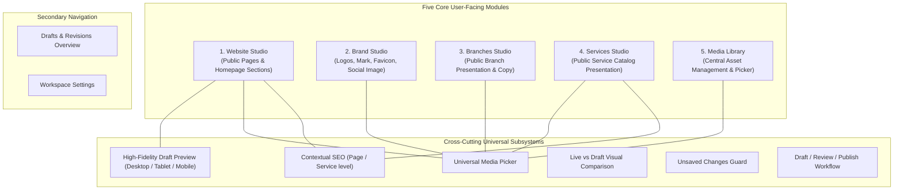
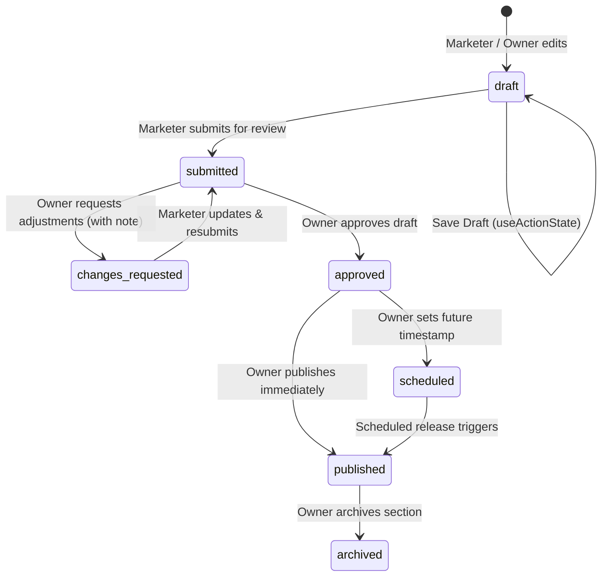

# C3 Digital Marketing Workspace Scope Freeze

**Program:** Controlled Stabilization  
**Stage:** C3 — Scope Freeze (DOCUMENTATION ONLY — ZERO CODE / ZERO UI / ZERO PRODUCTION MUTATION)  
**Target:** CradleHub Web — Digital Marketing Workspace (`/marketing`, `/owner/marketing`) & Public-Site Consumers  
**Base SHA:** `01c36375327b688fdd6e69fbbc130307d17da0eb` (Accepted C2 closeout merge commit on `main`)  
**Branch:** `stage/c3-marketing-scope-freeze`  
**Date:** 2026-09-01  
**Status:** SCOPE FROZEN / AWAITING OWNER REVIEW (C4 / C5+ NOT AUTHORIZED)  

---

## A. Stage, Authorization & Target Identification

1. **Authorization Scope:** Conditioned on the accepted C2 diagnostics closeout (`694873dfe9b9572a56620951bb69024492fe04c0`), the owner explicitly authorized C3 Scope Freeze for the Digital Marketing Workspace.
2. **Strict Guardrails:**
   - C3 is **DOCUMENTATION & SPECIFICATION ONLY**.
   - Zero UI implementation, zero component creation, zero schema/database mutation, zero migration execution, zero Storage modification, zero production mutation.
   - C4 Design Implementation and C5+ Coding remain strictly **NOT AUTHORIZED** until separate explicit owner authorization.
3. **Database & Environment Target:** LOCAL / STABILIZATION REPOSITORY GOVERNANCE. Live production Supabase mutations are strictly prohibited.
4. **Evidence Classification:** All repository-grounded facts are classified as `VERIFIED REPOSITORY FACT`. Historical migration artifacts are classified as `REPOSITORY-RECORDED PRODUCTION EVIDENCE`. Live Supabase runtime state remains `NOT INDEPENDENTLY VERIFIED`.

---

## B. Accepted C2 Diagnostic Findings Carried Forward

The following verified architectural discoveries and risk items from C2 diagnostics (`docs/audits/C2_MARKETING_STRUCTURED_DIAGNOSTICS_REPORT.md`) are formally accepted as baseline inputs for this scope freeze:

1. **MKT-001 (P1 — Desktop/Mobile Consumer Divergence):**
   - Desktop homepage (`src/components/public/home-page-sections.tsx`) dynamically consumes `public_site_sections`.
   - Mobile homepage (`src/components/public/mobile/public-mobile-home.tsx` / `mobile-home-hero-carousel.tsx`) hardcodes static copy (`"Where calm meets care."`) and static slides (`HERO_SLIDES`).
   - *C3 Requirement:* Website Studio scope freezes full mobile-desktop parity by specifying that mobile consumers must read from published `public_site_sections`.
2. **MKT-002 (P1 — Owner Direct Mutation Bypasses Audit Revisions):**
   - Direct mutations in `/owner/marketing` write to `public_site_sections` without generating a record in `marketing_content_revisions`.
   - *C3 Requirement:* The publishing architecture requires an audit revision record for every live mutation, regardless of whether it originates from a reviewed draft or an owner direct edit.
3. **MKT-003 (P1 — BrandLogo Static SVG Coupling):**
   - `BrandLogo` component statically bundles SVG files and does not resolve from `marketing_brand_settings`.
   - *C3 Requirement:* Brand Studio specifies dynamic resolution from `marketing_brand_settings` with static SVG fallback preserved.
4. **MKT-004 (P2 — Media Orphan & Deletion Risk):**
   - Media deletion currently lacks cascade checking against live sections or active drafts.
   - *C3 Requirement:* Central Media Library specifies non-destructive soft-archiving (`status = 'archived'`) and usage-impact analysis prior to asset replacement or archiving.
5. **MKT-005 (P2 — Focus Visibility & Touch Target Standards):**
   - Inputs/textareas currently set `outline: none` without attaching `--cs-focus-ring`; owner `reviewNote` is placeholder-only; compact viewports have touch targets below 44px.
   - *C3 Requirement:* UI specifications enforce `var(--cs-focus-ring)` focus rings, explicit `<label>` associations, and 44x44px minimum touch targets on compact viewports.
6. **MKT-006 (P3 — Unstructured JSON Metadata):**
   - Raw JSON textareas risk syntax rejection upon draft save.
   - *C3 Requirement:* Form fields per section type replace raw JSON inputs.

---

## C. In-Scope Modules & Information Architecture

The Digital Marketing Workspace is structured into **five independent primary modules**, **two secondary navigation utilities**, and **contextual SEO capabilities**:



### Module Breakdown:

1. **Website Studio (`/marketing` & `/owner/marketing` > Website):**
   - Dedicated management of public-facing web content across pages:
     - Home (Hero, About, Promotion / Quote Banner, Before You Book).
     - About (Company story, values, spa highlights).
     - Contact (Public contact copy, hours summary).
     - Secondary informational sections.
   - Core capabilities: Rich section editing, copy adjustment, image selection via Media Picker, CTA configuration, section visibility toggling, contextual Search & Social metadata, responsive Draft Preview, and Live vs. Draft visual comparison.
2. **Brand Studio (`/marketing` & `/owner/marketing` > Brand):**
   - Dedicated visual identity asset management:
     - Primary Logo (Horizontal full logo).
     - Light / Reversed Logo (For dark navigation/footers).
     - Dark Logo (For light backgrounds).
     - Logo Mark (Standalone brand icon / emblem).
     - Favicon (Browser tab icon).
     - Social Sharing Image (Default OpenGraph card image).
   - Core capabilities: Brand asset upload, dimensions validation, SVG fallback toggle, preview across light/dark surfaces. Global design-system CSS token editing is strictly out of scope.
3. **Branches Studio (`/marketing` & `/owner/marketing` > Branches):**
   - Dedicated management of public-facing branch presentation fields for existing canonical branch records.
   - Core capabilities: Edit public phone, secondary phone, email, Facebook page, Messenger link, public opening hours copy, maps embed URL, and branch gallery photos.
   - Strict operational isolation: Marketer cannot create, delete, activate, deactivate, or modify operational booking grid/travel fee parameters for branches.
4. **Services Studio (`/marketing` & `/owner/marketing` > Services):**
   - Dedicated management of public marketing copy and imagery for existing catalog services.
   - Core capabilities: Edit public title, public description, custom marketing image, image alt text, featured status, marketing category grouping, and contextual Search & Social metadata.
   - Strict catalog isolation: Marketer cannot alter operational base prices, custom branch prices, durations, buffer times, delivery modes, or therapist eligibility.
5. **Media Library (`/marketing` & `/owner/marketing` > Media):**
   - Central visual asset repository for `public-site-media` bucket and `marketing_media_assets`.
   - Core capabilities: Bulk upload, visual grid browser, title/alt-text tagging (minimum 3 characters enforced), asset search and tag filtering, asset replacement with reference updating, usage locations inspector, usage-impact warning dialog, and non-destructive soft-archiving.
6. **Secondary Navigation:**
   - **Drafts (`/marketing/drafts` / `/owner/marketing/drafts`):** Unified queue of active drafts, items pending owner review, scheduled releases, and historical audit revisions.
   - **Settings (`/marketing/settings` / `/owner/marketing/settings`):** Workspace preferences, notification settings, and default preview viewports.

---

## D. Explicit Out-of-Scope Items

To preserve strict stabilization boundaries and prevent speculative feature creep, the following items are explicitly **PROHIBITED** and declared **OUT OF SCOPE** for C3, C4, and C5:

1. **NO Overview KPI / Analytics Dashboard:** No website visitor graphs, conversion tracking, revenue attribution, or traffic telemetry.
2. **NO Campaigns / Marketing Automation:** No email campaign builder, SMS dispatch, discount code generator, voucher management, or newsletter tooling.
3. **NO Marketer Direct Publishing:** Non-owner marketers cannot publish directly to live tables (`public_site_sections`, `public_site_assets`, `branches`, `services`).
4. **NO Operational Catalog Mutation:** Marketers cannot alter service base price, branch custom price, duration minutes, buffer times, spa/home service delivery availability, booking visibility, customer tier restrictions, or therapist qualification rules.
5. **NO Operational Branch Mutation:** Marketers cannot create branches, delete branches, toggle `is_active`, alter `slot_interval_minutes`, modify `home_service_free_km` / `home_service_extra_km_fee`, edit branch resources, or manage staff assignments.
6. **NO Operational CRM / Booking / Attendance Access:** Marketers have zero access to customer booking records, client PII, therapist dispatch, attendance scanning, GPS logs, payroll, or cashier reconciliation.
7. **NO Database / Migration Reconciliation:** No bulk execution of historical migrations or database schema rewrites during marketing stabilization.
8. **NO Global Theme Redesign:** No green redesign, heavy purple tinting, or substitution of public site `--pw-*` / `--sp-*` classes into the internal dashboard.

---

## E. Source-of-Truth Matrix

| Editable Entity / Concept | Canonical Database Source | Interim Storage / Draft Source | Owning Role | Operational Consumers | Public Consumers | Revalidation Tags / Paths |
| :--- | :--- | :--- | :--- | :--- | :--- | :--- |
| **Homepage Hero** | `public_site_sections` (`hero`) | `marketing_content_drafts` | `owner` (Draft: `digital_marketer`) | None | Desktop & Mobile Home | `revalidatePath('/')` |
| **Homepage About** | `public_site_sections` (`about`) | `marketing_content_drafts` | `owner` (Draft: `digital_marketer`) | None | Desktop & Mobile Home | `revalidatePath('/')` |
| **Promotion / Quote Banner** | `public_site_sections` (`quote_banner`) | `marketing_content_drafts` | `owner` (Draft: `digital_marketer`) | None | Desktop & Mobile Home | `revalidatePath('/')` |
| **Before You Book** | `public_site_sections` (`before_you_book`) | `marketing_content_drafts` | `owner` (Draft: `digital_marketer`) | None | Desktop & Mobile Home | `revalidatePath('/')` |
| **Gallery Images** | `public_site_assets` (`gallery`) | `marketing_media_assets` | `owner` (Draft: `digital_marketer`) | None | Desktop Home Gallery | `revalidatePath('/')` |
| **Brand Identity Assets** | `marketing_brand_settings` | Static SVGs (Fallback) | `owner` (Draft: `digital_marketer`) | Dashboard Shell, Auth, Mobile Header | Public Header, Footer, Favicon | `revalidatePath('/', 'layout')` |
| **Route SEO Metadata** | `marketing_seo_settings` | `buildMetadata()` constants | `owner` (Draft: `digital_marketer`) | None | HTML `<head>` metadata | Route-level ISR/SSR |
| **Branch Public Presentation** | `branches` (Public copy columns) | None (Owner-reviewed direct edit) | `owner` (Marketer: Read/Suggest) | Booking dispatch, mapping, travel fee | `/branches`, `/`, Header Phone, Footer | `revalidateTag(cacheTags.publicBranches)` |
| **Service Public Presentation** | `services` (Public copy columns) | None (Owner-reviewed direct edit) | `owner` (Marketer: Read/Suggest) | Operational catalog, therapist allocation | `/services`, `/`, `/book` | `revalidatePath('/services')`, `revalidatePath('/book')` |
| **Media Assets & Files** | `marketing_media_assets` | Storage bucket `public-site-media` | `digital_marketer` / `owner` | None | All public image consumers | CDN / Storage Cache-Control |
| **Revision Audit Log** | `marketing_content_revisions` | Automated audit triggers | `owner` / `digital_marketer` (Read) | Internal audit | None | None |

---

## F. Authorization & Role Security Matrix

| Feature / Operation | Public Guest (`anon`) | Digital Marketer (`digital_marketer`) | Owner (`owner`) | Operational Staff / Manager |
| :--- | :---: | :---: | :---: | :---: |
| **View Live Public Site** | ALLOW | ALLOW | ALLOW | ALLOW |
| **Access `/marketing` Workspace** | DENY | ALLOW | ALLOW | DENY |
| **Access `/owner/marketing` Studio** | DENY | DENY | ALLOW | DENY |
| **Create / Edit / Save Marketing Drafts** | DENY | ALLOW | ALLOW | DENY |
| **Submit Draft for Review** | DENY | ALLOW | ALLOW | DENY |
| **Approve / Request Changes on Draft** | DENY | DENY | ALLOW | DENY |
| **Schedule Draft Publication** | DENY | DENY | ALLOW | DENY |
| **Publish Draft to Live Website** | DENY | DENY | ALLOW | DENY |
| **Archive Live / Draft Content** | DENY | DENY | ALLOW | DENY |
| **Upload Media to `public-site-media`** | DENY | ALLOW | ALLOW | DENY |
| **Soft-Archive Media Assets** | DENY | ALLOW | ALLOW | DENY |
| **Hard-Delete Media Files** | DENY | DENY (Soft-archive only) | DENY (Soft-archive only) | DENY |
| **Edit Public Branch Phone / Hours / Social** | DENY | ALLOW (Draft / Review) | ALLOW (Direct & Review) | DENY |
| **Edit Branch Location / Name / Address** | DENY | DENY (Read-Only) | ALLOW (Owner Ops Path) | DENY |
| **Edit Branch Activation (`is_active`)** | DENY | DENY | ALLOW (Owner Ops Path) | DENY |
| **Edit Service Public Copy / Image** | DENY | ALLOW (Draft / Review) | ALLOW (Direct & Review) | DENY |
| **Edit Service Price / Duration / Visibility** | DENY | DENY | ALLOW (Owner Ops Path) | DENY |

---

## G. Field Ownership & Mutability Matrix

### 1. Website Studio Sections (`public_site_sections` / `marketing_content_drafts`)
- **Marketer Writable (via Draft):** `title`, `subtitle`, `body`, `image_url`, `alt_text`, `cta_text`, `cta_link`, `cta_secondary_text`, `cta_secondary_link`, `is_active` (visibility toggle in draft), structured `metadata` fields (e.g. proof points, badge text, step highlights).
- **Marketer Read-Only / System Controlled:** `section_key`, `created_at`, `updated_at`, `reviewed_by`, `published_at`, `published_by`.
- **Prohibited:** Raw JSON strings in textareas; direct mutation of live rows without owner approval.

### 2. Brand Studio (`marketing_brand_settings`)
- **Marketer Writable (via Draft):** `logo_primary_url`, `logo_dark_url`, `logo_mark_url`, `favicon_url`, `social_image_url`, asset dimensions, fallback SVG toggle.
- **Marketer Prohibited:** Altering global CSS variables (`--cs-*`, `--pw-*`), typography scales, root colors, or theme configurations.

### 3. Branches Studio (`branches`)
- **Shared Canonical Identity / Location Data (READ-ONLY to Marketer / Maintained via Owner Ops):**
  - `name`, `address`, `city`, `barangay`, `latitude`, `longitude`, `place_id`, `location_metadata`.
- **Marketer-Editable Candidates (Field-by-Field C3 Freeze):**
  - `phone`, `secondary_phone`, `email`, `fb_page`, `messenger_link`, `opening_hours`, public branch photos/content.
  - `maps_embed_url` and `sort_order` remain read-only pending explicit source-of-truth validation in future authorized implementation.
- **Strictly Prohibited Operational Fields:**
  - `is_active`, `slot_interval_minutes`, `home_service_free_km`, `home_service_extra_km_fee`, `branch_resources`, staff assignments.

### 4. Services Studio (`services` & `branch_services`)
- **Marketer-Editable Presentation Fields (via Draft / Reviewed Path):**
  - `public_title`, `public_description`, `custom_image_url`, `image_alt`, `is_featured`, contextual SEO metadata (`meta_title`, `meta_description`, `og_image_url`).
- **Strictly Prohibited Operational Fields:**
  - Base `price`, custom branch `price`, base `duration_minutes`, custom branch `duration_minutes`, `buffer_before`, `buffer_after`, `available_in_spa`, `available_home_service`, `visibility`, `booking_visibility`, `customer_tier_required`, `requires_senior_staff`, `requires_special_setup`.

### 5. Media Library (`marketing_media_assets` & `public-site-media`)
- **Marketer Writable:** File upload, `title`, `alt_text` (minimum 3 characters enforced), `section_key` association, `content_key` association, soft-archive toggle (`status = 'archived'`).
- **System Controlled:** `bucket_path`, `public_url`, `file_size`, `mime_type`, `dimensions`, `usage_count`, `usage_references`.
- **Prohibited:** Unreferenced hard deletion from Storage without soft-archive grace period; upload without valid alt text.

---

## H. Public-Site Consumer Map

```mermaid
flowchart TD
    subgraph LiveTables["Live Database Records"]
        PSS["public_site_sections"]
        PSA["public_site_assets"]
        MBS["marketing_brand_settings"]
        MSS["marketing_seo_settings"]
        BR["branches"]
        SRV["services"]
    end

    subgraph DesktopConsumers["Desktop Public Consumers"]
        D_HOME["Homepage (home-page-sections.tsx)"]
        D_ABOUT["/about Page"]
        D_SERV["/services Page"]
        D_BRANCH["/branches Page"]
        D_CONTACT["/contact Page"]
        D_BOOK["/book Page"]
    end

    subgraph MobileConsumers["Mobile Public Consumers"]
        M_HOME["Mobile Home (public-mobile-home.tsx)"]
        M_HERO["Hero Carousel (mobile-home-hero-carousel.tsx)"]
        M_SHELL["Mobile Shell Layout"]
    end

    subgraph GlobalConsumers["Global Shell & Layout"]
        LOGO["BrandLogo (All Routes)"]
        HEAD["HTML <head> & Meta"]
    end

    PSS -->|Hero, About, Quote, Before You Book| D_HOME
    PSS -->|Hero, About, Quote (Harmonized)| M_HOME
    PSS -->|Dynamic Slides (Harmonized)| M_HERO
    PSA -->|Gallery Assets| D_HOME
    MBS -->|Dynamic Logo & Mark with SVG Fallback| LOGO
    MSS -->|Search & Social Metadata| HEAD
    BR -->|Public Phone, Hours, Embed| D_BRANCH
    BR -->|Header Phone & Footer| D_HOME
    BR -->|Header Phone & Footer| M_HOME
    SRV -->|Public Title, Description, Image| D_SERV
    SRV -->|Featured Services| D_HOME
    SRV -->|Featured Services| M_HOME
```

---

## I. Shared Component & Subsystem Contracts

### 1. Universal Media Picker Contract
- **Trigger:** Available inside all studio modules (Website, Brand, Branches, Services) wherever image selection occurs.
- **Interface:** Modal dialog displaying thumbnail grid, search bar, tag filters, aspect-ratio filter, upload CTA, and asset details inspector.
- **Selection Payload:** Returns `{ id: string, public_url: string, bucket_path: string, alt_text: string, dimensions: { width: number, height: number } }`.
- **Validation:** Disallows selection if `alt_text` is missing or fewer than 3 characters.

### 2. High-Fidelity Draft Preview Contract
- **Presentational Component Reuse:** Draft preview must mount the **exact same React components** used on public pages (`HomePageHero`, `AboutSection`, `QuoteBannerSection`, `BeforeYouBookSection`), passing merged draft data via props.
- **Device Viewport Toggle:** Seamlessly switches preview containers between Desktop (100% width), Tablet (768px container), and Mobile (375px container).
- **Zero Layout Duplication:** No duplicate HTML or CSS mockups created for preview; preview renders the actual component tree with zero DOM divergence.

### 3. Live vs. Draft Comparison Subsystem
- **Side-by-Side Diff:** Displays the current live published version alongside the proposed draft version.
- **Visual Highlighting:** Color-coded badges indicating modified text fields, altered images, and updated CTA links.
- **Safety Gate:** Must be accessible to Owner prior to executing approval or publication.

### 4. Unsaved Changes Guard
- **Browser Navigation Warning:** Listens to `beforeunload` event if form state is dirty.
- **Client-Side Route Guard:** Intercepts internal tab/workspace switching when unsaved draft modifications exist, presenting a confirmation dialog (*Discard changes / Keep editing*).

### 5. Draft / Review / Publish State Machine


### 6. Asset Usage Tracking & Safe Replacement
- **Usage Scanner:** Scans `public_site_sections`, `public_site_assets`, `services`, `branches`, `marketing_brand_settings`, and active drafts for references to a given media asset ID or URL.
- **Impact Warning:** If an asset is referenced in 1 or more active locations, the system displays a modal listing all affected consumers before allowing replacement or archiving.
- **Non-Destructive Archiving:** Assets are flagged `status = 'archived'`. Underlying files in Storage bucket are preserved to prevent broken URLs on historical or cached pages.

---

## J. Preview Contract

1. **Rendering Fidelity:** The preview environment inside `/marketing` and `/owner/marketing` must reflect live rendering with 100% structural fidelity.
2. **Data Props Pattern:**
   ```typescript
   type PublicSectionDataProps<T> = {
     data: T;
     mode: 'live' | 'preview';
     viewport?: 'desktop' | 'tablet' | 'mobile';
   };
   ```
3. **Draft Merge Fallback:** If a draft field is empty, the preview component gracefully merges fallback values from `PUBLIC_SITE_SECTION_DEFAULTS` to ensure no UI breakage during drafting.

---

## K. Media Lifecycle Contract

1. **Upload Requirements:**
   - Supported MIME types: `image/jpeg`, `image/png`, `image/webp`, `image/svg+xml`.
   - Maximum file size: 5 MB per asset.
   - Required metadata: Asset `title` and `alt_text` (minimum 3 characters).
2. **Storage Path Convention:**
   `public-site-media/{section_key}/{timestamp}_{sanitized_filename}.{ext}`
3. **Public URL Structure:**
   Derived from Supabase Storage public bucket endpoint; stored as canonical string alongside `bucket_path`.
4. **Lifecycle State Enforcement:**
   `draft` → `submitted` → `approved` → `published` → `archived`. Hard deletion from Supabase Storage is prohibited for all referenced assets.

---

## L. Responsive Design & Visual Token Contract

1. **Internal Workspace Design System:**
   The Digital Marketing Workspace must strictly utilize the CradleHub internal `--cs-*` design tokens from `src/app/globals.css` and `src/components/features/dashboard/sidebar.tsx`:
   - Core Background: `--cs-bg: #F5F2EE` (Warm cream).
   - Core Surfaces: `--cs-surface: #FFFFFF`, warm surface: `--cs-surface-warm: #FAF8F5`.
   - Borders: `--cs-border: #EAE4DC`, soft border: `--cs-border-soft: #F0ECE5`.
   - Sidebar Shell: `--cs-sidebar: #1E1916`, hover: `--cs-sidebar-hover: #2A2420`, active: `--cs-sidebar-active: #332C28`.
   - Marketing Workspace Accent: `--cs-owner-accent: #7A5A8A` (Muted purple) with `accentBg: rgba(122, 90, 138, 0.15)` for identity badges and active selection.
   - Primary Action CTAs: Cradle Sand family (`--cs-sand: #A67B5B`, `--cs-sand-dark: #8A6347`, `--cs-sand-light: #C4966E`).
   - Focus Ring: `var(--cs-focus-ring)` (`0 0 0 3px rgba(166,123,91,0.2)`).
2. **Responsive Breakpoints & Touch Targets:**
   - Supported viewports: 320px (Compact Mobile), 375px (Standard Mobile), 414px (Large Mobile), 768px (Tablet Portrait), 1024px (Tablet Landscape), 1280px+ (Desktop).
   - Touch Target Rule: All clickable navigation tabs, action buttons, icon triggers, and dropdown items must maintain a minimum touch target of **44x44px** on compact viewports (`< 768px`).

---

## M. Accessibility Contract

1. **Explicit Form Labels:** All input elements, textareas, and select controls must have explicit label associations via wrapping `<label>` or `id` and `htmlFor` attributes.
2. **Focus Visibility:** All interactive inputs, textareas, tabs, and buttons must display visible focus rings using `var(--cs-focus-ring)`.
3. **Screen Reader Live Announcements:** State notifications and action feedback (draft saved, review requested, publish success) must render inside an `aria-live="polite"` container with `role="status"`.
4. **Keyboard Usability:** Full keyboard navigation support across tabs, modals, media grid items, and preview toggles with logical tab order.
5. **Color Contrast:** All text and critical UI elements must achieve a minimum contrast ratio of 4.5:1 against their respective surface backgrounds.

---

## N. Performance-Measurement Contract ("Measure First" Policy)

1. **Baseline Latency Measurement:** Controlled empirical performance benchmarks must be captured for initial query loading (`Promise.all()` fetching sections, assets, drafts, revisions) before any caching or query optimization changes are introduced.
2. **Revalidation Precision:** Publishing actions must invoke targeted revalidation (`revalidatePath('/')`, `revalidateTag(cacheTags.publicBranches)`) without flushing unrelated application caches.
3. **Image Optimization:** Public image rendering must enforce Next.js `<Image sizes="..." />` optimization with modern format delivery (WebP/AVIF).

---

## O. Required Later Test & Quality Evidence Contract

Before any future implementation can be accepted or merged into `main`, the following 17 verification items must be executed and evidenced:

1. **Digital Marketer Role Browser QA:** Authenticated end-to-end browser walkthrough verifying draft creation, editing, media attachment, and submission.
2. **Owner Role Browser QA:** Authenticated end-to-end browser walkthrough verifying owner review, change request, approval, scheduling, publishing, and archiving.
3. **Marketer Publish Gate Verification:** Automated/manual verification proving that `digital_marketer` role cannot invoke publish Server Actions or mutate live tables.
4. **Marketer Catalog Boundary Verification:** Verification that `digital_marketer` cannot modify service price, duration, buffers, visibility, or therapist qualifications.
5. **Marketer Branch Boundary Verification:** Verification that `digital_marketer` cannot modify operational branch activation, slot intervals, travel fees, or staff.
6. **Desktop Public-Page Rendering QA:** Verification of published content rendering across all desktop public routes (`/`, `/about`, `/services`, `/branches`, `/contact`).
7. **Mobile Public-Page Rendering QA:** Verification of published content rendering across mobile views.
8. **Desktop / Mobile Content Parity QA:** Verification that publishing a section updates both desktop and mobile views synchronously.
9. **High-Fidelity Draft Preview Parity QA:** Visual parity validation between draft preview container and actual live public page.
10. **Media Upload & Alt-Text QA:** Verification of media upload, alt-text minimum character enforcement, and MIME validation.
11. **Asset Usage & Impact Warning QA:** Verification that replacing or archiving an in-use asset triggers usage warning dialog.
12. **Keyboard Navigation & Focus Ring QA:** Verification of visible focus rings (`--cs-focus-ring`) and complete keyboard navigation.
13. **Responsive Viewport Layout QA:** Inspection across 320px, 375px, 414px, 768px, 1024px, and desktop viewports.
14. **Measured Performance Benchmark:** Captured empirical query execution times before and after implementation.
15. **Revalidation Immediate Invalidation QA:** Proof that publishing invalidates Next.js cached views immediately.
16. **Failure & Network Error-State QA:** Verification of graceful error handling for schema validation errors, network drops, and unauthorized mutations.
17. **Rollback & Fallback Recovery QA:** Verification of automatic fallback to static defaults if database records are unavailable.

---

## P. Safe Implementation Order Recommendation

For future authorized stages, the recommended phased execution sequence is:

1. **Phase 1 (C4 Scope):** Visual & Interaction Design Freeze. Author complete component wireframes, design specifications, and interaction contracts for the 5 modules without changing production code.
2. **Phase 2 (C5.1 Scope):** Core Subsystems & Media Foundation. Implement Universal Media Picker, media usage tracking, and soft-archive lifecycle.
3. **Phase 3 (C5.2 Scope):** Website Studio & Mobile Consumer Parity. Unify desktop/mobile public components, implement presentational preview prop pattern, and wire draft-first publishing.
4. **Phase 4 (C5.3 Scope):** Brand Studio. Implement dynamic brand settings loader with static SVG fallback.
5. **Phase 5 (C5.4 Scope):** Branches & Services Public Copy Studios. Implement field-level public copy editing with strict operational isolation.
6. **Phase 6 (C5.5 Scope):** End-to-End QA, A11y, Performance Benchmarking & Closeout.

---

## Q. Rollback Considerations

1. **Static BrandLogo SVGs Preserved:** Static assets `cradle-logo-horizontal.svg` and `cradle-logo-mark.svg` remain permanently bundled in the repository as fallback defaults.
2. **Public Section Defaults Preserved:** `PUBLIC_SITE_SECTION_DEFAULTS` in `src/lib/marketing/public-section-defaults.ts` remain permanent fallbacks.
3. **Preserve Existing Live Paths:** Existing server actions and query paths remain operational until new draft/preview paths are verified.
4. **Non-Destructive Soft Archiving:** No hard deletion of storage media files.
5. **Audit Revisions Retained:** Full version history preserved in `marketing_content_revisions`.

---

## R. Five Usability Acceptance Missions

The future Marketing Studio must empower a non-technical digital marketer to independently accomplish these five acceptance missions without technical assistance:

| Mission # | Acceptance Goal | Marketer User Flow | Success Verification |
| :---: | :--- | :--- | :--- |
| **Mission 1** | Replace Website Logo | Open Brand Studio → Upload new logo file → Add alt text → Preview on light & dark mockups → Submit for Owner review. | Brand logo updates across header, footer, and shell upon Owner approval; SVG fallback remains intact. |
| **Mission 2** | Update SM Branch Public Phone | Open Branches Studio → Select SM Branch → Edit public phone & opening hours copy → Save & Submit. | Public phone updates on `/branches` and header phone widget; operational slot interval & travel fees remain 100% untouched. |
| **Mission 3** | Archive Expired Model Photo Safely | Open Media Library → Select photo → Inspect "Usage Locations" (shows Hero & About) → Replace asset with new photo → Archive old asset. | System replaces image URLs across affected sections, warns user of impact, and archives old asset without broken links. |
| **Mission 4** | Update Public Image for Service | Open Services Studio → Select "Signature Cradle Massage" → Pick new image from Media Picker → Save & Submit. | Marketing image updates on `/services` catalog; operational price (PHP), duration (mins), and buffers remain 100% untouched. |
| **Mission 5** | Update Homepage Hero Copy & Preview | Open Website Studio → Edit Hero Headline & Subtitle → Toggle Mobile & Desktop Draft Previews → Inspect Live vs. Draft diff → Submit. | Marketer inspects exact pixel-accurate preview on desktop and mobile before submission; publishing synchronizes both desktop and mobile homepages. |

---

## S. Current Authorization & Stop Condition

```
============================================================
STAGE C3 STATUS: SCOPE FROZEN / AWAITING OWNER REVIEW
C4 DESIGN IMPLEMENTATION: STRICTLY NOT AUTHORIZED
C5+ PRODUCT CODING: STRICTLY NOT AUTHORIZED
PRODUCTION MUTATION: STRICTLY PROHIBITED
============================================================
```

This document represents the complete, frozen scope specification for the Digital Marketing Workspace. In accordance with Controlled Stabilization governance, work stops here. No code changes, UI implementations, or production actions may proceed without explicit owner review and authorization.
