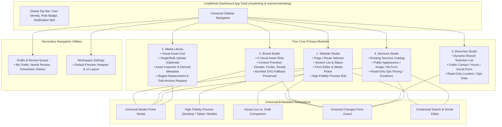
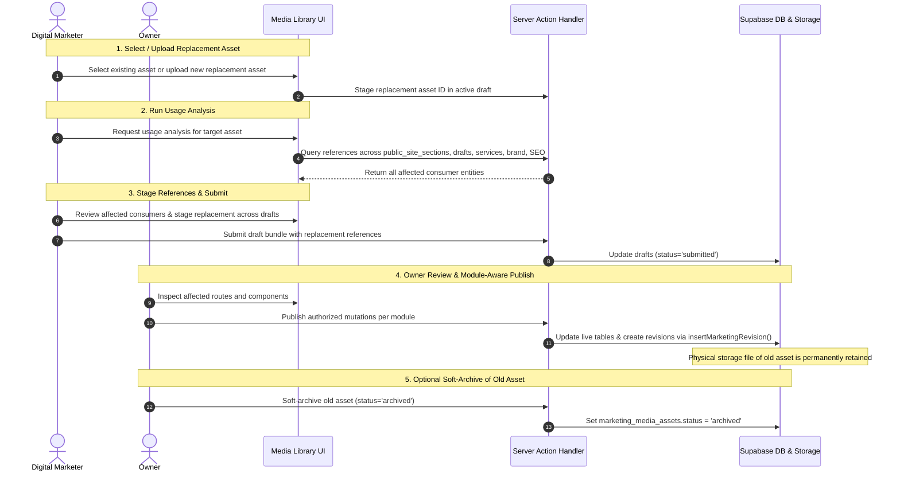

# C4 Digital Marketing Workspace UI/UX and Workflow Plan

**Program:** Controlled Stabilization
**Stage:** C4 — UI/UX and Workflow Planning (DESIGN SPECIFICATION ONLY — ZERO PRODUCT CODE / ZERO SCHEMA MUTATION / ZERO PRODUCTION MUTATION)
**Target:** CradleHub Web — Digital Marketing Workspace (`/marketing`, `/owner/marketing`) & Public-Site Consumers
**Base SHA:** `fb94e2f8163017fae83ab267cfb96ee483dc994c` (Accepted C3 closeout merge commit on `main`)
**Initial C4 Delivery SHA:** `c65f3049370be6eedc3dea8c2d007ead968cd28c`
**Whitespace Cleanup SHA:** `829037f53d14b721245dba6d59389f41c7bc0664`
**Branch:** `stage/c4-marketing-uiux-workflow-plan`
**Date:** 2026-09-01
**Status:** PLAN CORRECTED / AWAITING INDEPENDENT REVIEW (C5+ NOT AUTHORIZED)

---

## A. Stage, Authorization, Branch & Base Identification

1. **Authorization Context:** Following the accepted C3 Scope Freeze merge into `main` (`d19ce34753e09244b8aad0e1d10c964302a33e7c`) and C3 Closeout (`fb94e2f8163017fae83ab267cfb96ee483dc994c`), the owner explicitly authorized C4 UI/UX and Workflow Planning under `GOV-016` and `GOV-017`.
2. **Strict Guardrails:**
   - C4 is **DESIGN, WORKFLOW, AND SPECIFICATION PLANNING ONLY**.
   - Zero product implementation, zero component creation, zero schema/database mutation, zero migration creation or execution, zero Storage policy mutation, zero production mutation.
   - C5+ Coding and implementation remain strictly **NOT AUTHORIZED** until separate explicit owner authorization.
3. **Database & Environment Target:** LOCAL / STABILIZATION REPOSITORY GOVERNANCE. Live production mutations are strictly prohibited.
4. **Evidence & Truth Classification:**
   - Inspected source code and migration files = `VERIFIED REPOSITORY FACT / intended database definition recorded in repo`.
   - Actual live Supabase database/RLS/Storage execution = `UNKNOWN / NOT INDEPENDENTLY VERIFIED`.
   - `REPOSITORY-RECORDED PRODUCTION EVIDENCE` is used strictly where concrete production observations exist in repository records.
5. **Canonical Public Identity & Location Context:**
   - Canonical Public Domain: `SITE_DOMAIN = https://cradlewellnessliving.com`
   - Canonical Primary Location: Bacolod City, Philippines.
   - The workspace and public site represent Cradle Wellness Living in Bacolod City. No cross-project or unproven branch data (e.g. Pampanga/Clark/Telabastagan) is assumed.

---

## B. C3 Frozen Constraints Carried Forward

The following frozen boundaries and architectural contracts established in C3 (`docs/audits/C3_MARKETING_SCOPE_FREEZE.md`) govern all C4 design specifications:

1. **Mental Model & User Experience:**
   - `SEE IT → CHANGE IT → PREVIEW IT → SUBMIT → OWNER REVIEWS → PUBLISH SAFELY`.
   - Non-technical Marketer abstraction: Zero technical jargon exposed (no Supabase, JSON, PostgreSQL tables, bucket paths, routes, Git, or deployments).
2. **Five Primary Modules & Two Secondary Views:**
   - Primary: (1) Website Studio, (2) Brand Studio, (3) Branches Studio, (4) Services Studio, (5) Media Library.
   - Secondary: Drafts Queue, Workspace Settings.
   - SEO: Contextual Search & Social integration.
3. **Strict Operational Isolation:**
   - Marketers cannot create/delete branches or services, alter prices/durations/buffer times, toggle operational active statuses, or access operational booking/CRM/attendance data.
4. **Owner-Only Publication & Explicit Audit Revision:**
   - Marketers create and submit drafts (`digital_marketer`); only Owners (`owner`) can approve, schedule, or publish live content.
   - Every live mutation must write an audit record to `marketing_content_revisions` via `insertMarketingRevision()`.

---

## C. Global Marketing Workspace Information Architecture



---

## D. Global Shell and Layout Specification

1. **Dashboard Shell Integration:**
   - The Digital Marketing Workspace embeds natively inside the existing CradleHub dashboard shell (`src/components/features/dashboard/sidebar.tsx`).
   - No redundant secondary sidebar is created.
   - Default route for `/marketing` and `/owner/marketing` lands on **Website Studio**.
2. **Visual Tokens & Theme Contract:**
   - **Shell Background:** `--cs-bg: #F5F2EE` (Warm cream canvas).
   - **Card / Panel Surfaces:** `--cs-surface: #FFFFFF`, warm surface `--cs-surface-warm: #FAF8F5`.
   - **Dividers & Borders:** `--cs-border: #EAE4DC`, soft border `--cs-border-soft: #F0ECE5`.
   - **Sidebar Shell:** `--cs-sidebar: #1E1916`, active state `--cs-sidebar-active: #332C28`.
   - **Marketing Identity Accent:** Muted Purple `#7A5A8A` with background tint `rgba(122, 90, 138, 0.15)` for active module pills and marketing badges.
   - **Primary Action Family:** Cradle Sand (`--cs-sand: #A67B5B`, hover `--cs-sand-dark: #8A6347`, light `--cs-sand-light: #C4966E`).
   - **Focus Rings:** Explicit `var(--cs-focus-ring)` (`0 0 0 3px rgba(166,123,91,0.2)`) on all interactive controls.
   - **Typography:** DM Sans for all dashboard UI controls; Playfair Display is restricted strictly to high-fidelity public content previews.

---

## E. Website Studio UI/UX Specification

### 1. Section Source-of-Truth Classification
Repository inspection reveals that not all public homepage areas currently possess database rows in `public_site_sections`. Website Studio classifies sections into two distinct operational groups:

#### Category A: Existing Managed Section Contracts (Proven Database Backing)
- **`hero`:** Backed by `PUBLIC_SITE_SECTION_DEFAULTS` and `public_site_sections`.
- **`about`:** Backed by `PUBLIC_SITE_SECTION_DEFAULTS` and `public_site_sections`.
- **`quote_banner`:** Backed by `PUBLIC_SITE_SECTION_DEFAULTS` and `public_site_sections`.
- **`before_you_book`:** Backed by `PUBLIC_SITE_SECTION_DEFAULTS` and `public_site_sections`.
- **`signature_services`:** Checked dynamically in `HomePageSections` (`src/components/public/home-page-sections.tsx`); lacks seeded defaults in repository constant.
- **`gallery`:** Checked dynamically in `HomePageSections`; mapped to `public_site_assets`.

#### Category B: Currently Static Public Components / Future Management Candidates
The following homepage components are currently backed by static constants or hardcoded component copy in the repository:
- `Experience` (Spa experience highlights)
- `Choose Your Setting` (Setting selector)
- `Why Guests Choose Cradle` (Value pillars)
- `Wellness Team` (Staff highlights)
- `Reasons Guests Visit` (Guest benefits)
- `Contact Presentation` (Homepage contact teaser)

> [!IMPORTANT]
> **Source-of-Truth & Persistence Gap for Category B:**
> C4 specifies the target editing UX for these areas, but explicitly records: `SOURCE OF TRUTH / DRAFT PERSISTENCE = UNRESOLVED IMPLEMENTATION DEPENDENCY`. The system does NOT silently assume `public_site_sections` rows already exist for Category B. A future authorized schema/seed stage must establish their persistence.

### 2. Route-Level Page Content vs. Homepage Section Editing
- **Homepage Section Editing:** Manages sections mounted on the root `/` route.
- **Dedicated Route-Level Pages (`/about`, `/contact`, `/branches`, `/services`, `/book`):** Governed by route-level page layouts. Future marketing management of route-level static pages is distinguished from modular homepage section editing.

### 3. Layout & Workspace Hierarchy
- **Header Bar:**
  - Page Selector: `Home` (default), with tabs/selectors for distinct public routes (`About`, `Contact`, `Before You Book / Info`).
  - Global Page Action: Live Status indicator (`Published`, `Draft in Review`, `Unsaved Changes`), View Live Page link, Unsaved Changes Guard status.
- **Three-Pane Split View (Desktop ≥ 1280px):**
  - **Left Pane (280px) — Section List:**
    - Displays Category A managed sections with primary badges, and Category B candidates marked with status pills (`Managed Live` vs. `Static Component`).
    - Section Item Card: Title, enabled badge (`is_enabled`), status indicator (`Live`, `Draft`, `Needs Review`), selection highlight.
  - **Center Pane (Flexible 480px–600px) — Form Editor:**
    - Structured, friendly field controls mapping directly to schema fields without exposing JSON:
      - **Content Tab:** Section Title (`title`), Subtitle (`subtitle`), Main Body copy (`body` with multi-line auto-expanding editor), CTA Button Label (`cta_label`), CTA Link Destination (`cta_href` with controlled route/anchor picker), Section Visibility Toggle (`is_enabled`).
      - **Images Tab:** Primary Image (`image_url` via Universal Media Picker), Secondary Image (`secondary_image_url` for split layouts), Image Alt Text (`alt_text`).
      - **Search & Social Tab:** Contextual Page Meta Title, Meta Description, Social OG Image.
  - **Right Pane (Flexible min 420px) — High-Fidelity Preview Rail:**
    - Sticky preview rendering live component layout with viewport switcher (Desktop, Tablet, Mobile) and mode switcher (Draft, Live, Side-by-Side Compare).
- **Footer Action Bar:**
  - `Digital Marketer`: `Save Draft` (Secondary button), `Submit for Review` (Primary Sand button with optional reviewer note dialog).
  - `Owner`: `Save Draft / Working Copy` (does NOT perform direct live mutation), `Request Changes` (with note), `Schedule Publication`, `Publish to Live Website` (Primary Sand button dispatching to authorized publisher).

---

## F. Brand Studio UI/UX Specification

### 1. Asset Slot Architecture
Brand Studio organizes identity assets into **6 dedicated card slots** corresponding to logical brand settings:
1. **Primary Logo (`logo_primary`):** Full horizontal brand logo for light backgrounds.
2. **Light / Reversed Logo (`logo_light` / `logo_reversed`):** White/light logo for dark navigation bars and footers.
3. **Dark Logo (`logo_dark`):** Monochromatic dark logo for high-contrast light surfaces.
4. **Logo Mark / Emblem (`logo_mark`):** Standalone circular emblem/mark for compact mobile headers and app icons.
5. **Favicon (`favicon`):** 32x32 / 48x48 icon for browser tabs.
6. **Social Sharing Image (`social_image`):** 1200x630 OpenGraph card image for Facebook/Twitter previews.

### 2. Slot Card Interaction Pattern
- Each card displays:
  - Asset Slot Title & Purpose description.
  - Thumbnail Preview Box with background checkerboard / surface toggle (Light vs. Dark background preview).
  - Current Asset Metadata: File dimensions, format, resolution health indicator.
  - Action Controls: `Replace Asset` (opens Media Picker), `Revert to Bundled Fallback` (restores bundled static vector).
- **Live Context Previews:**
  - Public Site Header Simulation (Desktop & Mobile).
  - Public Site Footer Simulation.
  - Social Media Card Preview (Facebook/iMessage share simulation).
- **Verified Fallback Assets:**
  - Horizontal Brand Logo: `@/assets/brand/cradle-logo-horizontal.svg`
  - Logo Mark / Icon: `@/assets/brand/cradle-logo-mark.svg`
  - If a slot has no uploaded asset, the UI automatically falls back to these verified bundled static vectors. Any future additional bundled variants are labeled as proposed.

---

## G. Branches Studio UI/UX Specification

### 1. Dynamic Branch Selection
- **Dynamic Branch Grid:** Renders all existing canonical branch records retrieved dynamically from the database.
- **Strict Guardrails:** NO hardcoded branch names in the design system; NO "Add Branch"; NO "Delete Branch"; NO operational settings access.

### 2. Field Classification & Visual Boundaries
- **Public Presentation & Contact (Marketer Candidate Editable via Draft):**
  - Public Phone Number (`phone`).
  - Secondary / Mobile Phone (`secondary_phone`).
  - Public Contact Email (`email`).
  - Facebook Page URL (`fb_page`).
  - Facebook Messenger Link (`messenger_link`).
  - Public Opening Hours Copy (`opening_hours`).
  - Public Branch Photos (`photos` via Media Picker).
- **Shared Canonical Location & Identity (Read-Only to Marketers):**
  - Branch Name (`name`), Street Address (`address`), City (`city`), Barangay (`barangay`), Coordinates (`latitude`, `longitude`), Place ID (`place_id`), Maps Embed URL (`maps_embed_url`), Sort Order (`sort_order`).
  - Clearly styled in disabled container with badge: *"Managed by Branch Setup / Owner"*.
- **Operational Parameters (Prohibited / Hidden from Marketers):**
  - Active Status (`is_active`), Booking Slot Interval (`slot_interval_minutes`), Free KM Radius (`home_service_free_km`), Extra KM Fee (`home_service_extra_km_fee`), Resource allocation, Staff schedules.

### 3. Proposed Branch Draft Interaction Contract
- **Problem:** Database enum currently lacks `content_type = 'branch'` in `marketing_content_drafts`.
- **C4 Evaluation & Recommendation:**
  - **Preferred Contract:** Introduce a dedicated `content_type = 'branch'` in a future separately authorized schema/migration stage, pairing it with an isolated branch draft review pipeline.
  - **Alternative Contract:** Owner-only direct branch contact editing until a formal reviewed draft pipeline is authorized.
  - **Prohibited Workaround:** C4 explicitly rejects hijacking `content_type = 'brand'` or abusing other unrelated content types to bypass schema governance.
  - **Governance Requirement:** `Any new 'branch' content_type / schema change = OWNER DECISION REQUIRED + DATABASE/SECURITY AUTHORIZATION REQUIRED`.

---

## H. Services Studio UI/UX Specification

### 1. Catalog Presentation Hierarchy
- **Master Services Catalog List:** Displays existing catalog services grouped by category.
- **Strict Prohibition:** NO "Add Service", NO "Delete Service", NO operational pricing/duration mutation.

### 2. Field-by-Field Source-of-Truth Recommendation
To preserve catalog integrity without breaking operational booking/CRM consumers, C4 evaluates each service marketing field:

| Presentation Field | Verified Repository Fact | Recommended Target Destination | Side Effect & Consumer Analysis | Governance / Decision Status |
| :--- | :--- | :--- | :--- | :--- |
| **Public Image (`image_url`)** | `services.image_url` is consumed by `getPublicServiceCatalog()`. | Master `services.image_url`. | Updates public service card image across `/services` and `/book`. Safe for marketing presentation. | **RECOMMENDATION** (C5 implementation dependency) |
| **Image Alt Text (`image_alt`)** | `services.image_alt` exists in master table. | Master `services.image_alt`. | Provides accessible description for public image. Safe for marketing presentation. | **RECOMMENDATION** (C5 implementation dependency) |
| **Public Title / Display Name** | `services.name` is canonical identity used by therapist booking, CRM, cashier, and receipts. | **Destination A (Recommended):** Store public presentation title in `services.metadata.public_title` (or `branch_services.public_title` if branch-specific). **Do NOT overwrite `services.name` directly.** | Overwriting `services.name` directly would silently rename operational services across internal staff dispatch, POS, and historical booking logs. | **RECOMMENDATION — OWNER DECISION REQUIRED** |
| **Public Description** | `services.description` is public-facing copy consumed by catalog. | Master `services.description` (or `services.metadata.public_description`). | Safe for marketing copy adjustments. | **RECOMMENDATION** (C5 implementation dependency) |
| **Featured Badge (`is_featured`)** | `branch_services.is_featured` exists per branch; master `services` uses `metadata`. | Master `services.metadata.is_featured` for global catalog, or `branch_services.is_featured` for branch-specific. | Highlights service on public homepage signature services list. | **RECOMMENDATION — OWNER DECISION REQUIRED** |
| **Operational Parameters (`price`, `duration`, `buffer`, `category`, `delivery`)** | Master `services` + `branch_services`. | **READ-ONLY IN MARKETING STUDIO.** | Changing these modifies cashier pricing, appointment duration grids, and therapist eligibility. Prohibited in Marketing Studio. | **FROZEN REPOSITORY FACT** |

---

## I. Media Library UI/UX Specification

### 1. Grid-First Asset Browser
- **Toolbar:**
  - Search Bar: Real-time search across asset titles, alt text, and section tags.
  - Category / Section Filter: `All Media`, `Homepage`, `Services`, `Branches`, `Brand`, `Archived`.
  - View Mode: Grid (Thumbnail cards with title and badge) vs. List (Detailed table with dimensions and usage count).
  - Upload Trigger: `+ Upload Image` button (single upload required; bulk upload is optional and non-blocking for V1).
- **Asset Card:**
  - High-resolution thumbnail with aspect-ratio preservation.
  - Asset Title and Section Tag pill.
  - Usage Count Badge (e.g. `Used in 3 places`).
  - Lifecycle Status Badge: `Draft` (Slate), `Submitted` (Amber), `Approved` (Blue), `Published` (Emerald), `Archived` (Muted Gray).
  - Selection Checkbox for batch archive requests.

### 2. Asset Inspector & Derived Metadata Drawer
- Opening an asset slides out a comprehensive Inspector Drawer:
  - Full-size Image Preview with zoom capability.
  - **Editable Metadata:** Asset Title, Image Alt Text (required, min 3 chars), Assigned Section Key.
  - **Derived File Specifications:** File dimensions (e.g. `1920 x 1080 px`), File Size (e.g. `420 KB`), MIME Type (`image/webp`), Upload Timestamp, Uploaded By.
  - **Usage Location Tracker:** Live list of every section, service, or draft referencing this asset URL.
  - **Actions:**
    - `Replace Image File`: Stages replacement asset across affected drafts (see Section S for safe workflow).
    - `Request Soft-Archive` (Digital Marketer): Opens usage warning dialog and submits archive request.
    - `Finalize Archive` (Owner): Soft-archives asset (`status = 'archived'`).
    - **NO Hard-Delete Button:** Hard deletion is completely excluded from the UI layout.

---

## J. Drafts Secondary Workspace

1. **Unified Draft & Review Queue (`/marketing/drafts` & `/owner/marketing/drafts`):**
   - Central dashboard tracking all pending and historical marketing content changes.
   - **Filter Tabs:**
     - `All Drafts`
     - `My Drafts` (Filter by current user)
     - `Needs Review` (Drafts submitted for owner approval)
     - `Changes Requested` (Drafts sent back with owner review notes)
     - `Scheduled` (Approved content with target publication dates)
     - `Publication History` (Immutable log of published content revisions)
2. **Draft Queue Table Columns:**
   - **Target Content:** Section/Entity Name (e.g., `Home > Hero Section`, `Signature Massage`).
   - **Module:** Badge (`Website`, `Brand`, `Branches`, `Services`, `Media`).
   - **Draft Status:** Canonical lifecycle badge (`draft`, `submitted`, `changes_requested`, `approved`, `published`).
   - **Last Modified:** Relative timestamp and author name.
   - **Review Note:** Preview of latest review feedback.
   - **Actions:** `Edit Draft`, `Preview Changes`, `Review / Publish` (Owner).

---

## K. Settings Secondary Workspace

1. **Workspace UI Preferences (`/marketing/settings`):**
   - **Default Preview Viewport:** Preferred preview mode upon opening Website Studio (`Desktop (1280px)`, `Tablet (768px)`, `Mobile (375px)`).
   - **Comparison Mode Default:** Side-by-side vs. Overlay Slider.
   - **Editor Layout:** Form & Preview side-by-side vs. Tabbed Focus view.
2. **Strict Guardrails:** No speculative notification email dispatchers, no global theme token editors, and no database credential management.

---

## L. Contextual SEO Interaction Pattern

1. **Route-Level Architecture:**
   - `marketing_seo_settings` stores SEO metadata keyed by `route_path`.
   - Verified public routes on `SITE_DOMAIN` (`https://cradlewellnessliving.com`):
     - `/` (Home)
     - `/services` (Services Catalog)
     - `/book` (Online Booking)
     - `/branches` (Branch Locations)
     - `/about` (About Cradle)
     - `/contact` (Contact & Hours)
     - `/products` (Wellness Products)
     - `/home-service-massage-bacolod` (Home Service Bacolod Landing)
     - `/massage-spa-bacolod` (Spa Bacolod Landing)
2. **Interaction & Mapping Design:**
   - **Website Studio:** "Search & Social" tab maps directly to the specific page/route being edited (e.g. `/`, `/about`, `/contact`). It does NOT generate conflicting SEO records per homepage sub-section.
   - **Services Studio:**
     - The `/services` route owns page-level Search & Social metadata.
     - Individual service cards manage card presentation copy (`public_title`, `public_description`, `og_image_url`).
     - Future individual service-detail SEO (e.g. dedicated deep-link pages) requires a separately authorized route/product decision.
3. **Form Fields:**
   - Page Meta Title (Character meter: optimal 50–60 chars).
   - Meta Description (Auto-resizing textarea: optimal 120–155 chars).
   - Social Sharing Image (OG Image via Media Picker: optimal 1200x630px).
   - Live SERP & Social Card Preview (Google search snippet & Facebook/iMessage share simulation).

---

## M. Universal Media Picker Design

1. **Modal / Sheet Architecture:**
   - Reusable modal launched from any image input in Website, Brand, Branches, Services, or SEO.
   - Preserves originating editor form state in background without page refresh or data loss.
2. **Picker Layout & Workflow:**
   - **Header:** Search input, category filter dropdown, `+ Upload New` button.
   - **Main Area:** Visual thumbnail grid with infinite scroll / pagination.
   - **Sidebar (Selected Asset Preview):**
     - Thumbnail, title, dimensions, file size.
     - **Alt Text Input:** Required field; auto-populates with existing asset alt text; prompts user if empty.
     - **Selection Button:** Prominent `Select Asset` button returning the chosen asset URL, alt text, and ID to the originating form.

---

## N. High-Fidelity Preview Design

1. **Component-Grounded Rendering:**
   - Previews render the actual public-facing React components (`src/components/public/...`) fed directly with draft state in memory.
   - Eliminates discrepancy between editor mockups and live website behavior.
2. **Viewport Simulation Controls:**
   - `Desktop`: 1280px fixed-width container with responsive scaling.
   - `Tablet`: 768px portrait container with realistic padding and navigation.
   - `Mobile`: 375px mobile viewport with mobile carousel and touch layout.
3. **Mode Switcher:**
   - `Draft Mode`: Renders proposed draft changes.
   - `Live Mode`: Renders currently published public website state.
   - `Compare Mode`: Visual comparison mode.

---

## O. Live vs. Draft Comparison Design

1. **Side-by-Side Split View:**
   - Two parallel viewport panes (Left: `Live Published`, Right: `Proposed Draft`).
   - Synchronized scroll behavior: Scrolling in one pane scrolls the other simultaneously.
2. **Visual Diff Highlighting:**
   - Changed text blocks highlighted with subtle green border/background tint.
   - Replaced images flagged with a `Changed` badge.
   - Field-by-Field Diff Summary toggle: Expandable list showing `Old Value` vs. `New Value` for rapid review by Owners.

---

## P. Unsaved Changes Guard Design

1. **Form Dirty-State Tracking:**
   - Real-time comparison between current form values and baseline loaded state.
   - Unsaved state indicator: Pulse badge in top bar (`Unsaved Changes`).
2. **Navigation Interception:**
   - Intercepts in-app tab navigation, sidebar module switches, and browser unload events (`beforeunload`).
   - **Confirmation Dialog:**
     - Title: *"You have unsaved changes"*
     - Message: *"Leaving this page will discard your recent copy and image selections."*
     - Buttons: `Discard Changes` (Destructive style), `Save Draft & Continue` (Secondary), `Keep Editing` (Primary).

---

## Q. Owner Review and Approval Experience

1. **Dedicated Owner Studio (`/owner/marketing`):**
   - Owners access all marketer capabilities plus exclusive review and publication controls.
2. **Module-Specific Dispatch Architecture:**
   - *Current Repository Fact:* `publishMarketingContentDraft()` only handles `content_type = 'section'` to `public_site_sections`.
   - *Target Dispatch Contract:* The universal Owner Review Drawer dispatches to module-specific publisher handlers:
     - **Website Sections:** Calls existing section publisher (writing to `public_site_sections`).
     - **Brand Settings:** Dispatches to brand publisher (target UX; writes to `marketing_brand_settings`).
     - **SEO Settings:** Dispatches to SEO publisher (target UX; writes to `marketing_seo_settings`).
     - **Services:** Dispatches to service presentation publisher (target UX; writes to approved service destination).
     - **Branches:** Dispatches to branch presentation publisher (target UX; unresolved draft pipeline).
3. **Owner Decision Controls:**
   - **Save Working Copy / Draft:** Saves edits to the working draft. Does NOT perform a silent direct-live mutation.
   - **Request Changes:** Opens dialog requiring a written feedback note (`reviewNote`), transitions draft to `changes_requested`.
   - **Approve:** Marks draft as `approved`.
   - **Schedule Publication:** Sets target publication timestamp (for manual execution or future scheduler).
   - **Publish Live:** Executes the module-specific publisher, updates live tables, creates an immutable record in `marketing_content_revisions` via `insertMarketingRevision()`, triggers Next.js path revalidation, and displays success toast.

---

## R. Five Required Usability Missions (Click-by-Click Target Workflows)

### Mission 1: Replace Website Logo
1. **Entry Point:** Marketer navigates to `/marketing` and clicks `Brand` in primary sidebar.
2. **Click Sequence:**
   - Marketer locates **Primary Logo** card slot.
   - Clicks `Replace Asset` button on the card.
   - Universal Media Picker modal opens over Brand Studio.
   - Marketer selects `+ Upload New` or chooses an existing vector/image asset from the grid.
   - Marketer types alt text in the picker sidebar: `"Cradle Wellness Living Logo"`.
   - Clicks `Select Asset` button.
3. **Modal / Sheet Usage:** Media Picker modal closes smoothly; logo preview instantly updates on the slot card with a `Draft Changed` pill.
4. **Validation:** Checks format is SVG/PNG/WebP and size is under 5MB.
5. **Draft Behavior:** Brand draft is saved with updated logo asset URL.
6. **Review Behavior:** Marketer clicks `Submit for Review`, enters note: *"Updated primary logo to refreshed vector asset."* Status changes to `submitted`.
7. **Owner Action:** Owner opens `/owner/marketing/drafts`, views live header preview simulation, clicks `Approve & Publish`.
8. **Error Recovery:** If asset fails to load, slot card automatically falls back to verified bundled vector (`@/assets/brand/cradle-logo-horizontal.svg`) and displays alert.
9. **Responsive Behavior:** On mobile (375px), slot card stacks vertically with full-width replace button.
10. **Success Confirmation:** Green toast: *"Primary logo successfully published to live website."*

---

### Mission 2: Change Existing Branch Public Phone Number
1. **Entry Point:** Marketer navigates to `/marketing` and clicks `Branches` in sidebar.
2. **Click Sequence:**
   - Marketer dynamically selects the target existing branch record from the branch grid.
   - Editor form opens showing branch public contact details.
   - Shared location fields (`Address`, `City`, `Coordinates`, `Maps Embed`) are displayed in grayed-out read-only container with badge *"Managed by Branch Setup / Owner"*.
   - Marketer clicks on `Public Phone Number` input field.
   - Enters updated contact phone number.
3. **Modal / Sheet Usage:** No modal needed; inline form validation triggers on blur.
4. **Validation:** Phone format validation verifies valid number structure.
5. **Draft Behavior:** Unsaved Changes indicator pulses; marketer clicks `Save Draft`.
6. **Review Behavior:** Marketer clicks `Submit for Review` with note: *"Updated branch customer contact phone."*
7. **Owner Action:** Owner reviews submitted branch draft in `/owner/marketing/drafts`, compares old vs. new number, clicks `Publish`.
8. **Error Recovery:** Invalid phone format highlights input in red with message: *"Please enter a valid contact phone number."*
9. **Responsive Behavior:** Single-column layout on mobile with sticky submit bar at bottom.
10. **Success Confirmation:** Banner notification: *"Branch contact details updated successfully."*

---

### Mission 3: Safely Remove/Archive an Expired Model Photo After Seeing Every Usage
1. **Entry Point:** Marketer navigates to `/marketing` and clicks `Media Library` in sidebar.
2. **Click Sequence:**
   - Marketer uses Search Bar to find target asset.
   - Clicks on asset card in grid; Inspector Drawer slides in from right.
   - Marketer scrolls to **Usage Locations** section in drawer.
   - Inspects active usage links across sections, services, and drafts.
   - Clicks `Request Soft-Archive` button.
3. **Modal / Sheet Usage:** Usage-Impact Warning Dialog opens displaying: *"This image is actively referenced in public content. Archiving will retain the file to prevent broken links, but flags it as inactive in the media browser."*
4. **Validation:** Requires marketer to enter an archive reason (e.g. *"Licensing contract expired"*).
5. **Draft Behavior:** Asset status transitions to `submitted` for archive review.
6. **Review Behavior:** Request appears in Owner's review queue under `Media Archive Requests`.
7. **Owner Action:** Owner inspects usage locations, stages replacement image in affected sections, and clicks `Finalize Archive`.
8. **Error Recovery:** If marketer accidentally requests archive, they can click `Cancel Request` prior to owner finalization.
9. **Responsive Behavior:** Inspector opens as full-screen modal on mobile viewports (< 768px).
10. **Success Confirmation:** Toast: *"Asset soft-archived. Underlying file retained for link integrity."*

---

### Mission 4: Change an Existing Service's Public Marketing Image Without Touching Price/Duration/Eligibility
1. **Entry Point:** Marketer navigates to `/marketing` and clicks `Services` in sidebar.
2. **Click Sequence:**
   - Marketer clicks on the target existing service from the catalog list.
   - Service Presentation Editor opens.
   - Operational parameters (`Price`, `Duration`, `Category`, `Delivery Modes`) are displayed dynamically from the database in a read-only side summary card labeled *"Operational Service Parameters (Managed by Service Operations)"*.
   - Marketer hovers over `Public Marketing Image` slot and clicks `Change Image`.
   - Universal Media Picker modal opens.
   - Marketer selects replacement image asset.
   - Enters Image Alt Text (required, min 3 characters).
   - Clicks `Select Asset`.
3. **Modal / Sheet Usage:** Media Picker modal returns asset; editor displays preview of service as seen on public `/services` page.
4. **Validation:** Operational fields have zero input handles and cannot receive cursor focus or change events.
5. **Draft Behavior:** Service marketing draft is saved with new image URL and alt text.
6. **Review Behavior:** Marketer clicks `Submit for Review`.
7. **Owner Action:** Owner opens review drawer, verifies operational pricing/duration is untouched, and clicks `Publish Service Presentation`.
8. **Error Recovery:** If image URL fails to load, service card renders fallback placeholder with service title icon.
9. **Responsive Behavior:** 2-column on desktop, single stacked column on tablet/mobile.
10. **Success Confirmation:** Toast: *"Service presentation updated on public website and booking page."*

---

### Mission 5: Change Homepage Hero Copy/Image and Preview Exact Desktop/Mobile Result Before Submission
1. **Entry Point:** Marketer navigates to `/marketing` (lands on `Website Studio > Home`).
2. **Click Sequence:**
   - Marketer selects `Hero` section from the left section list.
   - Form editor loads Hero fields in center pane: Title, Subtitle, CTA Button, Primary Image.
   - Marketer updates Hero title copy (e.g., illustrative copy: `"Experience Tranquility & Healing at Cradle Wellness Living"` — *UI EXAMPLE — NOT CURRENT DATA*).
   - Clicks `Choose Image` on Primary Image slot; selects new high-res hero image from Media Picker.
   - Right Preview Rail immediately updates live in memory.
   - Marketer clicks `Mobile (375px)` icon on Preview Rail toolbar.
   - Preview container shrinks smoothly to 375px showing exact mobile carousel layout, font wrapping, and CTA thumb reachability.
   - Marketer clicks `Desktop (1280px)` icon to verify wide desktop hero layout.
   - Marketer toggles `Compare` mode to see side-by-side split diff against currently live Hero.
3. **Modal / Sheet Usage:** Viewport and mode toggles switch seamlessly within the sticky preview rail without opening modals.
4. **Validation:** Title character length meter indicates optimal length.
5. **Draft Behavior:** Autosave updates draft in memory; marketer clicks `Save Draft`.
6. **Review Behavior:** Marketer clicks `Submit for Review` and types review note.
7. **Owner Action:** Owner opens `/owner/marketing`, selects submitted Hero draft, toggles mobile preview, clicks `Publish Live`.
8. **Error Recovery:** Marketer can click `Revert to Live` button at any time to discard unsubmitted draft changes.
9. **Responsive Behavior:** On tablet/mobile devices, the Preview Rail is accessed via a floating `Preview` action button that slides open a full-height preview sheet.
10. **Success Confirmation:** Toast: *"Hero section published live. Changes are now visible to desktop and mobile visitors."*

---

## S. Media Usage, Replace, and Archive Workflow



### 9-Step Safe Media Replacement Workflow:
1. **Select / Upload Replacement:** Marketer uploads or selects the replacement asset in Media Library.
2. **Execute Usage Analysis:** System scans all known C3 consumer references (`public_site_sections`, `public_site_assets`, `marketing_content_drafts`, `services`, branch references, `marketing_brand_settings`, `marketing_seo_settings`, `branch_services`).
3. **Display Affected Consumers:** UI lists every section, service, or draft currently referencing the old asset.
4. **Stage Replacement in Drafts:** The replacement asset URL is staged into candidate drafts. The live website is NOT modified automatically.
5. **Marketer Submits Drafts:** Marketer submits the updated drafts for review.
6. **Owner Inspects Changes:** Owner reviews visual diffs across all affected routes and components.
7. **Owner Executes Live Publication:** Owner publishes the reviewed drafts via module-specific publishers.
8. **Permanent File Retention:** The physical file of the old asset is permanently retained in Storage to prevent broken historical URLs.
9. **Owner Finalizes Archive:** Owner marks the old asset record as `status = 'archived'`.

---

## T. Responsive Layouts & Breakpoint Grid

The Marketing Workspace UI adapts across 6 standard viewport widths:

| Viewport | Device Target | Layout Behavior | Navigation & Panel Behavior | Touch Targets |
| :--- | :--- | :--- | :--- | :--- |
| **320px** | Compact Mobile | Single-column task flow | Collapsed hamburger sidebar; preview opens in full-screen modal; bottom action bar. | Min 44x44px |
| **375px** | Standard Mobile (iPhone SE/13 mini) | Single-column task flow | Floating action buttons; tabbed section selector; bottom sheet preview. | Min 44x44px |
| **414px** | Large Mobile (iPhone Plus/Max) | Single-column task flow | Expanded card layout; sticky save/submit bar. | Min 44x44px |
| **768px** | Tablet Portrait (iPad) | 2-Column Split (List + Editor) | Collapsible sidebar; preview accessible via sliding side sheet or split toggle. | Min 44x44px |
| **1024px** | Tablet Landscape / Small Laptop | 2-Column Split with floating preview | Persistent sidebar; side-by-side Form and Preview pane. | Standard (36px+) |
| **1280px+** | Desktop / Large Monitor | Full 3-Pane Layout | Persistent sidebar, Section List (280px), Form Editor (520px), Sticky Live Preview (480px+). | Standard (36px+) |

---

## U. Accessibility Rules (A11y Standards)

1. **Focus Visibility:**
   - All interactive controls (inputs, buttons, tabs, dropdowns, modal triggers) MUST attach `var(--cs-focus-ring)` on `:focus-visible`.
   - `outline: none` without replacement is strictly forbidden.
2. **Accessible Form Associations:**
   - Every input, textarea, and toggle MUST have an explicit `<label htmlFor="...">` with matching `id` or wrap the input control inside `<label>`.
3. **Screen Reader & Live Feedback:**
   - `ActionNotice` and form status banners MUST include `role="status"` and `aria-live="polite"`.
   - Modals and Drawers MUST implement focus trapping, `aria-modal="true"`, `role="dialog"`, and `Escape` key dismissal.
4. **Color Contrast & Indicators:**
   - All text must meet WCAG AA contrast ratio of at least 4.5:1 against its background.
   - Status indicators (e.g. `draft`, `published`, `archived`) must combine color with text badges or distinctive icons; color alone is never used to communicate state.

---

## V. Empty, Loading, Error, and Permission States

1. **Empty States:**
   - *No Media Found:* Illustrative icon, message ("No media assets match your search"), and `Clear Filters` / `Upload New` buttons.
   - *No Active Drafts:* "All caught up! No drafts currently pending review." with button to `Create New Draft`.
2. **Loading & Skeleton States:**
   - Form fields and preview panes display subtle shimmer skeleton loaders matching exact layout dimensions to prevent layout shifts.
   - Button actions show inline loading spinners with accessible text (`Saving draft...`, `Publishing live...`).
3. **Error Handling & Recovery:**
   - Inline field validation errors appear directly beneath the input with clear corrective instructions (e.g., *"Alt text must be at least 3 characters long"*).
   - Network failure banner displays error message with a `Retry Action` button without discarding filled form data.
4. **Role Permission Boundaries:**
   - If a Digital Marketer attempts to access `/owner/marketing`, the system displays a friendly `Access Restricted` state with a button redirecting to `/marketing`.

---

## W. Interaction and Data Contract Resolutions

| Contract Item | Verified Repository Fact | Target UX Requirement | Recommendation | Security / Data Risk | Implementation Dependency | Owner Decision Required? |
| :--- | :--- | :--- | :--- | :--- | :--- | :---: |
| **1. Branch Draft Persistence Gap** | Database enum currently lacks `content_type = 'branch'`. | Marketer can edit public branch copy in draft and submit for review. | **Preferred:** Introduce dedicated `content_type = 'branch'` in authorized schema stage. **Alternative:** Owner-only direct branch editing until draft pipeline exists. (Reject hijacking `brand` type). | Low; drafts are completely isolated from operational booking tables. | Requires C5 schema/draft handler specification. | **YES** |
| **2. Service Source-of-Truth Decision** | Catalog data spans `services` and `branch_services`; `getPublicServiceCatalog()` consumes master `services`. `services.name` is operational catalog identity. | Marketers edit public service copy/images without touching operational pricing/durations or renaming CRM catalog. | **Recommendation:** Destination for marketing image/alt is master `services.image_url` / `image_alt`. Destination for public title/description is `services.metadata` (or presentation overrides). **Do NOT overwrite `services.name` directly.** | High if `services.name` is overwritten; zero risk if isolated to presentation fields. | C5 service draft publisher implementation. | **YES** |
| **3. Service Draft → Live Publish Mapping** | `publishMarketingContentDraft()` throws error if `content_type !== 'section'`. | Owner can approve and publish service presentation drafts to live catalog. | Extend `publishMarketingContentDraft()` server handler to support `content_type = 'service'` writing to approved service presentation fields. | Overwriting operational fields; mitigated by strict whitelist of presentation fields. | Server action extension in C5. | **YES** |
| **4. Brand Draft → Live Publish Mapping** | Brand settings reside in `marketing_brand_settings` (`value` JSONB); no draft publish pipeline exists. | Marketer proposes brand logo/favicon; Owner reviews and publishes live. | Create brand draft publisher that updates `marketing_brand_settings.value` and triggers `revalidatePath('/', 'layout')`. | Breaking site-wide header/footer logo; mitigated by bundled static SVG fallback. | Server action extension in C5. | **YES** |
| **5. SEO Draft → Live Publish Mapping** | SEO settings reside in `marketing_seo_settings` and `buildMetadata()` constants; draft publish pipeline is missing. | Marketers manage Search & Social metadata per route in draft; Owner publishes live. | Create SEO draft publisher updating `marketing_seo_settings` and triggering route revalidations. | Malformed meta tags; mitigated by structured form controls with length limits. | Server action extension in C5. | **YES** |
| **6. Website Section Image Alt/Link Persistence** | `public_site_sections` table lacks first-class `alt_text` column (`alt_text` is in drafts and `metadata`). | Image alt text is preserved when published to live public site. | Store `alt_text` inside `public_site_sections.metadata` JSONB upon publish, and read via existing metadata helpers. | Missing alt text degrading public SEO/a11y; mitigated by structured metadata helper. | Client/server metadata parsing in C5. | **NO** (Within existing schema) |
| **7. Media Hard-Delete Enforcement Gap** | Product rule is PROHIBITED; migration defines DELETE policy for owner/marketer; live Storage policy is UNKNOWN. | Hard delete is excluded from product UX; only non-destructive soft-archive exists. | Remove UI delete buttons; in future security stage, update Storage DELETE policy to reject browser client deletion. | Direct client bypass via Supabase SDK; mitigated by omitting client delete methods and enforcing soft-archive. | Storage policy update in authorized security stage. | **YES** |
| **8. Owner Direct-Edit Audit Consistency** | Direct mutations in `/owner/marketing` write to `public_site_sections` without calling `insertMarketingRevision()`. | Every live mutation produces an immutable revision record. | Refactor owner direct mutation server action to unconditionally invoke `insertMarketingRevision()`. | Unaudited live copy changes; eliminated by standardizing server mutation pipeline. | Server action refactor in C5. | **NO** (Strict adherence to C2/C3 contract) |
| **9. Desktop / Mobile Public Parity** | Desktop Home reads `public_site_sections`; Mobile Home hardcodes static copy and slides. | Mobile Home dynamically displays published section copy and slides. | Refactor `PublicMobileHome` and `MobileHomeHeroCarousel` to consume `public_site_sections` props. | Visual divergence between desktop and mobile visitors; resolved by unified data flow. | Public consumer refactor in C5. | **NO** (Mandated by MKT-001) |

---

## X. Security-Gap Planning Decisions & Server Architecture

1. **Current Verified Server Architecture:**
   - Marketer Actions: `src/app/(dashboard)/marketing/actions.ts`
   - Owner Marketing Actions: `src/app/(dashboard)/owner/marketing/actions.ts` (enforces `requireOwner()` boundary).
   - Shared Query Helpers: `src/lib/queries/marketing-content.ts` (enforces authenticated role checks).
   - *Architecture Recommendation:* A future centralized mutation boundary (e.g. `src/actions/marketing.ts`) is a **RECOMMENDATION** for code organization, not an existing repository fact.
2. **Defense-in-Depth for Media Deletion:**
   - UI excludes all hard-delete controls.
   - Client-side code in `/marketing` will contain zero invocations of `supabase.storage.from(...).remove()`.
   - Soft-archiving updates metadata `status = 'archived'`.
3. **Strict Server-Side Mutation Boundaries:**
   - All draft saving, submission, review, and publishing actions execute through dedicated server actions protected by server-side session authentication and role verification (`requireOwner()`).
   - Browser clients never write directly to PostgreSQL tables via client Supabase SDK.

---

## Y. Performance Measurement Plan

Before authorizing caching or speculative performance optimizations in C5, the following baseline metrics must be measured in the live staging/local environment:

1. **Workspace Initial Load Latency:** Time to load `/marketing` shell and fetch initial section drafts. *(BASELINE REQUIRED BEFORE OPTIMIZATION — PROPOSED SLO CANDIDATE: < 800ms — NOT MEASURED — OWNER DECISION REQUIRED AFTER BASELINE)*
2. **Section Switch Latency:** Time to switch between section editing forms. *(BASELINE REQUIRED BEFORE OPTIMIZATION — PROPOSED SLO CANDIDATE: < 100ms — NOT MEASURED — OWNER DECISION REQUIRED AFTER BASELINE)*
3. **Media Picker Modal Opening & Search Latency:** Time from clicking "Choose Image" to grid rendering. *(BASELINE REQUIRED BEFORE OPTIMIZATION — PROPOSED SLO CANDIDATE: < 400ms — NOT MEASURED — OWNER DECISION REQUIRED AFTER BASELINE)*
4. **High-Fidelity Preview Render Timing:** Frame render time for responsive viewport switching. *(BASELINE REQUIRED BEFORE OPTIMIZATION — PROPOSED SLO CANDIDATE: < 16ms / 60fps — NOT MEASURED — OWNER DECISION REQUIRED AFTER BASELINE)*
5. **Publish & Revalidation Execution Time:** Total round-trip time for publishing server action + `revalidatePath`. *(BASELINE REQUIRED BEFORE OPTIMIZATION — PROPOSED SLO CANDIDATE: < 1500ms — NOT MEASURED — OWNER DECISION REQUIRED AFTER BASELINE)*

---

## Z. Required Later Implementation Evidence and C5 Sequence

### 1. Required Verification Evidence (C5 Target Gates)
1. **Type Safety & Build Verification:** `pnpm build` and `tsc --noEmit` exit code 0.
2. **Unit & Integration Test Suite:** Vitest tests covering all marketing server actions, role verification, revision creation, and draft lifecycle transitions.
3. **Interactive Usability Verification:** Successful execution of the 5 acceptance missions in test environment.
4. **Accessibility Audit:** 100% compliance with focus rings, label associations, and 44x44px touch targets.
5. **Audit Trail Verification:** Proof that every live update inserts a corresponding row in `marketing_content_revisions`.

### 2. Recommended C5 Correction-Pass Sequence
1. **Pass 1 — Public Consumer Parity & Component Grounding:** Refactor `PublicMobileHome` to consume `public_site_sections` and ground public components for preview isolation.
2. **Pass 2 — Central Media Library & Universal Picker:** Implement `Media Library` grid, Inspector drawer, usage tracker, and `Universal Media Picker` modal.
3. **Pass 3 — Website Studio & High-Fidelity Preview:** Implement Website section editor, viewport preview rail, Live vs Draft diff, and Unsaved Changes Guard.
4. **Pass 4 — Brand, Branches, and Services Studios:** Implement Brand asset slots, Branches public presentation editor, and Services marketing copy editor.
5. **Pass 5 — Draft Queue, Owner Review Studio & Audit Trail:** Implement Drafts queue, Owner review drawer, change request workflow, and live publishing with automatic `insertMarketingRevision()` audit logging.

---

```
============================================================
C4: PLAN CORRECTED / AWAITING INDEPENDENT REVIEW
C5+: NOT AUTHORIZED
============================================================
```
