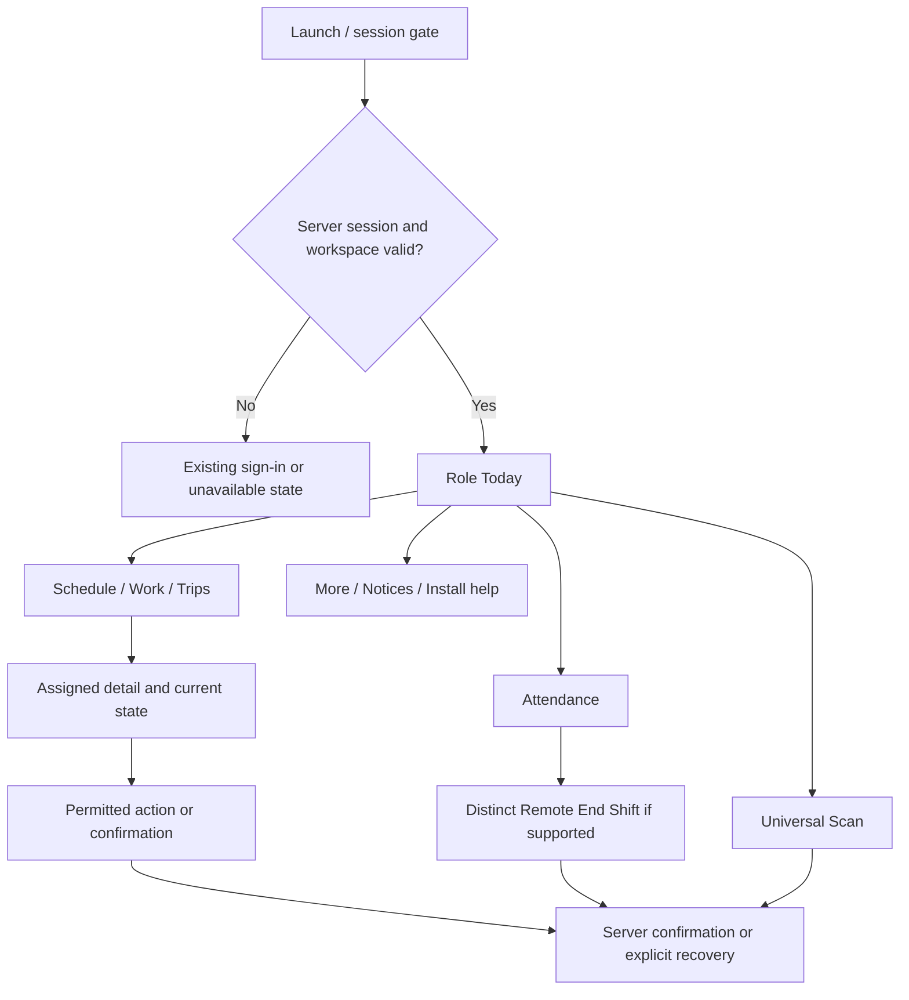
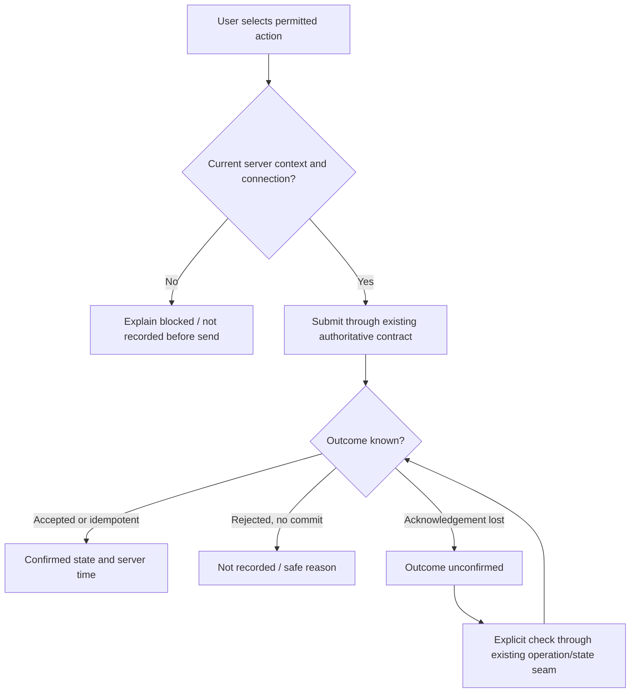
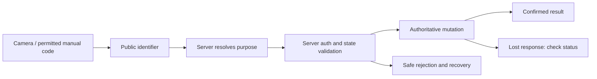
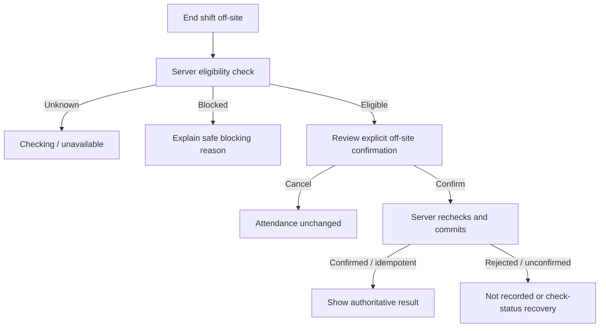

# CradleHub Staff PWA — PWA-C4 UI/UX Specification

**Stage:** PWA-C4 — UI/UX Specification, design/specification only.  
**Status:** READY FOR EXTERNAL REVIEW — NOT ACCEPTED / NOT MERGED.  
**Accepted C3/main:** `3c069f198db8a6341b6bf27758cdbec24d344089`.  
**Branch:** `stage/pwa-c4-uiux-specification`.  
**Authority:** [PWA-GOV-006](../11-DECISION-LOG.md#staff-pwa-decisions); latest owner C4 instruction.  
**Stop:** No runtime implementation, routes, server actions, database/schema/migrations, Auth/RLS/Storage changes, production access/mutation, deployment or merge. **PWA-C5+ remains NOT AUTHORIZED.**

## 1. Purpose, evidence and binding contracts

Design an operational phone companion that tells staff what is happening, what is next, what needs attention and what action is safe. One hand should reach frequent actions. One screen has one dominant operational action; status reading must never look like a mutation. Avoid analytics tiles, marketing banners, decorative charts and speculative reports. Preserve forest green, gold accents and cream/slate identity without copying desktop CRM layout.

The accepted [C3 freeze](PWA-C3-FINAL-SCOPE-FREEZE.md) and its PWA-C3-D001–D021 decisions remain binding. C4 specifies presentation and acceptance criteria, not new permissions, product states, a second database or offline authority. C3's old stage-stop wording is historical; GOV-006 authorizes only this specification. The [C4 handoff](PWA-C4-HANDOFF.md) owns delivery status.

### Evidence ledger

| Evidence | What this specification uses | Limit |
| --- | --- | --- |
| [C1 truth map](PWA-C1-TRUTH-MAP.md), [C2 diagnostics](PWA-C2-STRUCTURED-DIAGNOSTICS.md), accepted C3 | Operational authority, consumers, role/route gaps, snapshot/push/attendance seams | Repository evidence does not certify current production or devices |
| Owner-provided visual references (General/CRM, Utility, Therapist, Driver) | Visual hierarchy, card anatomy, scanner viewfinder framing/corners, checkmark confirmation badges, header profile/bell layout | Visual design references only; do not override accepted C3 or authorize new features. Illustrative task checklists (Utility/CRM) and route lines/ETAs (Driver) do not unblock backends or authorize client-side route fabrication |
| `src/app/globals.css`: internal `--cs-*` and `.sp-public` `--sp-*` blocks | Existing DM Sans body family, forest `#163A2B`, gold `#C8A96B`, cream `#F7F3EB` inspiration | Public/internal token scopes remain separate; do not apply `.sp-public` to the PWA or change CRM tokens |
| `src/app/(dashboard)/utility/page.tsx` | Role check, Coming Soon text and planned-module cards; no operational Work payload | Planned copy is not a task backend or authorization |
| `src/lib/bookings/progress.ts` | Shared progress helper and labels | Broader helper transitions differ from frozen C3 presentation; see dependency C4-G01 in section 10 |
| UI/UX Pro Max local search; accessibility skill | Functional hierarchy, readable controls, focus and recovery considerations | Generic generated landing-page/palette output was rejected; no generated design-system file or new icon/font dependency is adopted |
| Official W3C, Apple and web.dev guidance, linked in sections 16/18 | Accessibility and install platform constraints | Public documentation research only; no CradleHub production browsing or real-device testing |

**Evidence labels:** design values below are **C4 SPECIFICATION**, source observations are **VERIFIED REPOSITORY FACT**, calculated color ratios are **LOCAL DOCUMENTATION CHECK**, and deployed/device/provider behavior is **UNKNOWN / NOT VERIFIED**. Any historical production statement remains **REPOSITORY-RECORDED PRODUCTION EVIDENCE**. No database target is accessed.

## 2. Design language and compact tokens

Use warm flat page surfaces, white work cards, forest actions and restrained gold identity accents. Information order, not decoration, creates hierarchy. No glass overlays on text, animated gradients, oversized greeting panels or auto-rotating content. Light surfaces are the specified baseline; C4 adds no theme selector. Honor forced-colors/high-contrast settings and verify host/browser appearance later.

These are semantic design names, not CSS implementation or a replacement for existing shared tokens. PWA-C5 must map them in an isolated Staff PWA scope after authorization.

| Token role | Value / usage |
| --- | --- |
| Page / surface | `#F7F3EB` cream / `#FFFFFF` white |
| Primary / pressed | `#163A2B` forest / `#10261D`; white label on both |
| Accent | `#C8A96B` gold with forest text; identity marker only, never sole status or thin control boundary on white |
| Text / secondary | `#1E293B` slate / `#475569` slate; on white or cream |
| Success / On Shift chip | `#1A4A2A` text/icon on `#EEF8F2` (or `#E8F5E9` soft green); include check icon and confirmed wording |
| Warning / pending chip | `#654600` text/icon on `#FFF4DB`; include age or blocked reason |
| Error / destructive action | `#9B1C20` text/border on `#FDEBEC`; solid `#9B1C20` action uses white text; outline for secondary destructive controls |
| Control border | `#64748B` where boundary identifies an input/control; 1 CSS px |
| Decorative separator | `#EAE4DC` / `#E2E8F0`; never the only control boundary or focus cue |
| Confirmation badge | 64–72 px circular green badge (`#1A4A2A` / `#2E7D32`) with centered white checkmark (`✓`) |
| Focus | 3 CSS px forest outline with 2 px white separation; inverse white outline on forest regions; verify adjacent colors |
| Disabled | Retain readable text/reason and clear disabled semantics; no opacity-only state meaning |
| Spacing | 4, 8, 12, 16, 24, 32 CSS px; 8 within related groups, 16 within cards, 24 between sections |
| Radius | 10 px controls; 14–16 px work cards; 18 px sheet top corners; pill for short status chips |
| Elevation | Flat cards plus separator; subtle shadow only for a sticky bar/sheet above content, never state authority |
| Icon | Existing consistent vector family; 20/24 px visual inside at least 48 × 48 CSS px target; text label for navigation |
| Motion | 120 ms press feedback; up to 180 ms sheet entrance/exit; no bouncing Scan, map-marker interpolation or success confetti; reduced motion removes translation |

| Type role | Size / line height / weight | Rule |
| --- | --- | --- |
| Page title | 24 / 30 px / 700 | DM Sans or existing system fallback; wraps naturally |
| Section/work title | 20 / 26 px / 600 | Sentence case; no all-caps role titles |
| Body / action / input | 16 / 24 px / 400 or 600 | Input text remains readable; never shrink to fit |
| Secondary / status | 14 / 20 px / 400 or 600 | Not lower-contrast merely because secondary |
| Bottom navigation | 12 / 16 px / 600 | Always visible labels at default text size; expanded-layout rule below |
| Time / timer | 24 / 30 px / 600, tabular numerals | Label as server-derived status; timer alone never enables completion |

Reuse DM Sans and existing fallbacks; no new font download. A small existing wordmark may retain the brand display face; operational labels do not use decorative serif. Long names, addresses and rejection text wrap. Ellipsis is permitted for secondary previews only when the full text is available on a permitted detail screen, never for safety reasons, branch, next action or state.

## 3. Global mobile shell and responsive behavior

### Shell hierarchy

```text
System safe area
TopBar: brand wordmark (left) + notification bell (badge count) + user avatar (right)
Today Greeting Block: "Good morning, [Name]" + role/shift chip + branch / business date
ConnectivityBanner: persistent when not online; readable inline region
Main: current work → next action → next work → attendance
BottomNav: five destinations, center Scan action
System gesture safe area
```

Use one main vertical scroll region. Top bar is sticky, default minimum 56 px plus top safe inset; it grows for text. On Today, the top bar presents the brand wordmark on the left, with an operational notification bell (with unread badge counter when supported) and compact user avatar (32–36 px circle) on the right. On inner views (Active Service, Schedule, Messages/Notices, Profile/More), the top bar transitions to an accessible Back navigation control (`<` or `X`), centered view title, and contextual secondary action (`...` or settings). Below the sticky header on Today sits the staff greeting block: "Good morning, [Name]" with an inline status pill (e.g. "Therapist • On Shift") and right-aligned branch & business date (e.g. "Thu, Apr 24 / Main Branch"). No hide-on-scroll header or navigation. Bottom navigation is minimum 64 px plus bottom safe inset. The center Scan control has a 56 px target within its own cell, with icon and label; it does not protrude over content. Other targets are at least 48 px. Contextual primary actions live in the work card; do not stack a floating CTA over the Scan bar.

Main content clearance equals the **measured** bottom bar height plus bottom safe inset plus 16 px. Safe insets are applied once, not twice in installed mode. Use the available visual viewport rather than assuming fixed browser chrome. In landscape, also account for left/right insets. These are layout requirements, not CSS edits.

| Phone viewport width | Side gutter | Main content width before safe insets | Default composition |
| --- | --- | --- | --- |
| 320 px | 12 px | 296 px | Single column; stacked card metadata; no inline action pairs |
| 360 px | 16 px | 328 px | Single column; primary full-width action |
| 375 px | 16 px | 343 px | Same hierarchy; at most two short metadata fields per row |
| 390 px | 16 px | 358 px | Same hierarchy; card titles may use two lines |
| 412 px | 20 px | 372 px | Same actions and order; more text, not more modules |
| 430 px | 20 px | 390 px | Same order; no desktop table or dashboard expansion |

Bottom navigation uses the full safe width with five equal cells at default text size, independently of content gutters. No horizontal nav scrolling. Use the short visible label **Notices** for the C3 Messages/Notices destination. At text scaling where any label cannot fit, replace the fixed five-column layout with an in-flow wrapping navigation list at the end of main content, retaining order and a keyboard/screen-reader skip link to navigation; keep Scan reachable from the page action area. Never reduce text or clip labels to preserve the dock. Measure both arrangements in later implementation.

At 600–767 px, keep a centered reading column of at most 560 px and the same navigation. At 768 px and above, permit list/detail or map/detail columns only when each is at least 320 px; otherwise stack. Cap the operational canvas at 960 px. This is secondary tablet behavior, not a desktop CRM redesign. On short landscape viewports, remove sticky content actions and let header/nav flow if they obstruct the task; do not lock orientation.

### Launch, context and interruptions

| Condition | Presentation / interaction |
| --- | --- |
| Initial authenticated launch | Stable wordmark + “Opening your workspace…”; no minimum artificial splash delay or cached customer name before session validation |
| Valid identity, role and branch loaded | Open the authorized Today or validated internal deep link; present role in More and on Today if it disambiguates the workspace |
| Unauthenticated / expired session | Existing sign-in/recovery experience; preserve only a safe internal destination, never replay an operation after sign-in |
| Session check offline or failed | “Can't verify your session. Connect and try again.” No private cached workspace disclosure during unauthenticated launch |
| Role/capability changed | Refresh server context, stop pending new submissions, suppress unauthorized data/actions; show “Your access has changed” and safe home/back action |
| Branch / business day | Visible branch and server-derived business date on Today, Schedule and Attendance; no client timezone replacing branch authority; no invented branch switcher |
| Header Notice entry | 48 px button labeled “Notices”; count only if source provides it; if unsupported, omit button and explain in the conditional Notices destination |
| Keyboard | Scroll focused field and error into view; move sheet actions into flow; hide fixed dock while editing if needed, restore on blur, no content jump or forced keyboard dismissal |
| Back / cancel | Detail returns to originating list and retained safe scroll position; sheet closes first; never interpreted as rollback of a sent request |
| App background / external Maps return | Release camera; do not promise location capture continues; on return revalidate identity, trip and outstanding operation before enabling mutations |
| Logout | Stop capture and clear sensitive in-memory presentation; invoke existing logout contract; if server logout fails, remain locally concealed and offer retry, not a false account-wide revocation claim |

### Sheets, confirmations and focus

Scanner is full-screen on phones, not a small camera inside a bottom sheet. Short read-only details may use a sheet at most 85% of available viewport; long or keyboard forms use a full-height dialog. Every sheet has a heading, explicit close control and an accessible back/Escape path. Opening moves focus to heading or first meaningful control; background is inert; closing restores trigger focus. No nested modal stack: confirmation replaces the current sheet with a clear return path.

Confirm actions with material irreversible meaning: service completion, terminal trip action, Remote End Shift and logout during an unresolved operation. Name the record/action in the confirmation using only permitted fields. “Cancel” and the explicit verb are separate controls; destructive styling is reserved for consequential actions, not ordinary navigation. During server processing, disable duplicate submission, announce processing and permit leaving the view with a warning that leaving does not cancel the request. Recovery follows section 7.

## 4. Role navigation and destination ownership

Scan is an action button, not a selected page tab. Destination links expose the current page; Scan returns to the source destination after a result. Four destination links plus one Scan action form the five-position dock.

| Approved operational group | Ordered destinations | Owner and conditional rules |
| --- | --- | --- |
| Therapist | Today · Schedule · Scan · Progress · More | Existing Staff/service-provider authority |
| Nail Tech | Today · Schedule · Scan · Progress · More | Same provider shell, role text and assigned services |
| Aesthetician / Facialist | Today · Schedule · Scan · Progress · More | Same provider shell; long role label wraps outside dock |
| Salon Head | Today · Schedule · Scan · Progress · More | Same provider shell; no new supervisory controls pending Q005 |
| CRM / General Staff | Today · Work · Scan · Notices · More | Personal work only; Notices means C3 Messages/Notices; CRM shortcuts require existing server capability |
| Utility | Today · Work · Scan · Notices · More | Work opens unavailable explanation; Scan/schedule/attendance/notices only when independently authorized; no fabricated Work data |
| Driver | Today · Trips · Scan · Map · More | Dedicated `/driver` ownership; do not broaden Staff Portal access to rescue conflicting links |

Existing Manager/Owner authorization/correction contexts do not produce new Staff-PWA operational groups. A role label is not an access grant. For unauthorized known actions show an explanatory blocked state where necessary; omit irrelevant sensitive destinations/data. A conditional destination retained in the frozen dock must open an honest unavailable page, not a dead click or permission bypass. Never redirect Utility through the known Staff Portal loop.

`Today`, `Progress`, `Map` and the screen IDs below are **design destinations**, not instructions to create routes. PWA-C5 and relevant role stages must map to inspected existing routes/consumers. Existing `/scan/[publicCode]` remains the server-owned Scan seam; the client does not invent an intent route. More groups account/profile, own schedule if not in the dock, Attendance, conditional off-site End Shift, notice settings, install help and sign out. No statistics, reports or broad admin menu is added.

## 5. Screen inventory and hierarchy

Each row inherits global loading/empty/error/offline/access/scale behavior; specific states follow. IDs are design references only.

| Screen ID | Screen / presentation | Parent / entry | Primary purpose and source | Later stage owner |
| --- | --- | --- | --- | --- |
| C4-S01 | Launch / session gate | Installed/browser/deep-link launch | Resolve current authenticated workspace; no local authority | C5 |
| C4-S02 | Today, seven role variants | Dock / safe home | Current work, next work, attention, attendance from authorized sources | C8/C9/C10/C11 |
| C4-S03 | Own schedule / day detail | Schedule dock or More | Branch business-date appointments/assignments; read-first | C8/C9/C10 |
| C4-S04 | Provider Progress | Provider dock | Current assigned service, timer, next permitted step | C8 |
| C4-S05 | Appointment detail | Today/Schedule/Progress | Minimum service/customer/provider/room information and permitted transition | C8 |
| C4-S06 | Personal Work | CRM/general dock | Existing own schedule/work and narrow authorized shortcuts | C9 |
| C4-S07 | Notices list / unsupported state | Dock/header/More | Existing permitted operational notices; no new messaging backend | C9/C10/C15 |
| C4-S08 | Notice detail / guarded destination | Notice selection or deep link | Existing notice or authorized target; no payload-granted action | C15 |
| C4-S09 | More | Dock | Account, Attendance, install/notification help and supported links | C5 and role stages |
| C4-S10 | Attendance detail | Today card / More | Server state, branch/day, next action, trust and correction entry | C7 |
| C4-S11 | Device activation/recovery | Attendance or Scan rejection | Existing activation/replacement/recovery flow with status and expiry | C7 |
| C4-S12 | Correction/reviewer handoff | Attendance explanation | Existing restricted correction pathway or informational escalation | C7 |
| C4-S13 | Full-screen Scanner | Any allowed Scan entry | Capture public code only | C6 |
| C4-S14 | Scan result/recovery | Server scan response | Confirmed outcome, rejection or unresolved request | C6/C7/C8 |
| C4-S15 | Remote End Shift | Attendance / Driver More when supported | Eligibility, confirmation, server result; distinct off-site action | C14 |
| C4-S16 | Trips list | Driver dock / Today | Own active/next/finished trips from existing assignment source | C11 |
| C4-S17 | Active trip / trip detail | Trips/Today/Map summary | Current trip, permitted transitions, navigation and snapshot controls | C11 |
| C4-S18 | Driver Map | Driver dock / active trip | Permitted destination and timestamped snapshots, map failure recovery | C12/C13 |
| C4-S19 | Utility Work unavailable | Utility Work dock | Explain current lack of supported Work information | C10 |
| C4-S20 | Notification settings | More / Notices | Contextual permission and existing subscription lifecycle | C15 |
| C4-S21 | Install guidance | More / optional launch guidance | Android prompt or iPhone manual help, installed/unavailable variants | C5 |
| C4-S22 | Confirmation/result dialog | Consequential command | Shared confirmed/cancelled/processing/recovery presentation | Relevant feature stage |
| C4-S23 | Existing sign-in/recovery | S01/session expiry | Reuse existing authentication; no new Auth flow | C5 presentation integration |
| C4-S24 | Access unavailable / safe return | Route, role or assignment denial | Explain without exposing unauthorized record contents | C5 and role stages |



## 6. Today, Schedule and More composition

Today answers, in order: **what am I doing now; fastest safe next action; what is next; anything requiring action; attendance state**. Critical unresolved-operation or trust/eligibility blockers appear above the affected action, not hidden below the fold. Attendance is a persistent compact card, never implied by a service state. If there is no active work, the next assignment becomes the leading card. Do not fill empty space with analytics or fabricated tasks.

| Role | Current / next | Attention and attendance | First safe action |
| --- | --- | --- | --- |
| Therapist | Assigned service, next booking time/type | Missing room or assignment conflict; separate clock state | Open Progress; Scan to start only at valid frozen step |
| Nail Tech | Assigned nail service, next appointment | Same shared conditions; no invented station allocation | Open service detail / eligible Scan |
| Aesthetician / Facialist | Assigned facial/service, next appointment | Only permitted service instructions; no new sensitive treatment-history panel | Open service detail / eligible Scan |
| Salon Head | Own active/next assigned service | Existing permitted supervisory notice only; unresolved mapping unavailable | Own Progress; no new team-management workspace |
| CRM / General Staff | Own current schedule/work from proven source | Existing operational notices and separate attendance | Open Work or Attendance; only authorized CRM shortcut |
| Utility | Attendance and own schedule only if supported | “Work is unavailable” inline explanation, existing notices if supported | Attendance/Scan only with proven capability; otherwise explain unavailable access |
| Driver | Active assigned trip, next trip, explicit snapshot-sharing status | Trip/return blocker and separate attendance | Open active trip; map/navigation are secondary read/handoff controls |

Canonical wireframes below use placeholders, not customer/staff data. Width and field wrapping follow section 3.

```text
PROVIDER TODAY                     DRIVER TODAY
Today       [Notices]              Today       [Notices]
[Branch] • [business date]         [Branch] • [business date]
[Connectivity if relevant]         [Connectivity if relevant]
CURRENT SERVICE                   ACTIVE TRIP
[Service] • [server state]         [Trip label] • [server state]
[Permitted customer label]         [Permitted destination summary]
[Room] [assigned providers]        [Last shared time / not sharing]
[Open progress / safe action]      [Open active trip]
NEXT [time + service]              [View map] [Open navigation]
ATTENDANCE [state] [View]          NEXT TRIP [server information]
[Notices needing attention]        ATTENDANCE [state] [View]
Today Schedule Scan Progress More Today Trips Scan Map More
```

Schedule is a single-column dated list using server branch business date, with Today and previous/next day controls only where existing own-schedule scope permits. Show date, time, service/work type and state; selection opens S05 or existing personal detail. A date tap is navigation, never clock-in or service start. Loading and failed reads cannot become “No assignments”. Missing date authority shows “Schedule date unavailable” and retry. No cross-staff roster, drag/reschedule, availability editor or statistics is introduced.

More shows identity/role/branch first, then permitted self-service links, then help/settings and sign out. Driver links remain inside dedicated ownership or a verified permitted existing destination. “Notices unavailable” or “Schedule unavailable for this role” is honest when the backend/capability is not proven. Do not present a “Coming soon” delivery promise.

## 7. Shared action, connectivity and recovery contract

Presentation states are not new database statuses. Every operational action follows current server identity, assignment, state, device and policy checks. Reading a card does not initiate a user command; the existing Attendance read-side recalculation exception is documented in section 9.

| UI state | Trigger / copy | Controls / transition |
| --- | --- | --- |
| ONLINE | Network appears available and latest required server context loaded | Actions still require server authorization; network indicator is not a success guarantee |
| OFFLINE | Browser reports offline | Persistent “Offline. Connect to record changes.”; safe previously loaded read-only data shows timestamp; block new mutations |
| RECONNECTING | Connectivity returns but context/result not revalidated | “Reconnecting. Checking current status…”; refresh safe reads, do not auto-replay commands |
| Processing | User submitted; server outcome pending | Specific verb, e.g. “Starting travel…”; one in-flight submission per operation; no green success |
| Confirmed | Authoritative accepted or recognized-idempotent result | State + server time + specific confirmation; refresh affected surfaces; user dismisses, no rapid auto-dismiss |
| REQUEST FAILED | Error or connection loss | Explain whether outcome is known; retry is explicit, not automatic |
| NOT RECORDED | Request never sent, or server explicitly confirms no committed change | “Not recorded. Connect and try again.” or the returned safe reason; keep prior confirmed state |
| Outcome unconfirmed | Request may have reached server but acknowledgement was lost | “Couldn't confirm the result. Check status before trying again.” Do not assert success or definite rollback; reconcile through existing operation/state seam before retry |
| Stale read | Last authorized data available but not revalidated | “Last checked [time]” with stale/unknown label; no guess of current assignment or eligibility |
| Empty | Successful authorized response contains zero items | “No assigned work for this day”; distinct from unavailable/failed |
| Access rejected | Server denies role/assignment/device/state | Explain allowed reason and safe destination; redact denied record; never broaden role to recover |

“NOT RECORDED” means a known failed recording, not an assertion that a lost acknowledgement rolled back the server. The unconfirmed branch is required to preserve C3's server-authority and no-fake-success rules. For all failures, show no confirmed new operational record until authoritative evidence exists. Existing operation IDs/dedupe are reused; C4 does not invent an endpoint or durable queue. If the existing seam cannot resolve an ambiguous outcome safely, block re-submission and expose the existing reviewer/support route; carry that gap to the relevant feature stage.

Never label operational changes “Queued”, “Will sync later” or “Saved offline”. Cached state cannot enable a mutation by itself. Leaving a processing screen, pressing Back, reloading, backgrounding, or signing back in never silently replays a command. Offline or server failure does not reset an authoritative timer/status to zero. Avoid aggressive polling, especially on Attendance's potentially write-capable read path.



## 8. Universal scanner UX — C4-S13/S14

Every allowed Scan entry opens the same camera experience directly. There is no Attendance / Service Start selector and no service-end QR. Returning from a role detail may preserve a return destination, but cannot preselect or grant QR intent. QR content supplies only the approved public identifier; the server resolves purpose, identity, authorization and state, performs any authoritative mutation, and returns the outcome.

Full-screen camera layout (aligned with owner visual references): top safe area → “Scanning...” header with accessible Close (`X` or `<`) control → high-contrast camera viewfinder featuring rounded white corner brackets `[   ]` and a subtle horizontal green scanline guide → persistent reassuring guidance below the frame: “Point your camera at a Cradle QR code. The app automatically recognizes the code and records the correct action.” (or “Align the QR code within the frame”) → bottom utility row above bottom inset: flashlight toggle icon (left), manual-code/gallery entry icon (right, only where permitted by existing contracts). Do not show a shutter button when detection is automatic. Camera frames are used for decoding only; no arbitrary image upload or photo gallery feature replaces server QR validation.

Result presentation (C4-S14 / Attendance / Service Start confirmation):
- Large centered circular green badge (64–72 px `#1A4A2A` / `#2E7D32`) with crisp white checkmark (`✓`).
- Confirmed status headline: “Clocked In”, “Service Started”, or “Trip Completed” (24 px bold).
- Structured summary card: authoritative server timestamp (e.g. “8:03 AM”), branch name, service title, assigned room, and permitted customer label.
- Warm reassurance banner (e.g. “Welcome to a great day! Thank you for being here. ✨” / “You're all set! Have a great session! ✨”).
- Solid forest green primary action: `[Done]` or `[Back to Home]` (returns to refreshed originating view); secondary link e.g. `[View Attendance]` where appropriate.

| Scanner state | Visible content | Interaction / focus / result |
| --- | --- | --- |
| Permission request | “Allow camera access to scan a CradleHub code” before/native prompt | Scan tap is the user gesture; request once; do not also request notifications/location |
| Permission denied | “Camera access is blocked” with browser/device setting guidance | Retry only after permission change; permitted manual fallback or existing correction help; Close always available |
| Camera unavailable | “Camera isn't available. Close other camera apps or try again.” | Retry camera; no fabricated preview; conditional manual fallback |
| Scanning | Viewfinder with white corner brackets, green scanline + “Align QR code within frame” | Close releases camera; no automatic focus hopping or repeated screen-reader announcements |
| Code detected | Freeze decoder input; “Code detected” | Stop repeated decode submissions; extract only permitted identifier; untrusted content is never rendered as HTML or auto-opened externally |
| Processing | “Checking code…” then only available server progress text | Stop capture; disable Scan again; no local intent choice, success sound or premature green check |
| Confirmed success | Large green check badge, specific server result, e.g. “Clocked In at 8:03 AM” or “Service Started” | Announce once; focus result heading; primary `[Done]` returns to caller with refreshed state; Scan another starts new gesture |
| Rejected / unauthorized | “You can't use this code for this action” plus safe server reason | No access-grant button; existing help/correction route only when permitted |
| Expired / invalid code | “This code is invalid or expired” | Scan again or existing help; no decode-to-success fallback |
| Wrong branch | “This code belongs to another branch” with only safe authorized context | Scan the correct branch code; never a client branch override |
| Wrong state | “This action isn't available in the current state” | View refreshed Attendance/service detail; no ability to force next state |
| Duplicate result | “Already recorded” only when server recognizes the operation/result | Display original authoritative result/time if returned; no second mutation; unresolved duplicate uses Check status |
| Connectivity failure before send | “Not recorded. Connect to scan.” | Camera may close; no queue or local success; explicit restart after revalidation |
| Connectivity loss after send | “Couldn't confirm the result” | Follow section 7's existing-operation reconciliation; do not blindly rescan/reissue |
| Cancel / Back | Before send: close and release camera; after send: explain result may still be recorded | No claim that navigation cancels server work; return focus to Scan and retain safe unresolved-status notice |
| Manual public-code fallback | “Enter code” only where the existing protected public-code contract permits | Labeled input, paste allowed, same server resolution/authorization; no manual intent picker, arbitrary URL launcher or bypass |

If neither camera nor permitted manual fallback is available, provide existing reviewer assistance without granting manager powers. Scanning from Attendance and Progress has the same identifier-only boundary. PWA-C6 must verify permission, malformed input, duplicate, focus return and cancellation cases on supported devices.



## 9. Attendance UX — C4-S10/S11/S12

Attendance detail hierarchy: branch + business date → current authoritative shift state → recorded times → next allowed action → trust/policy reason → existing correction help. “Checked in” on an appointment means the customer/service state, not staff clock-in. Attendance always uses **Clock in / Clock out** terminology and server timestamps, not the phone clock. Do not add GPS attendance.

| State | Presentation and safe next action |
| --- | --- |
| Not clocked in | “Not clocked in” and “Scan attendance code” if available; existing widget entry can be linked as existing check-in flow, never simulated locally |
| Clocked in | “Clocked in at [server time]”, branch and separate schedule; display next server-permitted clock-out action or its reason |
| Late | Add “Late — reported by attendance policy” only if authoritative payload reports it; do not calculate from phone time or service lateness |
| Clock-out eligible | “Clock-out available”; offer the server-required branch Scan or existing permitted portal path; never substitute off-site End Shift silently |
| Clock-out blocked | Specific safe reason beside disabled action, with View work / device recovery / reviewer help as applicable |
| Device not trusted | “This device isn't approved for attendance”; offer existing activation/recovery route, not an “Ignore” button |
| Activation required | Explain approved device activation; existing token entry/link flow; show expiry/used/rejected results from server; do not reveal tokens in summaries |
| Replacement/recovery | Existing request/review/activation state; show “Awaiting review” only if server returns it; no invented approval SLA or extra local device slot |
| QR processing / duplicate / rejection | Reuse S13/S14 and section 7; original authoritative outcome only |
| Read/policy recalculation pending | “Checking attendance policy…”; recorded shift remains visible if safely loaded; eligibility unavailable until authoritative response |
| Read failed / offline | “Attendance couldn't be refreshed”; show last confirmed timestamp only in an authorized session; block eligibility-dependent actions |
| Correction/reviewer escalation | Link to existing restricted flow when authorized; otherwise explanatory instructions to contact the usual supervisor, with no new request form/backend |

### Existing path coexistence — presentation without replacement

| Existing path | C4 representation | Preservation / implementation constraint |
| --- | --- | --- |
| QR attendance and scan events | Universal Scan result and refreshed Attendance card | Keep trusted-device/branch/event/operation authority; no new attendance writer |
| Direct StaffCheckinWidget consumers | Clearly labeled existing attendance entry where currently permitted; do not offer a second parallel submit during QR processing | Preserve source behavior and audit identity; C7 maps consumers before any canonical command reconciliation |
| Portal clock-out / dynamic policy | Show only server-returned eligible action and applicable method; distinguish branch flow from Remote End Shift | No client-derived cutoff or capability; existing portal method does not automatically satisfy every future C14 rule |
| `getMyAttendanceData` recalculation | User sees policy checking; ordinary navigation may invoke the existing read-side recalculation | Do not assert a mutation-free read; do not add prefetch, continuous polling or retries that multiply side effects; Q011 remains implementation gate |
| Corrections / exceptions | Existing reviewer-authorized action only, separate from normal clock-in/out | Preserve reason, audit/source linkage and reviewer boundaries; no new Manager/Owner workspace |
| Device activation/replacement/recovery | Existing flow embedded/linked with recovery status and safe return | Preserve expiry, revocation, existing device trust and server response; no local trust authority |

C4 does not select a replacement RPC, schema, write path or timing formula. C7 must first prove cross-path consistency, authoritative timestamps, operation dedupe and read-side effects on an explicitly authorized target. Completion of a service or Driver trip never automatically clocks out staff.

## 10. Service-provider UX — C4-S04/S05

Therapist, Nail Tech, Aesthetician / Facialist and Salon Head share these exact frozen sequences from PWA-C3-D008. These are operational states, not editable stepper options.

**In-spa:**

```text
not_started → checked_in → session_started → completed
```

**Home service:**

```text
not_started → travel_started → arrived → session_started → completed
```

| Frozen state / context | Visible label and detail | Primary next interaction, only with existing server authority |
| --- | --- | --- |
| `not_started`, in-spa | “Not started”; appointment time, service, permitted customer label, assignment and room if known | View appointment; “Waiting for customer check-in” when that transition is owned elsewhere; no invented provider check-in capability |
| `checked_in`, in-spa | “Customer checked in”; room/resource and assigned providers | “Scan to start service” through universal server-resolved scanner when permitted |
| `not_started`, home service | “Not started”; scheduled service and permitted destination summary | Existing authorized “Start travel” action after viewing destination; no route/ETA promise |
| `travel_started`, home service | “Travel started”; server-confirmed trip/service progress context | Existing authorized “Arrived” action; navigation handoff cannot mark arrival |
| `arrived`, home service | “Arrived”; assigned providers and service/location context | Service Start via existing permitted server contract; universal Scan where that contract requires it; no invented QR bypass if the existing entry is unavailable |
| `session_started`, either | “Session in progress”; server-derived start time and elapsed/remaining display if provided | “Complete service” only when server contract permits; confirmation identifies the service and states “This does not clock you out” |
| `completed`, either | “Service completed” and confirmed time if returned | View next assigned work; Attendance remains its own card; no service-end QR |

Current appointment appears above next appointment. Detail order: service + state → time and delivery type → minimum customer identifier → assignment/provider names needed for coordination → room/location if required → server-derived timer/status → current permitted action. Home address and navigation fields appear only on the active assigned home-service detail where needed, not every schedule row. No sensitive customer history or general contacts panel.

Active Service layout (C4-S04, aligned with Therapist visual reference):
- Header: “Active Service” title with contextual secondary action (`...`) and accessible back control.
- Status indicator: “Service in Progress” soft green chip (`#EEF8F2` / `#163A2B`) paired with a high-contrast tabular countdown/elapsed timer (e.g. `00:24:18`).
- Service summary card: assigned service name (“Swedish Massage”), duration (“60 minutes”), permitted customer label (“Anna M.”), assigned room (“Room 4”), and server-confirmed start time (“Started 10:31 AM”).
- Action row: secondary `[View Details]` outline button alongside server-permitted `[End Service]` / `[Complete Service]` button. Clicking End Service opens an explicit confirmation dialog naming the service and confirming completion; it never clocks staff out of attendance.
- Service notes area: read-only guidelines or authorized notes entry only if supported by existing contracts.

Multi-provider conditions: show only assignment names supplied to this user; distinguish “Your assigned service” from shared booking context. Disable a transition if current server eligibility is unresolved; no local rule that one provider's completion completes another provider or the entire booking. If server reports another provider changed state, refresh and explain “Service status changed”; do not duplicate or reverse their transition.

Blocked and rejected actions use a visible server reason, retained prior confirmed state and safe Refresh/View work control. Timer expiry is a display event, not a completion command or clock-out. On reload, derive time from authoritative timestamps; missing/invalid timestamps show “Timing unavailable”, not zero. Assignment removal conceals detail and sends the user to the authorized list. A completed/cancelled/unavailable booking arriving outside the designed happy path is read-only and cannot be coerced into a valid next step.

**C4-G01 — OWNER DECISION REQUIRED LATER (before conflicting C8 adaptation):** the inspected `src/lib/bookings/progress.ts` general helper also permits in-spa `not_started` directly to `session_started` and includes `no_show`. Accepted C3 freezes the narrower sequences above. C4 adds no extra step/action and does not change the existing helper. PWA-C8 must inspect actual consumers and obtain owner resolution if preserving working behavior conflicts with the frozen sequence. Do not silently remove existing server behavior, invent a “checked in” event, treat a direct result as proof that skipped steps occurred, or broaden the frozen PWA flow. Display the actual server-returned current state without fabricated history; unsupported transitions remain blocked for implementation pending that resolution.

## 11. CRM / General Staff UX — C4-S06/S07

This is a personal operational workspace, not another CRM. Work groups existing own schedule/assigned operational items first, then at most the narrow existing shortcuts that the current server capability grants. Each shortcut identifies the existing destination and uses current authorization; it does not reproduce an admin module in a mobile card.

**Reconciliation with visual references:** The owner-provided visual reference for General Staff displays a “Tasks / Bookings” tabbed view with mockup checklist items (“Walk-in Guest”, “Confirm Booking”, etc.). Under accepted C3 scope freeze (PWA-C3-D009), General Staff is strictly a personal operational view, not a CRM task-management system or ticket board. The checklist items in the visual reference are illustrative only and do not authorize a client-side task creator, task mutation endpoints, or a generic task database in V1.

Today shows current/next personal work, notices needing action and Attendance. Work has a plain list and specific empty/failed/unavailable states, with an optional own-day selector tied to branch business date. Detail remains within existing scope. No synthetic tickets, task assignment, work completion backend, messaging composer, metrics or reports is added. If no authoritative work payload exists for a context, show existing own schedule where permitted, otherwise “Work information is unavailable for this role.”

Bookings administration, Customers administration, Finance, Payroll, Marketing, Reports, Owner workspace and Staff administration remain excluded. A narrow CRM shortcut is available only where accepted C3 and existing server access allow it; URL knowledge or presentation mode is insufficient. Notices reuse section 17. Different CRM/general aliases do not create different permission rules in the client.

## 12. Utility UX — C4-S19 and Today variant

C4 re-inspected `src/app/(dashboard)/utility/page.tsx`: it contains a role-gated Coming Soon page, planned room/cleaning/restock/maintenance descriptions and a Staff Portal backlink; it does not provide authoritative Work records. Those descriptions are not promoted into scope. Existing source-backed evidence therefore does **not** unblock Work.

**Reconciliation with visual references:** The owner-provided visual reference for Utility Staff depicts an illustrative “My Tasks” screen with room cleaning items (“Room 4 - Prepare room”, “Changing Room 2 - Restock towels”, “Lobby - General cleaning”). As established by source inspection of `src/app/(dashboard)/utility/page.tsx`, no authoritative Work or Task management backend exists in the repository. In strict adherence to C3 scope freeze (PWA-C3-D010) and Q009, Utility Work remains strictly **BLOCKED** (C4-S19). The task items depicted in the visual reference represent future roadmap concepts and do NOT authorize a task backend or client-side task management in V1.

**Q009 design resolution:** retain the conceptual Work destination in its frozen position. Selecting it opens S19, an explanatory read-only page, not a disabled dead-end tab:

```text
Work
Work is unavailable
There is no supported work information for this workspace yet.
Use the available Attendance, Schedule or Scan options from Today.
[Back to Today]
```

“Back to Today” stays inside Utility's permitted shell; it never follows the unsafe Staff Portal backlink by default. There is no “Create task”, checklist, empty task counter, retry-to-unblock button, roadmap date or “Coming soon” promise. This resolves blocked labels/interactions; the capability remains **BLOCKED**, and the task-management backend remains **OUT OF V1**.

Utility Today may show Attendance, own schedule, Scan or existing Notices only after each source and action capability is proven. If no such capability is available, show clear unavailable text and permitted account/return controls, not fabricated shift/work cards. Q005 remains open for exact access mapping. The existence of a general staff schedule endpoint does not establish Utility authorization.

## 13. Driver core and map UX — C4-S16/S17/S18

Dedicated `/driver` owns Driver Today, Trips, Scan, Map and More. Existing conflicting Staff Portal links must be mapped later without broadening grants. Driver screens use existing assigned-trip state; the labels below are actions/presentation, not a new trip state enum.

Trips list orders active trip first, next assigned trip second, then other permitted trips for the business day; completed trips are separated by a textual heading. Each row shows only authorized service/destination summary, schedule, current state and assignment reference. No route optimization, cross-driver fleet list, fabricated ETA or arbitrary customer lookup.

Active trip hierarchy: current trip/state → permitted destination → server-allowed next transition → sharing status/last snapshot → external navigation / Map → next trip → separate Attendance. The map is central to spatial context while the server-confirmed action remains unambiguous. Do not encourage interaction while driving; controls are intended for use when safely stopped, without adding a driving-detection feature.

| Driver action | Confirmation/result contract |
| --- | --- |
| Start Travel | Explicit tap on existing eligible assigned-trip action; process server command, then show confirmed travel state. Opening Map/Maps alone does nothing to state |
| Arrived | Explicit existing server-permitted transition; no geofence or phone-location auto-arrival |
| Return / Complete | Display only the server-permitted next verb for the current trip. If the existing contract distinguishes them, retain that distinction; never collapse required Return into Complete. Terminal completion confirmation names the trip and does not clock out |
| Open navigation | Clearly external handoff, sends only approved destination data; show no unverified route/ETA. On return, refresh state, not auto-mark arrival or completion |
| Share current location | Existing one-shot snapshot action for active assigned trip; request location permission contextually; “Location shared at [server time]” only after persistence confirmation |
| End Shift | Separate Attendance/Remote End Shift entry; current active trip blocks the off-site action where applicable |

### Map composition and capture disclosure

Active Trip / Map layout (C4-S17/S18, aligned with Driver visual references):
- Spatial overview: top half renders the map display with verified branch start pin, customer destination marker, and route display. Route polyline, vehicle icon, and ETA (“12 min ETA, 4.2 km Distance”) depicted in visual references represent target presentation for when an authorized routing provider is integrated; client-side route fabrication or continuous tracking claims remain strictly prohibited under C3.
- Synchronization pill: “Live synced to CRM” (`#E8F5E9` / `#163A2B`) reflects server-confirmed persistence of the latest location snapshot, not an active background streaming websocket.
- Trip action card / bottom sheet: En Route status chip, last updated timestamp (“Updated 10 sec ago”), destination address (“123 Lacson Street, Bacolod City”), assigned provider reference (“Therapist: Maria Santos”), and dual actions: `[OPEN NAVIGATION]` (external handoff) and `[MARK ARRIVED]` (authoritative server transition).

Default phone map screen: header → connectivity → trip/state summary → map region (minimum 240 px at ordinary text size, shrinks or moves below details on short viewports) → persistent MapStatusOverlay → accessible textual location/destination summary and controls → dock. Map controls may not cover the state, attribution or OS safe areas. A list/text alternative carries all essential trip and snapshot information. No drawn line between points is presented as a road route; no animation pretends snapshots are continuous movement.

Sharing is a separate visible dimension from map availability and location age. Baseline supported wording is **“Snapshot only — not sharing continuously.”** Permission granted is not proof a snapshot was shared. Automatic foreground capture, if later proven and authorized under Q002, must expose “Sharing while this trip is active” with last confirmed time and explicit stop behavior; it is never enabled or promised by this specification. No background guarantee, hidden capture or implied 24/7 tracking.

| Map condition | Visible state / interaction |
| --- | --- |
| No trip | “No active trip”; no private destination marker; View trips |
| Assigned trip, not active | Authorized destination summary; sharing inactive; Start Travel only through existing eligible action |
| Loading | Stable map placeholder with “Loading map”; textual trip information remains available |
| Permission required | “Location access is needed to share a snapshot”; user taps Share current location to invoke permission |
| Location available | Show only permitted coordinates/marker accuracy when supplied; age and confirmed share time; no claim of continuous tracking |
| Location unavailable / denied | “Location unavailable” with safe permission/retry help; destination text and supported external navigation remain independent |
| Recent | “Recent snapshot · [recorded time / age]” only after an approved threshold contract classifies it; otherwise “Last snapshot [time] — freshness not assessed” |
| Stale | “Location may be out of date · [last time]”; stale marker style + label; offer explicit refresh/share if eligible; no guessed position |
| Offline | “Offline — last snapshot [time]”; cached map only if later cache policy/provider terms allow; otherwise textual last-known authorized summary; no recording queue |
| Reconnecting | “Checking trip and latest location…”; hold sharing/transitions until authoritative refresh |
| Trip ended | “Trip ended — sharing inactive”; stop capture lifecycle, do not retain active marker as a live driver; later retention policy controls stored history |
| Sharing inactive | Explicit “Not sharing”; an old stored snapshot may still exist, so do not claim deletion |
| One-shot capture pending / failed | “Sharing current location…” then server-confirmed time, known NOT RECORDED or outcome-unconfirmed recovery; no premature active indicator |
| Provider map failure | “Map couldn't load”; preserve permitted address/destination text and safe retry/external handoff; do not replace map failure with no-trip |

Q001 (stale threshold), Q002 (foreground cadence), Q003 (background reliability) and Q010 (provider readiness) stay gated. No numeric threshold/cadence is invented. Backgrounding stops any current camera session and cannot be presented as guaranteed tracking; returning requires a fresh state check. Stop-sharing ends future capture; it does not erase previously persisted snapshots. If an implementation cannot reliably stop capture on trip terminal state, logout or capability loss, it fails the later release gate.

## 14. CRM Live Map communication semantics

Specify the shared meaning consumed by the existing CRM Live Operations map; do not redesign that CRM or create a new transport, polling interval or subscription. Server-authorized snapshots, assignment and trip state remain the sources. The repository's 30-second CRM polling interval is not a Driver capture cadence or freshness SLA.

| Communication state | Evidence needed / wording | CRM and Driver implication |
| --- | --- | --- |
| Fresh snapshot | Newly server-confirmed captured sample with valid timestamp; “Snapshot received [time]” | Receipt does not mean continuous feed; both clients must eventually render the same authorized sample in later convergence tests |
| Recent snapshot | Last sample meets later approved Q001 criteria | “Recent · [age]”; exact threshold remains unresolved |
| Stale snapshot | Last sample exceeds later approved criteria | “Out of date · last received [time]”; preserve age, never interpolate a newer position |
| No location | Authorized response confirms no sample | “No location shared”; distinct from request failure |
| Driver offline / unknown | Offline only if an approved authoritative signal establishes it; stale/missing samples alone imply unknown | Default “Driver connection unknown”; CRM's own offline state is labeled separately |
| Trip ended | Server trip terminal state confirmed | Mark sharing inactive for the trip, prevent live interpretation of old location, apply approved retention/access rules later |

If timestamps are missing, inconsistent or in the future, show “Location time unavailable” and do not classify fresh/recent. Q001 must resolve authoritative time comparison and latency acceptance later. No route geometry, ETA or guessed travel promise is generated client-side. Approved provider/server-backed route/ETA requires separate later authorization and verification within accepted Driver scope.

## 15. Remote End Shift UX — C4-S15

Use the title **“End shift off-site”** with supporting copy “A separate attendance action for eligible off-site work.” Enter from Attendance or the supported Driver More entry, never a branch-QR success overlay. Eligibility is checked on entry and again by the server on submit. No map location or completed-service card independently unlocks it.

| Eligibility consideration | Presentation when blocked / unknown |
| --- | --- |
| Open attendance shift | “No open shift” or “Checking your shift”; already-ended result only when server confirms |
| No active service/work | “Finish active work before ending your shift”; View current work if permitted |
| No active Driver trip where applicable | “An active trip is still open”; View active trip, not a bypass confirmation |
| No remaining assignment | “You still have assigned work”; View own schedule/trips |
| Final-assignment state | “Final assignment hasn't been confirmed complete” or “Checking final assignment” |
| Capability | “Off-site end shift isn't available for this account”; no role switch or client approval |
| Timing/policy | Safe server-returned explanation; do not compute a local countdown or cutoff from an assumed formula |
| Return-to-branch expectation where applicable | Explain the actual returned requirement and existing permitted branch flow; no fabricated remote exemption |

Show the highest actionable blocking reason first and other safe reasons in an expandable explanation; expand via button, not hidden tooltip. If any required condition is unknown, show checking/unavailable rather than eligible. Exact timing/policy formula stays unresolved under **PWA-C3-Q004**.

| Interaction state | Content and controls |
| --- | --- |
| Checking eligibility | “Checking whether you can end your shift off-site…”; action disabled; Cancel/Back remains available |
| Eligible | Summary of open shift and final-work context from server; “Review end shift” |
| Blocked | Reason(s) above and safe View work / Attendance / Try check again if appropriate |
| Confirmation | “End your shift off-site?”; server-returned context; “This records an off-site shift end, not a branch scan.” Cancel / End shift off-site |
| Processing | “Ending shift…”; one submission; leaving does not imply cancellation |
| Confirmed ended | “Shift ended off-site at [server time]”; separate confirmed Attendance record; Done to Attendance |
| Already ended / idempotent | “Your shift is already ended” with original authoritative time/method if provided; no second write |
| Connection failure / NOT RECORDED | Before send or known server rejection: explicit not-recorded message; after uncertain send: section 7's check-status recovery, not a false success/failure |

The audit method/source and eligibility remain server-owned. C4 does not invent event/schema/RPC names, approver roles or formula values. Any existing portal action that cannot demonstrate these conditions remains a later C14 contract gate, not a UI bypass.



## 16. Install and standalone experience — C4-S21

Install help is optional in More and as a dismissible post-launch suggestion after work context is loaded. It never covers a critical action, interrupts a scan or repeats immediately after dismissal. Installing does not grant capabilities, authenticate the account or guarantee offline operations. No install analytics or persistence subsystem is introduced by C4.

| Environment/state | UX specification |
| --- | --- |
| Supported Android browser prompt available | Show “Install CradleHub” after platform eligibility is known; the user's tap opens the real browser prompt. A dismissed prompt leaves normal browser use available |
| Prompt unavailable / unsupported browser | “Install isn't available here. You can keep using CradleHub in your browser.” Offer appropriate manual help only if supported; do not simulate an OS prompt |
| iPhone Safari manual install | “Open this site in Safari. Open Share (from More if needed), choose Add to Home Screen, enable Open as Web App where shown, then Add.” Use text instructions that tolerate Safari layout/version differences |
| Already installed / standalone detected | Remove install promotion; show “Opened as an app” in help when known. Do not claim absence of a prompt proves installation |
| Standalone launch authenticated | Same S01 gate, role/branch context and safe-area shell; no assumed cookie/session parity with browser mode |
| Standalone unauthenticated / expired | Existing sign-in and guarded return destination; no background command replay |
| Update available | Non-blocking “Update available” only after actual foundation support; offer safe reload when no unresolved mutation/capture is active. Never reload automatically during work |
| Update / worker error | Explain app could not refresh; preserve safe confirmed view, offer retry at a safe point; no “clear all caches” user command |

Platform basis: browser install prompts require actual platform support and a real install event; a missing event needs fallback guidance, not a fabricated prompt. C4 does not assume iOS supports `beforeinstallprompt`. [web.dev installation prompt guidance](https://web.dev/learn/pwa/installation-prompt). Current Apple guidance uses Safari's Share/Add to Home Screen path and an Open as Web App choice where shown. [Apple iPhone guide](https://support.apple.com/guide/iphone/open-as-web-app-iphea86e5236/ios).

Manifest, registration scope, cache/update ownership and worker/push coexistence are **C5/C15 implementation and verification work**, not selected here. Preserve both existing worker artifacts until Q006 is resolved. Exact supported-device/browser matrix and installed-mode Auth behavior must be verified later; a specification diagram does not prove installability.

## 17. Notifications and notices UX — C4-S07/S08/S20

Reuse existing operational notices and subscription infrastructure. No messaging composer, chat system or speculative notice backend. An unsupported Notices destination renders “Notices aren't available for this workspace” with safe Back; lack of a supported source is not an empty inbox.

| State | Presentation / interaction |
| --- | --- |
| Permission not requested | In notification settings, explain relevant operational notices and offer Enable notifications; request only after that tap, never on launch or combined with camera permission |
| Permission granted, subscription saving | “Setting up notifications…”; no success until existing server subscription path confirms |
| Subscription confirmed | “Notifications enabled on this device”; this confirms setup, not delivery reliability |
| Permission denied | “Notifications are blocked in this browser/device”; settings guidance and keep using permitted in-app notices; no repeated native prompting |
| Unsupported / provider unavailable | “Push notifications aren't available here”; in-app notices remain conditional on existing source |
| Subscription failure / removal failure | Explain failed update, preserve known state or show unconfirmed state; retry through existing scoped contract; do not claim all devices unsubscribed |
| Notices list | Title, safe preview, source-provided time and unread status only if supported; source failure and empty are distinct |
| Unread / read | Text/icon plus weight, not color alone; no guessed counter or new mark-read write. Persist read state only through an existing contract |
| Notice selected | Open permitted detail or guarded internal destination; recheck current role/assignment/session; notice payload never grants action authority |
| Expired or unauthorized deep link | “This item is no longer available”; return to Notices/Today without exposing private preview data |

Lock-screen/browser notification text defaults to a generic operational prompt without customer names, addresses, contact details or precise coordinates. More detailed in-app content is fetched after authorization. No delivery badge, guaranteed alert timing or device/provider success is claimed. Subscription ownership and deployed-policy review remain PWA-C15/C17 gates under Q007; C4 does not fix routes or RLS.

## 18. Accessibility specification and acceptance target

Target **WCAG 2.2 AA** for the later implemented complete flows. Normative checks include normal text contrast at least 4.5:1, large text at least 3:1, meaningful non-text controls at least 3:1, keyboard operation, visible/unobscured focus, programmatic names/states, labels/errors and status announcements. WCAG's minimum target rule is 24 CSS px subject to its exceptions; this PWA deliberately specifies **48 × 48 CSS px** controls and **56 px Scan** for active phone work. [WCAG 2.2](https://www.w3.org/TR/WCAG22/).

Use text enlargement to 200% without clipping; test reflow at the equivalent of 320 CSS px, including 400% browser zoom from a 1280 px viewport. Map imagery may have intrinsic spatial constraints, but essential trip/status/actions must remain in reflowing text outside it. No horizontal scrolling of the operational page. [W3C Reflow guidance](https://www.w3.org/WAI/WCAG22/Understanding/reflow.html).

Modal semantics, contained keyboard focus, Escape/close and logical focus return follow the [WAI-ARIA modal dialog pattern](https://www.w3.org/WAI/ARIA/apg/patterns/dialog-modal/). The specific Staff PWA interaction requirements below are design decisions to verify later, not claims of implemented conformance.

| Concern | Concrete Staff PWA behavior / later acceptance |
| --- | --- |
| Hierarchy | One main heading per screen; meaningful section headings; nav is a named navigation region, not a generic button row |
| Control semantics | Navigation uses links; Scan/submit/expand uses buttons; current destination announced; action names include visible text; decorative icons hidden from assistive technology |
| Screen-reader labels | “Scan code”, “Close scanner”, “Share current location”, “End shift off-site”; include record context only where necessary and permitted |
| Focus order | Header → connectivity explanation → current work/action → next/attendance → navigation; skip links to main and navigation; no positive tab ordering |
| Focus under overlays | Sheet/dialog focus cannot enter background; result focuses meaningful heading; closing returns to original trigger; keyboard never trapped by camera/map |
| Error announcements | Submit rejection announced once and retained inline; manual-code field keeps label/error; multi-error forms focus summary linked to fields |
| Status announcements | Polite announcement for confirmed action/connectivity changes; do not announce every timer tick, camera frame or location-age increment |
| Motion | Respect reduced motion; no pulsing Scan, moving map marker, flashing detector or success animation required to understand state |
| Non-color signals | Text + icon for offline, denied, recent/stale and success; current nav has position/shape/text distinction |
| Touch/gestures | At least 8 px separation between unrelated adjacent actions where practical; explicit buttons replace swipe/drag-only requirements; no swipe-to-complete |
| Text/keyboard | Allow password manager/paste in existing sign-in and permitted manual-code field; retain safe entered text through validation, no forced re-entry except security-required cases |
| Camera alternative | Permitted manual-code path or existing reviewer assistance; no inaccessible camera-only dead end or invented permission bypass |
| Map alternative | Text summary and explicit navigation/refresh controls; meaningful markers labeled when exposed; no essential action depends on panning |
| Font/long content | Long role, branch, customer-safe label and server reason wrap; dock adapts as section 3 specifies; no shrinking safety copy |
| Short viewport | Focused input/result remains visible above keyboard and dock; sticky regions move into flow before covering controls |
| Authentication | Existing accessible sign-in/recovery preserved; explain session expiry and safe return; never ask a user to solve a new memory puzzle to enable attendance |

Local color arithmetic verified section 2's pairs: white/forest 12.54:1; slate/cream 13.22:1; secondary/white 7.58:1 and secondary/cream 6.85:1; forest/gold 5.58:1; success pair 9.40:1; warning 7.91:1; error 7.08:1; white/destructive 8.14:1; control border/white 4.76:1 and border/cream 4.30:1. Ratios cover opaque specified colors only, not later composed screenshots, opacity, map tiles or device sunlight. Gold on white is not permitted for normal text or essential boundaries. PWA-C18 must verify implemented combinations, text scaling, VoiceOver/TalkBack, keyboard and screen-reader flows on supported environments.

## 19. Privacy-sensitive presentation and state lifetime

Minimum field selection is a design boundary; exact payload allowlists and retention/cache policy remain Q008 and security gates. Hiding a field in CSS is insufficient—later server/query review must enforce the boundary.

| Surface | Display minimum | Exclude / conceal |
| --- | --- | --- |
| Today/Schedule | Own service/work title, time, state and permitted short customer identifier if needed | Full address, contact details, coordinates, broad customer history |
| Active provider detail | Assigned service, relevant providers/room and required instructions; active home-service destination when needed | Unrelated customer/staff records, financial/admin fields |
| Active Driver trip / navigation | Assigned destination and minimal trip identity required to execute work | Arbitrary customer search, unrelated trips, customer data in notifications or error diagnostics |
| Driver/CRM location summary | Authorized current-trip snapshot, time and meaningful location state | Hidden history trail, guessed current position, indefinite location retention |
| Utility | Own authoritative self-service information only where supported | Planned-task/sample data, customer payloads without proven need |
| Install/sign-in/OS notification | Generic product/account guidance | Operational customer content before authorization or on lock screen |

Previously loaded read-only information may remain visible only within the authorized session and approved cache boundary. Until Q008 is resolved, design no durable customer/location cache, offline pin, export or download control. On logout/access loss conceal sensitive cards, cancel capture and discard sensitive in-memory view state. On trip end cease sharing and active marker presentation; do not claim server history deletion. Error/support copy uses safe reasons and non-sensitive operation references only if the existing source supplies them. No secrets, cookies, device tokens, subscription endpoints or actual personal data appear in this specification's examples.

## 20. Component vocabulary — specification only

The names below establish a compact design vocabulary. They are not new React components, exports, CSS files, route contracts or library-install instructions. Reuse existing components later when their authority, accessibility and behavior satisfy the specification.

| Component name | Responsibility / variants | Contract boundary |
| --- | --- | --- |
| AppShell | Launch/context, main scroll, header/nav insets, compact/expanded text layout | Consumes server workspace context; no client permission authority |
| TopBar | Title/back, optional branch/role, conditional Notices entry | Wraps safely, correct accessible heading/navigation |
| BottomNav | Frozen ordered destinations, selected link and Scan action | No new route/role grant; full-width cells and scaled-text alternative |
| ConnectivityBanner | ONLINE/OFFLINE/RECONNECTING, safe details | Browser connectivity is evidence, not proof server mutation succeeded |
| StatusChip | Confirmed, blocked, unknown, stale; text/icon | No new backend enum; never used alone to grant action |
| PrimaryAction | Default, pressed, disabled-with-reason, processing | One explicit operation; current server authority and result |
| WorkCard | Own item/current/next/unavailable | No invented Utility/general task source |
| AppointmentCard | Assignment, service, state, timing, permitted customer label | Exact provider state presentation; no inferred transition |
| TripCard | Own active/next/ended trip, safe destination | Existing assignment/transition authority |
| ShiftSummaryCard | Shift hours, branch, current shift status chip ("On Shift"); links to Attendance | Presentation of server-provided shift schedule; no client clock-in mutation |
| AttendanceCard | Server clock-in/out state and separate entry | Does not derive attendance from service/trip completion |
| ScanButton | Prominent universal action, unavailable-with-help | Opens same camera UX, no intent selector |
| ScannerSheet | Full-screen capture, permission, decoding and safe exit | Camera identifier-only adapter; no recording feature |
| ResultCard | Confirmed checkmark badge, server timestamp, details, reassurance note, and Done CTA | Displays authoritative server result; no local success fabrication |
| ActionSheet | Short contextual choices; full-screen variant for long content | Only existing permitted actions; no nested modal maze |
| ConfirmDialog | Explicit verb, record context, cancel/submit/result | Does not imply cancellation of a sent request |
| ErrorState | Known rejection, not recorded, outcome unconfirmed | Preserve truth and safe retry; no fake empty state |
| EmptyState | Successful authorized zero-item result | Never masks network/authorization error |
| StaleState | Last timestamp plus unknown/stale distinction | Threshold gate remains Q001, no guessed freshness |
| LoadingState | Stable geometry and meaningful text | No artificial delay or skeleton containing private cached data |
| MapStatusOverlay | Sharing/capture state, age and provider failure | No continuous/background claim; essential status outside map imagery |
| NoticeItem | Safe preview, source time and supported unread state | Server recipient/access boundary; no new read/write backend |

## 21. C3 open-question dispositions and implementation gates

Classification applies to the whole outstanding question; the design sub-result is explicit. A resolved presentation does not certify its backend/device requirement. Exact measurable thresholds, permission grants, worker strategy and timing formulas are not silently invented. No new canonical C3 decision namespace is created.

| Question ID | Classification | C4 specification outcome | Remaining evidence / owner |
| --- | --- | --- | --- |
| PWA-C3-Q001 | CARRIED TO IMPLEMENTATION | Recent/stale/unknown labels and missing-time fallback fixed in sections 13/14 | Exact stale/recent threshold, authoritative age comparison and convergence acceptance need evidence in C12/C13 |
| PWA-C3-Q002 | CARRIED TO IMPLEMENTATION | Baseline snapshot-only disclosure, explicit sharing control, stop and reconnect presentation fixed | Exact foreground cadence and performance/battery/network behavior need C11/C12/C13 measurement; C4 sets no interval |
| PWA-C3-Q003 | DEVICE TEST GATE | No background guarantee; failure branch requires architecture decision | Supported real-device reliability evidence in C13; OWNER DECISION REQUIRED LATER if pure PWA cannot meet requirements |
| PWA-C3-Q004 | OWNER DECISION REQUIRED LATER | Full eligibility reason/confirmation/result UX in section 15, including active Driver trip | Exact timing/policy/return formula and approved eligibility mapping require owner contract and C14 proof; no formula resolved |
| PWA-C3-Q005 | SECURITY GATE | Seven-role nav, conditional/denied surfaces and no Manager/Owner workspace defined | Exact action/direct-route capability matrix, Utility and Salon Head mappings remain for C5/role stages/C17 using source plus authorized target evidence |
| PWA-C3-Q006 | CARRIED TO IMPLEMENTATION | Install/update/worker-error presentation and safe reload rules fixed | Exact registration, cache, update ownership and push coexistence strategy stays C5/C15; no worker implementation selected |
| PWA-C3-Q007 | DEVICE TEST GATE | Contextual permission, setup/unavailable, unread and deep-link presentation defined | Delivery/provider and supported-device acceptance in C15; SECURITY GATE for subscription ownership/deployed policies in C17 |
| PWA-C3-Q008 | SECURITY GATE | Per-surface minimization and concealment/no-durable-cache presentation in section 19 | Exact field allowlists, retention durations, invalidation/logging/provider cache terms and authorized-target proof in C17 with consumer stages |
| PWA-C3-Q009 | RESOLVED BY C4 SPECIFICATION | Work retained as read-only unavailable explanation, exact copy/Back to Today behavior in section 12; source has no Work backend | Utility Work remains BLOCKED; task backend OUT OF V1; no operational capability is unlocked; Q005 still gates self-service |
| PWA-C3-Q010 | DEVICE TEST GATE | Provider loading/error, permission, text alternative and external handoff UX specified | Maps/key/configuration/readiness and actual device acceptance require C11/C12/C13 verification |
| PWA-C3-Q011 | CARRIED TO IMPLEMENTATION | QR/widget/portal/recalculation/correction/device user presentation mapped in section 9 | C7 must prove command/audit/idempotency/read-side reconciliation; C4 does not replace paths or certify deployed behavior |

Additional dependency **C4-G01** (section 10) is **OWNER DECISION REQUIRED LATER** for the observed broader provider helper versus accepted C3's frozen sequence before conflicting C8 changes. This is an evidence/implementation gate, not authorization to reopen the C3 product scope during C4.

## 22. Acceptance criteria and future verification matrix

The following are **required later acceptance cases, NOT tests executed in C4**. Use synthetic/approved fixtures and explicitly authorized LOCAL, TEST, STAGING or PRODUCTION targets. An unknown database target stops that test; never substitute one. Feature stages may not interpret this test plan as execution authorization.

| Case ID | Scenario / expected result | Stage evidence owner |
| --- | --- | --- |
| C4-A01 | At 320/360/375/390/412/430 px, each role sees current/next/action/attendance in the specified order; no horizontal page overflow or hidden CTA | C5/role stages/C18 |
| C4-A02 | Browser chrome, installed mode, keyboard and landscape safe areas keep focused fields, Scan and result controls reachable; tablet split collapses below 320 px per column | C5/C18, real devices |
| C4-A03 | At 200% text and 400% zoom/reflow, labels and blocked reasons remain complete; navigation adapts without clipping or shrink-to-fit | C18 |
| C4-A04 | All seven groups see frozen nav order; Manager/Owner get no new workspace; denied route/action and role-change cases conceal data and preserve server authority | C5/role stages/C17 |
| C4-A05 | Scan opens camera directly; no intent choice; permission denied/unavailable/manual-permitted/cancel cases have accessible recovery | C6/C18, device matrix |
| C4-A06 | Invalid, expired, wrong branch, unauthorized and wrong-state codes never confirm a mutation; valid Attendance/Service Start return only authoritative results | C6/C7/C8 |
| C4-A07 | Duplicate scan, double tap, reload or lost acknowledgement never create fake success or blind replay; recognized operation reuses original result | C6/C7/C8 and other mutation stages |
| C4-A08 | QR, widget, portal, correction and device flows preserve existing authority/audit; recalculation is not multiplied by new prefetch/polling | C7, authorized target |
| C4-A09 | Phone-clock skew and branch midnight cannot redefine business day or attendance timestamps; policy unavailable disables eligibility | C5/C7/C8/C9/C11/C12 |
| C4-A10 | Both exact provider sequences display faithfully; no invented/reordered step; multi-provider rejection retains prior state; completion does not clock out | C8 after C4-G01 owner resolution if applicable |
| C4-A11 | CRM/general has personal work only; no excluded administration/reporting; unsupported notices/work differ from empty lists | C9/C17 |
| C4-A12 | Utility Work shows exact unavailable page and safe Utility return; no planned-module tasks/zero counts/create controls or Staff Portal redirect loop | C10/C17 |
| C4-A13 | Driver Start Travel/Arrived/Return/Complete are explicit server actions; map/navigation launch and snapshot sharing do not move trip state | C11 |
| C4-A14 | Snapshot receipt, unknown age, stale/offline/provider error and trip-ended states are distinguishable; no guessed ETA/routes/continuous marker motion | C12/C13 |
| C4-A15 | Capture start/stop, permission denial, external Maps/background return, logout and capability loss follow the explicit lifecycle without background reliability claims | C11/C12/C13/C17, devices |
| C4-A16 | Driver and CRM show consistent authorized snapshot/trip evidence; missing samples never prove driver offline; unknown thresholds stay unclassified | C12/C13 after Q001/Q002 resolution |
| C4-A17 | Each Remote End Shift criterion independently blocks or checks eligibility, including active Driver trip; submit rechecks; cancellation/duplicate/lost-response cases remain truthful | C14, owner policy and authorized target |
| C4-A18 | Offline before submit is NOT RECORDED; reconnection does not replay; uncertain after-submit state uses Check status; read-only data never grants authority | C5/C16 and mutation stages |
| C4-A19 | Android real prompt, iPhone manual guidance, unavailable, installed, sign-in and safe-update states work on the approved device/browser matrix | C5/C15, devices |
| C4-A20 | Notification permission is contextual; setup differs from delivery; denied/deep-link/access-loss and subscription lifecycle respect owner security boundary | C15/C17, provider/devices |
| C4-A21 | Keyboard, VoiceOver/TalkBack, focus return, error/status announcements, reduced motion and non-color-only states pass the complete flows | C18 |
| C4-A22 | Permitted fields, stale-view concealment, logout/trip-end presentation, retention/cache/logging and generic lock-screen notices match approved Q008 policy | C17 with role stages |
| C4-A23 | Frozen product exclusions and C3 decisions remain traceable; training readiness requires proven operational/device/security gates | C19/FINAL after separate authorization |

Interaction-effort targets for future usability checks: from loaded Today, Scan is one tap; current detail is one tap; Attendance detail is one tap; an eligible Remote End Shift review requires an explicit entry plus confirmation. Permission, authentication, server validation and required confirmations are not removed to meet tap targets. These are design targets, not measured completion times or latency guarantees.

## 23. Implementation handoff boundaries and stop gate

| Later stage | C4 inputs / boundary |
| --- | --- |
| PWA-C5 Shared Foundation | Shell, tokens, responsive/inset rules, session/error/connection/install presentation; inspect existing route/component consumers and installed Next.js guides before code; no operational backend invention |
| PWA-C6 Scanner | S13/S14 and exact result/retry/permission contract; preserve server intent and operation authority |
| PWA-C7 Attendance | S10–S12, coexistence/read-side effects and branch-date acceptance; resolve Q011 with evidence before replacing paths |
| PWA-C8 Therapist / Salon | S03–S05, frozen provider sequences, assignment rules and C4-G01 gate |
| PWA-C9 General / CRM | Personal Work and narrow shortcuts, conditional notices; no admin recreation |
| PWA-C10 Utility | Proven self-service only; S19 remains blocked explanation; no task backend |
| PWA-C11 Driver Core | Assigned-trip controls, explicit one-shot sharing and dedicated workspace |
| PWA-C12 Driver Live Map | Snapshot/freshness/provider/text alternative and existing CRM communication semantics |
| PWA-C13 Driver Reliability | Real-device evidence and unresolved threshold/cadence/background/architecture gates |
| PWA-C14 Remote Off-Site Checkout | Eligibility/confirmation/result UX, exact formula still Q004 |
| PWA-C15 Notifications | Contextual permission, setup/delivery distinction, deep links and worker coexistence |
| PWA-C16 Performance | Measure shell/transition/freshness behavior; no invented latency or polling guarantee |
| PWA-C17 Security | Action/recipient/field/cache/retention/direct-route boundaries; explicit environment authorization |
| PWA-C18 UX / Accessibility | Complete rendered/assistive-tech/scale/focus/reduced-motion acceptance |
| PWA-C19 Training Readiness | Train only after applicable operating and reliability evidence; C4 is not readiness certification |
| FINAL Release Certification | Accepted stage evidence and separate owner release gate; no automatic release from a passing document check |

C4 is complete as a specification only when every requested surface/state has a design contract and every unresolved question is explicitly assigned. It is not implementation-ready for a feature whose evidence/owner gate is still open. This document never authorizes another stage, routes, components, dependency installation, migrations, database access, worker changes or production activity. **PWA-C5 and all later stages remain NOT AUTHORIZED.** Stop after documentation validation, commit, normal push and external-review handoff. Do not merge or deploy.

## 24. C4 verification limits

C4 inspected local documentation and selected source, checked official public platform/accessibility guidance, defined specification tables/diagrams and computed static token contrast. It did not run the application, build UI, render a browser prototype, capture product screenshots, test camera/install/push/Maps/background location, query a database or verify production. Diagram and copy examples contain placeholders only. Device behavior, deployed authorization/RLS/RPCs, provider delivery, location convergence and performance remain **UNKNOWN / NOT VERIFIED**. Later acceptance cases above are not reported as passed. See [C4 handoff](PWA-C4-HANDOFF.md) for exact documentation checks and publication identity.
