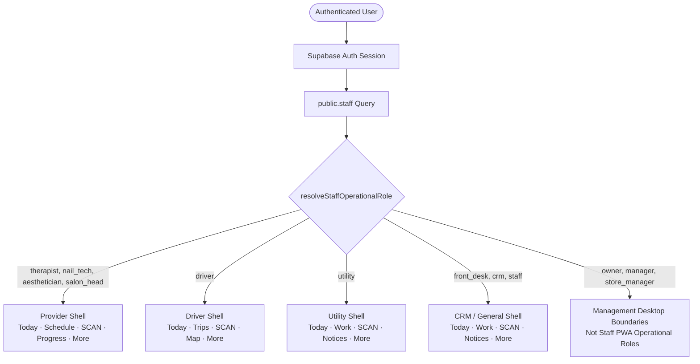
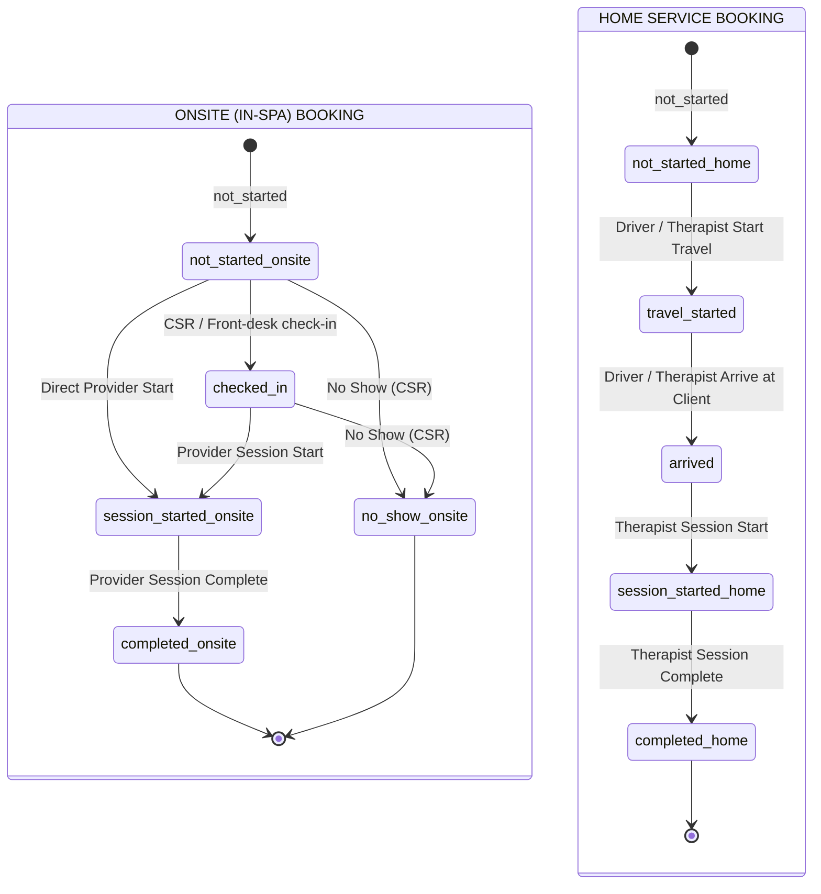
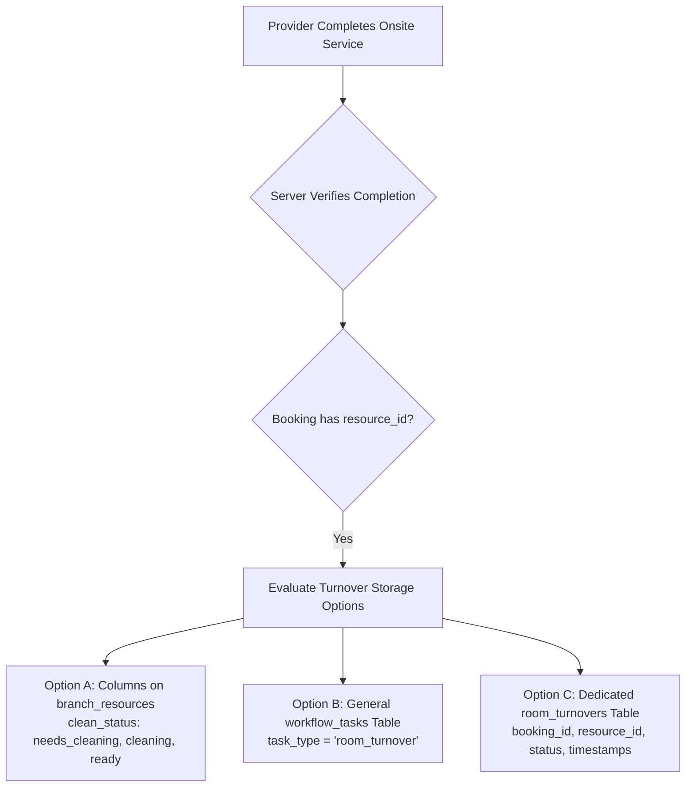
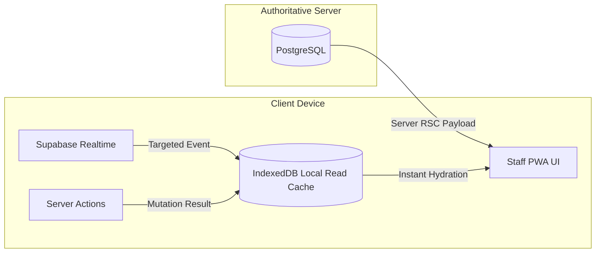
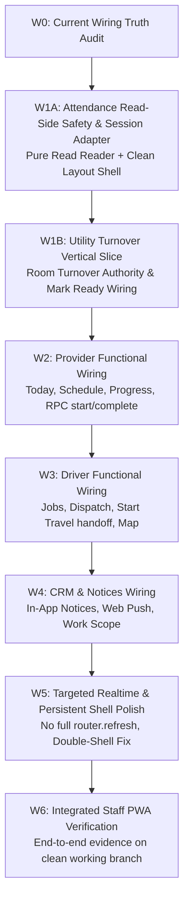

# CRADLEHUB STAFF PWA — W0 CURRENT WIRING TRUTH AUDIT
**Document Reference**: `docs/pwa/PWA-W0-WIRING-TRUTH-AUDIT.md`  
**Phase**: W0 — Wiring Truth Audit & Authority Mapping  
**Working Branch**: `stage/staff-pwa-wiring`  
**Accepted Base SHA**: `09d69fab267ae95422b26639cde43123810d33be`  
**Canonical Repository**: `techwithmpg/Cradlehub`  
**Inspection Date**: 2026-09-13  
**Status**: COMPLETE — REPOSITORY-PROVEN CURRENT BEHAVIOR

---

## 1. ACCEPTED BASELINE & OPERATIONAL BOUNDARIES

### 1.1 Baseline Verification
- **Accepted Main Head**: `09d69fab267ae95422b26639cde43123810d33be` (verified clean working tree on `main`).
- **Working Branch**: `stage/staff-pwa-wiring` branched cleanly from accepted `main`.
- **Pre-existing UI Merge**: Staff PWA mobile UI foundation (PWA-C1 through PWA-C6) is fully merged into canonical `main`.
- **Scope Boundary**: W0 is strictly read-only inspection, documentation, authority tracing, and gap identification. No operational wiring, no code mutations, no database migrations, no schema alterations, and no RLS adjustments.

### 1.2 Protected Accepted Behaviors
1. **Scanner C6 Security Boundary**:
   - Navigation to `/staff/scan` uses full document navigation (`<a href="/staff/scan">`) due to browser `Permissions-Policy` camera lifecycle isolation.
   - Preserved without regression: QR validation, secure-context assumptions, attendance scanner writes, camera lifecycle, and hardware permission handling.
2. **Canonical Role Hierarchy**:
   - Operational Staff PWA encompasses four distinct roles:
     - **Provider Family**: Therapist, Nail Tech, Aesthetician / Facialist, Salon Head.
     - **Driver**: Delivery & dispatch operational driver.
     - **Utility**: Onsite facility, room turnover, and maintenance staff.
     - **CRM / General Staff**: Front desk, guest relations, and basic operations.
   - Managers, Owners, and Marketing staff are **NOT** Staff PWA operational roles (governed by their respective desktop/management workspaces). UI visibility never conveys backend authority.

---

## 2. UI ROUTE & COMPONENT INVENTORY

### 2.1 Route Map
The completed Staff PWA contains 19 active routes under `src/app/(dashboard)/staff/` and subcomponents under `src/components/features/`:

| Route | Operational Role | Page / Component | Primary Data Displayed | Primary Actions | Loading / Empty / Disabled States | Current Data Source |
| :--- | :--- | :--- | :--- | :--- | :--- | :--- |
| `/staff` | Provider / CRM | `StaffPage` &rarr; `StaffTodayPage` / `GeneralStaffMobileHome` | Shift schedule, clock status, appointment stats, next appointment card, appointments list | "Start Session", "Complete Service", "Start Travel", "Mark Arrived", "Scan" | Skeleton / Empty appointments illustration / Disabled conclusion buttons | `getMyTodayAction`, `getMyTodayScheduleAction`, `getMyAttendanceData(30)` |
| `/staff/schedule` | Provider / Driver / CRM | Re-exports `staff-portal/schedule/page` | Weekly calendar tabs, shift windows, daily appointment list, driver jobs | Week navigation, date tab select | Empty schedule banner, error fallback | `getMyWeekAction(from, to)`, `getMyDriverJobsAction(date)` |
| `/staff/progress` | Provider | Re-exports `staff-portal/service-progress/page` | Active ongoing services, completed services today, session duration timers | "Complete Service", "View Details" | Empty active/completed lists, timer tick | `getMyServiceProgressAction(today)` |
| `/staff/more` | Provider / Driver / CRM / Utility | `StaffMorePage` &rarr; `TherapistMoreMenu`, `DriverMoreMenu`, `BasicStaffMoreMenu` | Staff profile header (avatar, name, role, branch), menu navigation items | Profile, Attendance, Schedule, Service History, Logout | Disabled items ("Soon" / "Managed" tags) | `getMyProfileAction()` |
| `/staff/profile` | All Staff | Re-exports `staff-portal/profile/page` | Name, nickname, system role, staff type, phone registration state, avatar | Upload photo, save nickname | Read-only badges, photo upload progress | `getMyProfileAction()`, `getOwnAttendancePhoneState()` |
| `/staff/attendance` | All Staff | Re-exports `staff-portal/attendance/page` | 90-day attendance history, worked minutes, overtime, exceptions/issues guide, portal clock-out eligibility | "Clock Out" (remote/portal when eligible) | Empty check-in history, ineligible portal button | `getMyAttendanceData(90)` |
| `/staff/scan` | All Staff | `StaffScanPage` &rarr; `StaffQrScanner` | Camera viewport, permission prompts, torch toggle, camera switcher | Camera switch, torch toggle, scan QR, manual input | Camera loading spinner, camera permission denied fallback | Client MediaDevices API + native document nav |
| `/staff/scan/process/[publicCode]` | All Staff | `StaffScanProcessPage` &rarr; `PublicScanProcessor` | Scan outcome banner, attendance summary, error details | "Done", "Try Again", "Return to Home" | Processing animation, error dialog | `/api/attendance/public-scan` |
| `/staff/scan/activate/[token]` | All Staff | `StaffScanActivatePage` &rarr; `PublicScanProcessor` | Token activation status, device enrollment | Confirm activation | Activation spinner, invalid token error | `/api/attendance/public-scan` |
| `/staff/driver` | Driver | `StaffDriverTodayPage` &rarr; `DriverMobileHome` | Today stats (awaiting dispatch, active trips, completed), attendance state, active trip card, upcoming list | "Start Travel & Navigate", "Mark Arrived", "View Details" | Empty trip list, disabled concluded buttons | `getMyDriverJobsAction(today)`, `getMyAttendanceData(30)` |
| `/staff/driver/trips` | Driver | `StaffDriverTripsPage` &rarr; `DriverTripsPage` | Tabbed trip lists (Today, Upcoming, History), job cards, dispatch badges | Tab filter, view trip details | Empty state cards for each tab | `getDispatchData({ branchId, date, role: "driver" })` |
| `/staff/driver/map` | Driver | `StaffDriverMapPage` &rarr; `DriverMapPage` | Embedded Google Map, active trip itinerary, next stop coordinates | "Start Travel & Navigate", external map launch | Map loading skeleton, no active route banner | `getMyDriverJobsAction(today)` |
| `/staff/driver/more` | Driver | `StaffDriverMorePage` &rarr; `DriverMoreMenu` | Driver profile overview, trips history link, attendance link | Navigate subpages, logout | Disabled placeholder features | Client component + `DriverProfileSheet` |
| `/staff/utility` | Utility | `CanonicalUtilityPage` &rarr; `UtilityMobileHome` | Utility greeting, attendance state, room turnover summary counter | "View Work", "Scan QR" | Zero turnovers banner | `getUtilityWorkspaceRuntime(today)` |
| `/staff/utility/work` | Utility | `StaffUtilityWorkPage` &rarr; `UtilityWorkList` | Completed onsite service rooms requiring turnover | "Mark Ready" (explicitly disabled) | Empty turnover queue ("All rooms ready"), disabled button | `getUtilityWorkspaceRuntime(today)` (derived from completed onsite bookings) |
| `/staff/utility/notices`| Utility | Re-exports `staff-portal/notifications/page` | Workspace notices, announcements, assignments | Mark as read, click action link | Empty notices container | `getWorkspaceNotificationsAction(100)` |
| `/staff/utility/more` | Utility | `StaffUtilityMorePage` &rarr; `BasicStaffMoreMenu` | Staff profile summary, utility work links, attendance link | Navigate, logout | Standard disabled rows | Client component |
| `/staff/work` | CRM / General Staff | `StaffWorkPage` | Empty work queue notice ("Mobile work queue not connected") | "Back to Today", "Scan QR" | Static explanatory card | Static placeholder |
| `/staff/notices` | CRM / General Staff | Re-exports `staff-portal/notifications/page` | In-app notification feed, action items | Mark as read, open target | Empty notices card | `getWorkspaceNotificationsAction(100)` |

---

## 3. ROLE & WORKSPACE OWNERSHIP



### Authorization Principles:
1. **Server-Owned Identity**: Staff identity is resolved exclusively on the server from `auth_user_id` mapped to `public.staff` where `is_active = true` and `archived_at is null`.
2. **Role Canonization**: Client claims or URL paths never grant privileges. If a driver accesses `/staff`, `StaffPage` intercepts and redirects to `/staff/driver`. If an unauthorized role enters `/staff/utility`, `CanonicalUtilityPage` checks `canAccessCanonicalUtility` and redirects to `/staff`.
3. **Branch Isolation**: Every query (`bookings`, `attendance`, `dispatch`, `resources`) filters strictly by `me.branch_id`. Cross-branch staff assignments are checked by backend RPCs.

---

## 4. PROVIDER AUTHORITY AUDIT

### 4.1 Authoritative Actions & Queries
- **`getMyTodayAction(date: string)`** (`src/app/(dashboard)/staff-portal/actions.ts:623`):
  - Fetches bookings for `staff_id = me.id` and `booking_date = date`.
  - Filters out cancelled and no-show bookings (`not("status", "in", '("cancelled","no_show")')`).
  - Strict Rule 13 compliance: customer query excludes `phone` and `email` (`customers(id, full_name)`).
  - Automatically joins assigned room/bed via `attachBranchResources(supabase, bookings)`.
- **`getMyTodayScheduleAction(date: string)`** (`src/app/(dashboard)/staff-portal/actions.ts:495`):
  - Fetches standard shift from `staff_schedules` for day of week.
  - Fetches overrides from `staff_schedule_overrides` for specific date.
- **`updateBookingProgressAction({ bookingId, nextStatus })`** (`src/app/(dashboard)/staff-portal/actions.ts:703`):
  - Validates staff assignment: `booking.staff_id === me.id` (or manager).
  - Enforces operational booking type (`delivery_type = home_service ? 'home_service' : 'in_spa'`).
  - Validates transition using `canTransitionBookingProgress()`.
  - Executes authoritative database RPCs:
    - `nextStatus === "session_started"` &rarr; RPC `start_booking_service_session(p_booking_id, p_source, p_actor_staff_id)`
    - `nextStatus === "completed"` &rarr; RPC `complete_booking_service_session(p_booking_id, p_completion_source, p_actor_staff_id)`
    - Other transitions (`travel_started`, `arrived`, `checked_in`, `no_show`) &rarr; RPC `update_booking_progress(p_booking_id, p_next_status)`

### 4.2 Canonical State Machine Truth (`src/lib/bookings/progress.ts`)



### 4.3 State Transition Authority Matrix

| Context | Current State | Allowed Next State | Server Action / RPC | Required Staff Role / Assignment | Branch Auth | Downstream Side Effects |
| :--- | :--- | :--- | :--- | :--- | :--- | :--- |
| Onsite | `not_started` | `checked_in` | `updateBookingProgressAction` &rarr; RPC `update_booking_progress` | Assigned Staff or CSR / Front Desk | `booking.branch_id` | Sets `checked_in_at = now()`; notifies assigned staff |
| Onsite | `not_started` | `session_started` | `updateBookingProgressAction` &rarr; RPC `start_booking_service_session` | Assigned Provider | `booking.branch_id` | Sets `session_started_at = now()`, `session_due_at`, `status = in_progress`; blocks Attendance clock-out |
| Onsite | `checked_in` | `session_started` | `updateBookingProgressAction` &rarr; RPC `start_booking_service_session` | Assigned Provider | `booking.branch_id` | Sets `session_started_at = now()`; updates attendance policy snapshot |
| Onsite | `session_started` | `completed` | `updateBookingProgressAction` &rarr; RPC `complete_booking_service_session` | Assigned Provider | `booking.branch_id` | Sets `session_completed_at = now()`, `completed_at = now()`, `status = completed`; leaves room needing turnover |
| Home Service | `not_started` | `travel_started` | `updateBookingProgressAction` &rarr; RPC `update_booking_progress` | Assigned Driver or Provider | `booking.branch_id` | Sets `travel_started_at = now()`, updates customer tracking feed |
| Home Service | `travel_started` | `arrived` | `updateBookingProgressAction` &rarr; RPC `update_booking_progress` | Assigned Driver or Provider | `booking.branch_id` | Sets `arrived_at = now()`, updates customer tracking feed |
| Home Service | `arrived` | `session_started` | `updateBookingProgressAction` &rarr; RPC `start_booking_service_session` | Assigned Provider | `booking.branch_id` | Sets `session_started_at = now()`, `session_due_at`, `status = in_progress` |
| Home Service | `session_started` | `completed` | `updateBookingProgressAction` &rarr; RPC `complete_booking_service_session` | Assigned Provider | `booking.branch_id` | Sets `session_completed_at = now()`, `completed_at = now()`, `status = completed`; enables portal clock-out if final job |

> [!IMPORTANT]
> **Provider Completion != Attendance Clock-out**: Provider service completion releases the service session lock on the booking, but does **NOT** clock the staff member out of Attendance. Clock-out remains an independent authoritative attendance event.

---

## 5. ATTENDANCE AUTHORITY & READ-SIDE SAFETY AUDIT

### 5.1 Call-Chain Trace: `getMyAttendanceData(days)`
`getMyAttendanceData(days = 90)` (`src/lib/staff-portal/attendance.ts:202`):
1. Resolves authenticated `user` via `supabase.auth.getUser()`.
2. Resolves `staff` record (`branch_id`, `system_role`, `staff_type`).
3. Fetches `attendance_settings` and computes branch business date.
4. Executes `Promise.all`:
   - `staff_shift_checkins` (historical checkins)
   - `attendance_exceptions` (open exceptions)
   - `bookings` (active ongoing sessions)
   - `getResolvedStaffSchedulesForDate`
5. Finds open check-in row for today: `currentOpenRow` (`status = 'checked_in'` and `checked_out_at is null`).
6. **Lines 384–385: CRITICAL MUTATION PATH DETECTED**:
   ```ts
   if (currentOpenRow) {
     const admin = createAdminClient();
     const policy = await recalculateAttendanceClockOutPolicy(admin, currentOpenRow.id);
     // ...
   }
   ```
7. `recalculateAttendanceClockOutPolicy` calls RPC `public.recalculate_attendance_clock_out_policy(p_checkin_id, p_calculated_at)` (`supabase/migrations/20260715021703_attendance_smart_dynamic_clock_out.sql:87`).
8. The RPC calculates dynamic boundaries based on scheduled shift, CRM bookings, driver dispatches, and active service sessions.
9. **Lines 632–647 of SQL migration**:
   ```sql
   if v_changed and v_checkin.status = 'checked_in' and v_checkin.checked_out_at is null then
     v_snapshot := v_candidate_snapshot || jsonb_build_object('calculatedAt', v_now);
     update public.staff_shift_checkins
     set attendance_expected_end_at = v_expected,
         earliest_normal_clock_out_at = v_earliest,
         latest_normal_clock_out_at = v_latest,
         clock_out_reminder_at = v_reminder,
         manager_escalation_at = v_escalation,
         hard_cutoff_at = v_hard,
         provisional_clock_out_at = v_provisional,
         attendance_policy_source = v_source,
         attendance_policy_snapshot = v_snapshot,
         updated_at = v_now
     where id = v_checkin.id
       and status = 'checked_in'
       and checked_out_at is null;
   ```

### 5.2 Attendance Call Path Classification

| Reader Path | File / Location | Invocations | Classification | Reason / Risk |
| :--- | :--- | :--- | :--- | :--- |
| `getMyAttendanceData(30)` | `src/app/(dashboard)/staff/page.tsx:38` | On render of `/staff` (CRM general home) | **WRITE-CAPABLE** | Calls `recalculate_attendance_clock_out_policy`, mutating `staff_shift_checkins` when policy snapshot changes. |
| `getMyAttendanceData(30)` | `src/app/(dashboard)/staff/driver/page.tsx:11` | On render of `/staff/driver` | **WRITE-CAPABLE** | Same mutation path via open check-in evaluation. |
| `getMyAttendanceData(30)` | `src/lib/staff-pwa/utility-runtime.ts:75` | On render of `/staff/utility` | **WRITE-CAPABLE** | Same mutation path via open check-in evaluation. |
| `getMyAttendanceData(30)` | `src/app/(dashboard)/staff-portal/page.tsx:73` | On render of `/staff` (Provider home) | **WRITE-CAPABLE** | Same mutation path via open check-in evaluation. |
| `getMyAttendanceData(90)` | `src/app/(dashboard)/staff/attendance/page.tsx:13` | On render of `/staff/attendance` | **WRITE-CAPABLE** | Same mutation path via open check-in evaluation. |

> [!CAUTION]
> **READ-SIDE AUTHORITY DECISION REQUIRED**:  
> Opening `/staff`, `/staff/driver`, or `/staff/utility` must **not** trigger database writes merely because the screen rendered.  
> The snapshot columns (`attendance_expected_end_at`, `earliest_normal_clock_out_at`, `latest_normal_clock_out_at`, `attendance_policy_snapshot`) already persist in `staff_shift_checkins`.  
> A pure read-only Attendance reader (`getPureAttendanceSnapshot()`) is required to read existing persisted columns without executing `recalculate_attendance_clock_out_policy`. Policy recalculation should be strictly triggered by authoritative domain mutations (service session started/completed, dispatch assigned, clock-in/out scan, scheduled cron).

---

## 6. AUTHENTICATED PHONE / DEVICE REGISTRATION AUDIT

### 6.1 Existing Trusted-Device Verification Flow
The trusted-device enrollment and validation system is fully implemented in `src/lib/attendance/scan-engine.ts`:
1. **Authenticated Session Resolution**:
   - `resolveScanIdentity(admin, authenticatedUserId, context)` inspects incoming HTTP request.
   - If device cookie (`cradlehub_device_credential`) is missing, it verifies `authenticatedUserId`.
2. **Auto-Registration Eligibility (`registerDeviceForAuthenticatedScan`)**:
   - Checks if attendance scanning is globally enabled (`isAttendanceScanningEnabled()`).
   - Validates QR point (`loadQrPoint`) is active and of type `attendance`.
   - Resolves active staff profile for `authUserId` (`isOperationalStaff()`).
   - Validates branch assignment: if staff's branch != QR branch, halts with `wrong_branch` and logs a `BranchAssignmentIssue` (prevents cross-branch spoofing).
   - Checks active device limits via `evaluateAttendanceDeviceRegistration`:
     - Compares count of `staff_devices` with status `active` against policy.
     - Allows replacement if an approved `staff_device_registration_requests` exists.
   - Generates cryptographically secure raw credential, stores SHA-256 hash in `staff_devices`, sets `status = 'active'`, and returns `state: "auto_registered_from_session"`.
3. **PWA Public Scan Processor Integration**:
   - `src/components/features/attendance/public-scan-processor.tsx` receives `deviceConnection: "auto_registered_from_session"`.
   - Automatically continues scan execution without user friction.
   - Cookie is attached via `Set-Cookie` header in HTTP response from `/api/attendance/public-scan`.

### 6.2 Findings & UX Contract
- **Status**: **READY** (Backend engine and API routes are 100% complete).
- **Rule Enforcement**: A valid login session will **never** silently overwrite or exceed device limits without an approved replacement request.
- **Contract Gap**: Zero contract gap for QR attendance scan. PWA Scanner C6 routes (`/staff/scan/process/[publicCode]`) already integrate with `PublicScanProcessor`.

---

## 7. UTILITY & ROOM / RESOURCE AUTHORITY AUDIT

### 7.1 Existing Resource Schema & Queries
- Physical resources are stored in `public.branch_resources` (`supabase/migrations/20260505000001_branch_resources.sql:9`):
  - Columns: `id`, `branch_id`, `name`, `type` (`'room' | 'bed' | 'chair' | 'equipment' | 'home_service_unit' | 'shared_area' | 'other'`), `capacity`, `is_active`, `sort_order`, `notes`.
  - `bookings.resource_id` references `branch_resources(id)`.
- **Current Turnover Read Authority** (`src/lib/staff-pwa/utility-runtime.ts:77`):
  - Queries `bookings` where `branch_id = staff.branch_id`, `booking_date = date`, `status != 'cancelled'`, `resource_id is not null`.
  - Filters for finished onsite bookings (`session_completed_at is not null` or `completed_at is not null` or `status = 'completed'`).
  - Emits `UtilityRoomTurnoverItem` list.
- **Current Turnover Write Authority**:
  - `src/components/features/staff-pwa/utility/utility-work-list.tsx:77`:
    > *"This room was inherited from a completed onsite service. Turnover completion is not writable yet because CradleHub does not currently have an authoritative room-readiness state. Mark Ready — backend connection required."*
  - **There is NO write authority, NO turnover state column, and NO turnover table currently in the database.**

### 7.2 Turnover Architecture Options Evaluated



| Option | Architecture | Pros | Cons | Recommendation |
| :--- | :--- | :--- | :--- | :--- |
| **Option A: Add state columns to `branch_resources`** | Add `clean_status` (`needs_cleaning`, `cleaning`, `ready`), `last_cleaned_at`, `cleaned_by_staff_id` to `branch_resources`. | Simple table schema; directly reflects current physical room state; easy to join in scheduling availability. | Does not preserve historical turnover audit logs across multiple appointments on the same day; concurrent bookings in shared areas could conflict. | **Viable for simple MVP, but lacks audit depth.** |
| **Option B: Use existing `workflow_tasks` table** | Utilize existing `public.workflow_tasks` (`task_type = 'room_turnover'`, `entity_type = 'booking'`, `entity_id = booking.id`). | Zero schema changes needed! Already has dedupe keys, status (`open`, `in_progress`, `completed`), assigned branch, role scope, and realtime publication. | Scheduling engine query would have to check `workflow_tasks` to determine if a room is bookable or ready; loose relational typing. | **Viable for tasks, but awkward for spatial availability engine.** |
| **Option C: Dedicated `room_turnovers` authority table** | Create `room_turnovers` (`id`, `branch_id`, `resource_id`, `booking_id`, `status: needs_cleaning | cleaning | ready`, `started_at`, `completed_at`, `cleaned_by_staff_id`). | Strict relational integrity; exact audit history; server-owned trigger upon `complete_booking_service_session`; clean RLS; explicit room release lock. | Requires a new migration and database project decision. | **RECOMMENDED ARCHITECTURAL TARGET** |

> [!IMPORTANT]
> **PROJECT DECISION NEEDED (Owner Gate)**:  
> Owner must decide between **Option B** (utilizing existing `workflow_tasks` without DB migration) or **Option C** (introducing dedicated `room_turnovers` schema table).  
> In all options: Provider completion marks room `needs_cleaning`. Only authoritative Utility completion releases the room to `ready`.

---

## 8. DRIVER AUTHORITY & LIFECYCLE AUDIT

### 8.1 Driver Data Sources & Actions
- **Data Source**: `getMyDriverJobsAction(date)` &rarr; `getDispatchData({ branchId, date, role: "driver", staffId: me.id })`.
  - Queries `bookings` where `branch_id = me.branch_id`, `booking_date = date`, `delivery_type = 'home_service'`, and `driver_id = me.id`.
  - Extracts customer destination from `booking.metadata` (lat/lng, address, area).
- **Start Travel UI Action Contract**:
  - `src/components/features/staff-portal/driver/map/driver-start-travel-button.tsx:21`:
    1. Driver taps "Start Travel & Navigate".
    2. Calls authoritative `updateBookingProgressAction({ bookingId, nextStatus: "travel_started" })`.
    3. Server verifies `driver_id === me.id` and transitions `booking_progress_status = 'travel_started'`.
    4. ONLY upon server success: calls `window.location.assign(navigationUrl)` to hand off to OS Google Maps.
  - This strict ordering is verified and preserved.
- **Arrived UI Action**:
  - Driver taps "Mark Arrived" &rarr; calls `updateBookingProgressAction({ bookingId, nextStatus: "arrived" })`.

### 8.2 Driver Gaps & Findings
1. **Return Trip / Driver Completion**:
   - The driver cannot advance past `arrived`. The therapist performs `session_started` and `completed`.
   - There is currently no `return_travel_started` or `return_arrived` state in the `bookings` table. Once the service is completed, the booking is closed.
   - Driver return-to-base trips are currently unmodeled in the database.
2. **Realtime Geolocation Snapshots**:
   - Driver map displays customer destination coordinates from booking metadata.
   - There is no background GPS driver tracking or location telemetry stream stored in PostgreSQL.

---

## 9. CRM / GENERAL STAFF OPERATIONAL AUTHORITY

### 9.1 Current UI Expectation vs Backend Reality
- **Route `/staff/work`**: Displays "Mobile work queue not connected".
- **Backend Authority**:
  - CRM desktop functionality is extensive (`src/lib/queries/crm-today.ts`): pending online bookings, unassigned bookings, payment confirmations, customer check-in, attendance overrides, cash reconciliations.
  - However, there is no lightweight mobile task stream specifically filtered for a general staff member holding a phone.
- **Available Safe PWA Actions for CRM / General Staff**:
  1. Attendance QR scanning (clock-in / clock-out / branch switch).
  2. Notices / announcement viewing (`workspace_notifications`).
  3. Customer Arrival check-in via QR scan (`PublicScanProcessor` supports customer check-in QR codes).
- **Backend Gap**: Ad-hoc task management on `/staff/work` is a **BACKEND GAP**. Do not invent a custom task engine during wiring.

---

## 10. NOTIFICATION SYSTEM AUDIT

### 10.1 Authoritative Infrastructure
- **Table**: `public.workspace_notifications` (`src/lib/notifications/workflow-notifications-store.ts:42`).
  - Columns: `branch_id`, `target_workspace`, `target_role`, `recipient_staff_id`, `actor_staff_id`, `type`, `title`, `body`, `entity_type`, `entity_id`, `action_href`, `priority`, `status` (`'unread' | 'read' | 'archived'`), `requires_action`, `dedupe_key`, `metadata`, `created_at`.
- **In-App Query**: `getWorkspaceNotificationsAction(limit = 100)` (`src/lib/notifications/queries.ts:31`).
  - Resolves staff profile, filters by `recipient_staff_id = me.id` OR `(branch_id = me.branch_id AND target_workspace in ('staff_portal', 'crm'))`.
- **Web Push Delivery**:
  - Backed by `public.web_push_subscriptions` (`src/lib/notifications/push/delivery.ts`).
  - Triggered automatically via `deliverWorkspaceNotificationPush` upon notification creation.

### 10.2 Attendance Awareness & Shift Reminders
- **Existing Capability**:
  - Automated closing shift reminders, manager escalations, and provisional auto-close are implemented in PostgreSQL via `process_due_attendance_closing_interventions` and triggered by `pg_cron` (`supabase/operations/configure-attendance-closing-cron.sql`).
- **Gaps**:
  - Pre-shift reminders ("Shift starts in 30 minutes", "Shift started 15 minutes ago but you have not clocked in") do **NOT** exist in PostgreSQL or the application layer.
  - Designing pre-shift notifications requires a server-side evaluator checking `staff_schedules` + `staff_shift_checkins`. It must not be built as an unreliable client-side timer.

---

## 11. REALTIME & EVENT-DRIVEN SYNC AUDIT

### 11.1 Active Supabase Realtime Channels
1. **`staff-today-${staffId}-${date}`** (`src/components/features/staff-portal/staff-today-dashboard.tsx:25`):
   - Table: `bookings`, filter: `staff_id=eq.${staffId}`.
   - Event: `*`.
   - Current Callback: `router.refresh()`.
2. **`staff-attendance-${staffId}`** (`src/components/features/staff-portal/staff-attendance-realtime.tsx:13`):
   - Table: `staff_shift_checkins`, filter: `staff_id=eq.${staffId}`.
   - Event: `*`.
   - Current Callback: `router.refresh()`.
3. **`workspace-notifications`** (`src/components/features/notifications/use-workspace-notification-realtime.ts:137`):
   - Table: `workspace_notifications`.
   - Event: `INSERT`, `UPDATE`.
   - Updates client notification badge and list state in place.

### 11.2 Invalidation & Broad Refresh Findings
- **The Problem**: Whenever a booking progress transition occurs (e.g. `updateBookingProgressAction`), or an attendance record updates, the realtime callback calls **`router.refresh()`**.
- **Performance Impact**: In Next.js App Router, `router.refresh()` forces a complete re-evaluation of the entire Server Component tree from `(dashboard)/layout.tsx` down through `staff/layout.tsx` to the page. This triggers 5+ database queries per refresh, including the write-capable `getMyAttendanceData()` call!
- **Target Pattern for Wiring**:
  - Realtime listeners must update local React state or targeted SWR/React Query caches, avoiding unconditional `router.refresh()` for known single-entity state updates.

---

## 12. PERSISTENT APP SHELL & RELOAD AUDIT

### 12.1 Root Shell Hierarchy
1. **Root Layout** (`src/app/(dashboard)/layout.tsx`):
   - Handles desktop `Header` and `Sidebar`. On mobile, `Header` is `hidden md:block`, and `Sidebar` is hidden.
   - Renders `<main data-testid="workspace-main">` containing `{children}`.
2. **Staff PWA Layout** (`src/app/(dashboard)/staff/layout.tsx`):
   - Fetches `staff` profile once per server render.
   - Wraps children in role-specific shell:
     - `DriverMobileShell`
     - `TherapistMobileShell`
     - `StaffMobileShell`
   - Each shell wraps content in `MobileNavigationProgressProvider` and mounts its respective `StaffBottomNav`.

### 12.2 Cause of Bottom Nav Disappearance & Visible Reloads

| Reload Source | Route / Trigger | Cause Analysis | Classification | Resolution / Strategy |
| :--- | :--- | :--- | :--- | :--- |
| **Scanner C6 Navigation** | Tapping "Scan" button in bottom nav (`/staff/scan`) | Bottom nav renders `<a href="/staff/scan">` (native anchor). Browser executes full document navigation. React unmounts completely; white flash occurs before page re-renders. | **SECURITY BOUNDARY (REQUIRED)** | Documented and accepted. Hardware Permissions-Policy requires clean document boundary for camera. Do NOT regress. |
| **Double AppShell in Scan** | Rendering `/staff/scan/page.tsx` | `StaffScanPage` renders `<StaffAppShell hideNav={true}>` inside `TherapistMobileShell` (from parent layout). Parent shell still renders `TherapistMobileBottomNav`! | **BUG / REDUNDANCY** | Standardize `/staff/scan` to inherit the layout shell cleanly rather than nesting an inner `StaffAppShell`. |
| **Uncached `router.refresh()`** | Mutation callbacks in Realtime and Actions | Invoking `router.refresh()` on every progress update re-executes all server queries and causes UI flicker. | **UNNECESSARY / ARCHITECTURAL** | Transition to optimistic UI updates with targeted state invalidation. |
| **Driver / Utility Redirects** | Root `/staff` hit by Driver or Utility staff | `/staff/page.tsx` calls `redirect('/staff/driver')` or `redirect('/staff/utility')`. Next.js aborts render and redirects. | **ADAPTER NEEDED** | Persistent shell should route directly from the bottom nav links (`DRIVER_NAV_ITEMS` and `UTILITY_NAV_ITEMS` already use correct root paths). |

---

## 13. LOCAL READ CACHE (INDEXEDDB DESIGN — AUDIT ONLY)

### 13.1 Candidate Structured Read Classes (Future Implementation)
IndexedDB is strictly for client read acceleration, offline resilience, and reducing database round-trips. It must **never** be authoritative for authorization, attendance, or booking mutations.



1. **Staff Profile Presentation**: `id`, `full_name`, `nickname`, `avatar_url`, `system_role`, `staff_type`, `branch_name`.
2. **Attendance Summary Snapshot**: Today's clock state, scheduled shift hours, expected end time (read-only snapshot).
3. **Weekly Schedule Planner**: Days array, working days, days off, shift types for current week.
4. **Today's Assigned Bookings / Trips**: List of appointments/trips for the current day.
5. **Cached Notices**: Last 50 workspace announcements.

### 13.2 Security Exclusions & Sensitive Data Boundaries
- **Strictly Excluded from Cache**:
  - Customer contact details (email, phone number, billing address) — Rule 13 violation.
  - Raw device credentials and activation tokens.
  - Supabase service-role keys (never present on client).
  - Cross-branch booking records.
- **Cache Eviction Lifecycle**:
  - Instant complete purge on `auth.signOut()`.
  - Scoped by `staff_id` and `branch_id`. If `auth_user_id` changes, previous store is wiped immediately.

---

## 14. TARGETED INVALIDATION MAP

| Authoritative Mutation | Mutation Owner | Primary Target Invalidation | Secondary Downstream Invalidation | Realtime Event Filter |
| :--- | :--- | :--- | :--- | :--- |
| **Start Service Session** | Assigned Provider | Provider Today (`next_appointment`, `appointments`) | Provider Progress (`active_services`), Attendance Policy Snapshot | `table=bookings, staff_id=eq.{id}` |
| **Complete Service Session** | Assigned Provider | Provider Progress (`completed_services`), Provider Today | Utility Room Turnover Queue (`needs_cleaning`), Attendance Policy Snapshot | `table=bookings, staff_id=eq.{id}` & `table=bookings, branch_id=eq.{branchId}` |
| **Clock In / Clock Out Scan** | Staff Member (QR Engine) | Attendance Summary, Today Status Badge | Attendance History List (`staff_shift_checkins`) | `table=staff_shift_checkins, staff_id=eq.{id}` |
| **Start Travel (Driver)** | Assigned Driver | Driver Active Trip Card, Driver Map Itinerary | Provider Home Service Status Card, Customer Tracking | `table=bookings, driver_id=eq.{id}` |
| **Mark Arrived (Driver)** | Assigned Driver | Driver Active Trip Card | Provider Home Service Status Card, Customer Tracking | `table=bookings, driver_id=eq.{id}` |
| **Mark Room Ready (Utility)** | Utility Staff | Utility Work List (`turnoverItems`) | Scheduling Engine Resource Availability (for onsite bookings) | Future `room_turnovers` or `branch_resources` event |
| **Dismiss / Read Notice** | Staff Member | Unread Notice Counter Badge | Notices List View (`workspace_notifications`) | `table=workspace_notifications, recipient_staff_id=eq.{id}` |

---

## 15. PERFORMANCE MEASUREMENT & SECURITY MATRIX

### 15.1 Baseline Request Overhead on `/staff` Load
Tracing current page load of `/staff` reveals repeated queries:
1. `src/app/(dashboard)/layout.tsx`: calls `getLayoutStaffContext()` &rarr; queries `staff`.
2. `src/app/(dashboard)/staff/layout.tsx`: calls `getMyProfileAction()` &rarr; queries `staff` again.
3. `src/app/(dashboard)/staff/page.tsx`: calls `getMyProfileAction()` &rarr; queries `staff` a third time.
4. `src/app/(dashboard)/staff-portal/page.tsx`:
   - `getMyTodayAction(today)` &rarr; queries `bookings`, `branch_resources`, `services`, `customers`.
   - `getMyTodayScheduleAction(today)` &rarr; queries `staff_schedules`, `staff_schedule_overrides`.
   - `getMyAttendanceData(30)` &rarr; queries `staff_shift_checkins`, `attendance_exceptions`, `bookings`, `schedules`, AND runs write-capable RPC `recalculate_attendance_clock_out_policy`.
- **Measurement Plan for Stabilization Pass**:
  - Consolidate layout-level staff profile fetching using React `cache()`.
  - Decouple attendance reading from policy recalculation to eliminate write queries on read loads.

### 15.2 Security Boundary Matrix

| Action | Authentication Source | Role Validation | Branch Validation | Assignment Validation | State Validation |
| :--- | :--- | :--- | :--- | :--- | :--- |
| **Start Session** | Supabase Auth JWT | Server checks provider role | Server checks `booking.branch_id == staff.branch_id` | Server checks `booking.staff_id == staff.id` | State must be `not_started` or `checked_in` |
| **Complete Service** | Supabase Auth JWT | Server checks provider role | Server checks `booking.branch_id == staff.branch_id` | Server checks `booking.staff_id == staff.id` | State must be `session_started` |
| **Start Travel** | Supabase Auth JWT | Server checks driver/provider role | Server checks `booking.branch_id == staff.branch_id` | Server checks `booking.driver_id == staff.id` or `staff_id == staff.id` | State must be `not_started` and delivery_type `home_service` |
| **Clock In / Out** | Auth JWT + QR Point + Device Hash | Operational staff check | Effective branch check (rejects cross-branch without issue) | Device must belong to authenticated staff | Dynamic policy evaluation (buffer, schedule, active service locks) |
| **Room Ready** | Supabase Auth JWT | Server checks utility role | Server checks `resource.branch_id == staff.branch_id` | Verifies service completed on resource | Room state must be `needs_cleaning` |

---

## 16. CLASSIFICATION MATRIX

Every visible UI field and action across the four operational workspaces is classified into exactly one of:
`READY`, `ADAPTER NEEDED`, `CONTRACT ADJUSTMENT NEEDED`, `READ-SIDE SAFETY REVIEW`, `BACKEND GAP`, `BLOCKED`, `OUT OF SCOPE`.

| # | Workspace | Screen / Component | Field / Action Item | Classification | Rationale & Evidence |
| :--- | :--- | :--- | :--- | :--- | :--- |
| 1 | Provider | Today Header | Staff greeting & role badge | **READY** | Sourced directly from `staff` record (`full_name`, `system_role`). |
| 2 | Provider | Today Header | Attendance clock status badge | **READ-SIDE SAFETY REVIEW** | Sourced via `getMyAttendanceData(30)` which executes write-capable RPC `recalculate_attendance_clock_out_policy`. |
| 3 | Provider | Today Stats | Bookings summary counts (total, remaining, completed, home service) | **READY** | Derived cleanly from `getMyTodayAction(today)`. |
| 4 | Provider | Today Next Card | Next appointment display (customer, service, time, room/location) | **READY** | Sourced from `getMyTodayAction` with Rule 13 compliant customer name. |
| 5 | Provider | Today Next Card | "Start Session" action button | **READY** | Wires directly to `updateBookingProgressAction` &rarr; RPC `start_booking_service_session`. |
| 6 | Provider | Today List | Appointment cards list | **READY** | Sourced from `getMyTodayAction`. |
| 7 | Provider | Today List | "Complete Service" action button | **READY** | Wires directly to `updateBookingProgressAction` &rarr; RPC `complete_booking_service_session`. |
| 8 | Provider | Today List | "Start Travel" action button (Home Service) | **READY** | Wires to `updateBookingProgressAction` &rarr; RPC `update_booking_progress`. |
| 9 | Provider | Today List | "Arrived" action button (Home Service) | **READY** | Wires to `updateBookingProgressAction` &rarr; RPC `update_booking_progress`. |
| 10 | Provider | Today List | Google Maps navigation link | **READY** | Sourced from branch / booking destination metadata. |
| 11 | Provider | Schedule | Week date selector & day tabs | **READY** | Sourced from `getMyWeekAction(from, to)`. |
| 12 | Provider | Schedule | Scheduled shift timing & override badge | **READY** | Sourced from `staff_schedules` and `staff_schedule_overrides`. |
| 13 | Provider | Schedule | Daily appointment list by date | **READY** | Sourced from `getMyWeekAction`. |
| 14 | Provider | Progress | Active services list with duration timer | **READY** | Sourced from `getMyServiceProgressAction(today)`. |
| 15 | Provider | Progress | Completed services list today | **READY** | Sourced from `getMyServiceProgressAction(today)`. |
| 16 | Provider | More | Profile link & avatar header | **READY** | Sourced from `getMyProfileAction`. |
| 17 | Provider | More | Attendance history link (`/staff/attendance`) | **READY** | Re-exports canonical attendance portal page. |
| 18 | Provider | More | Device / Scan Status menu row | **OUT OF SCOPE** | Labeled "Managed" in approved UI; no mobile management needed. |
| 19 | Provider | More | Help & Support / About menu rows | **OUT OF SCOPE** | Static informative stubs. |
| 20 | Provider | More | Logout button | **READY** | Server action calls `supabase.auth.signOut()`. |
| 21 | All Staff | Scanner C6 | Camera viewfinder & scan frame | **READY** | Native camera lifecycle protected by C6 boundary. |
| 22 | All Staff | Scanner C6 | Torch toggle & camera switcher | **READY** | Uses standard browser MediaTrack constraints. |
| 23 | All Staff | Scan Process | Attendance scan result display & checkin write | **READY** | Wires to `/api/attendance/public-scan` and `recordScanEvent`. |
| 24 | All Staff | Scan Process | First-scan auto-registration from authenticated session | **READY** | Implemented in `scan-engine.ts` via `registerDeviceForAuthenticatedScan`. |
| 25 | All Staff | Attendance | 90-day attendance history list | **READ-SIDE SAFETY REVIEW** | Loaded via `getMyAttendanceData(90)` which triggers policy recalculation on render. |
| 26 | All Staff | Attendance | Attendance exceptions & issue guide | **READY** | Sourced from `attendance_exceptions`. |
| 27 | All Staff | Attendance | Portal remote clock-out button | **ADAPTER NEEDED** | Requires registered device cookie + eligible shift snapshot; UI needs adapter to handle state changes cleanly. |
| 28 | Driver | Today Header | Driver greeting & attendance badge | **READ-SIDE SAFETY REVIEW** | Sourced from `getMyAttendanceData(30)` write-capable call path. |
| 29 | Driver | Today Stats | Trip stats (awaiting dispatch, active, completed) | **READY** | Sourced from `getMyDriverJobsAction(today)`. |
| 30 | Driver | Today Active Card| Active trip card with ETA & address | **READY** | Sourced from `getDispatchData`. |
| 31 | Driver | Today Active Card| "Start Travel & Navigate" button | **READY** | Wires to `updateBookingProgressAction` then `window.location.assign`. |
| 32 | Driver | Today Active Card| "Mark Arrived" button | **READY** | Wires to `updateBookingProgressAction` &rarr; `arrived`. |
| 33 | Driver | Trips | Tabbed trip lists (Today, Upcoming, History) | **READY** | Sourced from `getDispatchData`. |
| 34 | Driver | Map | Interactive Google Map & route pins | **ADAPTER NEEDED** | Needs clean adapter between booking coordinates and Google Maps Embed API. |
| 35 | Driver | Return Trip | Return travel & driver trip completion | **CONTRACT ADJUSTMENT NEEDED** | Driver return trip is not currently modeled as an entity in `bookings`. |
| 36 | Utility | Today Header | Utility greeting & attendance badge | **READ-SIDE SAFETY REVIEW** | Sourced from `getMyAttendanceData(30)` write-capable call path. |
| 37 | Utility | Today Stats | Room turnover waiting count | **READY** | Derived from completed onsite bookings with `resource_id`. |
| 38 | Utility | Work List | Completed onsite rooms queue | **READY** | Derived from `getUtilityWorkspaceRuntime(today)`. |
| 39 | Utility | Work List | "Mark Ready" room turnover action | **BACKEND GAP** | UI button is disabled. No room turnover write authority or DB table exists yet. |
| 40 | CRM / General | Today | General staff greeting & attendance card | **READ-SIDE SAFETY REVIEW** | Sourced from `getMyAttendanceData(30)` write-capable call path. |
| 41 | CRM / General | Work Queue | Operational work queue on `/staff/work` | **BACKEND GAP** | Stated on UI: "Mobile work queue not connected". No dedicated CRM task queue. |
| 42 | All Staff | Notices | Notification list feed (`/staff/notices`) | **READY** | Sourced from `getWorkspaceNotificationsAction(100)` & `workspace_notifications`. |
| 43 | All Staff | Notices | Web Push notifications | **READY** | Backed by `web_push_subscriptions` and `deliverWorkspaceNotificationPush`. |
| 44 | All Staff | Reminders | Shift starting soon / unclocked shift reminders | **BACKEND GAP** | No scheduled cron or job exists for pre-shift reminders (closing reminders exist). |
| 45 | All Staff | Shell | Persistent sticky bottom navigation | **ADAPTER NEEDED** | Bottom nav flickers on Scan departure (`<a>` tag) and double-mounts on `/staff/scan`. |

### 16.1 Classification Totals
- **READY**: **27**
- **ADAPTER NEEDED**: **4**
- **CONTRACT ADJUSTMENT NEEDED**: **1**
- **READ-SIDE SAFETY REVIEW**: **6**
- **BACKEND GAP**: **4**
- **BLOCKED**: **0**
- **OUT OF SCOPE**: **3**
- **TOTAL INVENTORIED ITEMS**: **45**

---

## 17. BACKEND GAPS & PROJECT DECISIONS NEEDED

### 17.1 Backend Gaps Identified
1. **Utility Room Turnover Write Authority (Gap #1)**:
   - UI has dedicated Utility Today and Work list surfaces.
   - Rooms needing cleaning are currently derived on the fly from completed onsite bookings with `resource_id`.
   - There is no database authority to record `needs_cleaning &rarr; cleaning &rarr; ready`. The "Mark Ready" button is disabled.
2. **Read-Side Attendance Mutation Risk (Gap #2)**:
   - `getMyAttendanceData` is called on render across `/staff`, `/staff/driver`, and `/staff/utility`.
   - It calls `recalculateAttendanceClockOutPolicy` which executes an `UPDATE` on `staff_shift_checkins`. A pure read helper does not exist.
3. **Driver Return Trip Entity (Gap #3)**:
   - Driver lifecycle currently terminates at `arrived`. Booking completion is owned by therapist session completion. Return-to-base trips have no database model.
4. **Pre-Shift Attendance Reminders (Gap #4)**:
   - Closing shift reminders/auto-close exist in `pg_cron`. Pre-shift reminders ("shift starting soon", "unclocked shift") do not exist.
5. **Mobile CRM Task Queue (Gap #5)**:
   - `/staff/work` is currently an empty placeholder notice because front-desk operational tasks have no mobile-curated queue.

### 17.2 Project Decisions Needed (Owner Gate Required)
1. **Decision D1: Room Turnover Authority Model**:
   - *Option B*: Utilize existing `public.workflow_tasks` table (`task_type = 'room_turnover'`). Zero migration needed, but looser relational linkage with branch resources.
   - *Option C (Recommended)*: Introduce dedicated `public.room_turnovers` table via authorized migration, strictly linking `booking_id`, `resource_id`, and `utility_staff_id`.
2. **Decision D2: Attendance Read-Side Safety**:
   - Decouple `recalculate_attendance_clock_out_policy` from page rendering.
   - Authorize a pure read-only Attendance reader (`getPureAttendanceSnapshot()`) that reads existing columns without executing write-capable RPCs.
3. **Decision D3: CRM Mobile Work Scope**:
   - Confirm whether `/staff/work` remains an informative redirect to Today / Scan for CRM staff, or if a specific queue (e.g. pending customer arrivals) should be attached.

---

## 18. RECOMMENDED IMPLEMENTATION PLAN & FIRST VERTICAL SLICE

### 18.1 Dependency-Ordered Implementation Phases
The original proposal (W1 Utility &rarr; W2 Provider &rarr; W3 Driver...) has a critical prerequisite dependency: **Attendance Read-Side Safety**. Because all pages render Attendance status badges and call `getMyAttendanceData`, doing Utility or Provider first on top of an unsafe write-capable read path risks accidental database mutations during testing.



### 18.2 First Implementation Slice Recommendation: Slice W1A
**Goal**: Establish 100% safe, read-only Attendance and Staff Session foundations across the persistent mobile shell.
- **Source of Truth**: Existing columns in `public.staff` and `public.staff_shift_checkins`.
- **Files to Modify**:
  - `src/lib/staff-portal/attendance.ts` (add `getPureAttendanceSnapshot` without `recalculate_attendance_clock_out_policy`).
  - `src/app/(dashboard)/staff/page.tsx`, `driver/page.tsx`, `utility/page.tsx` (switch to pure reader).
  - `src/app/(dashboard)/staff/scan/page.tsx` (remove redundant inner `StaffAppShell` to fix double-nav anomaly).
- **Server Actions / RPCs**: None mutated; strictly read-only.
- **Authorization**: Supabase Auth session &rarr; active staff profile &rarr; own branch check.
- **Database / Schema Work**: **NONE** (0 migrations).
- **Rollback Considerations**: Trivial zero-risk rollback via Git revert; no remote database impact.

---
*End of Audit Document — Awaiting Owner Review and Slice Authorization.*
